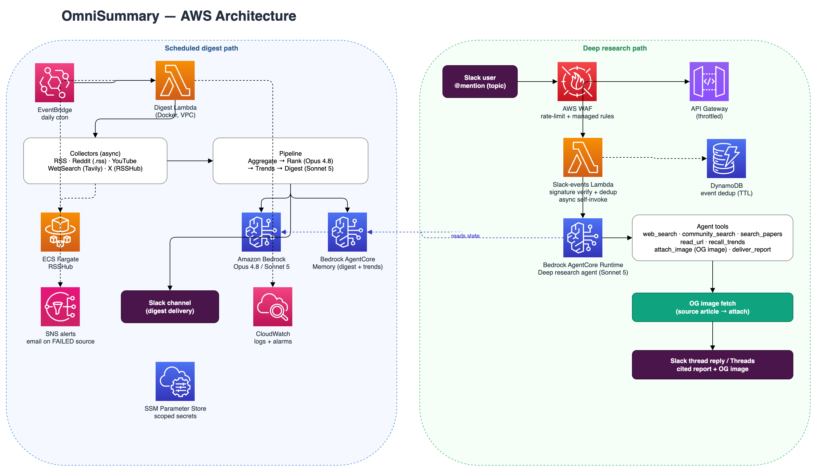
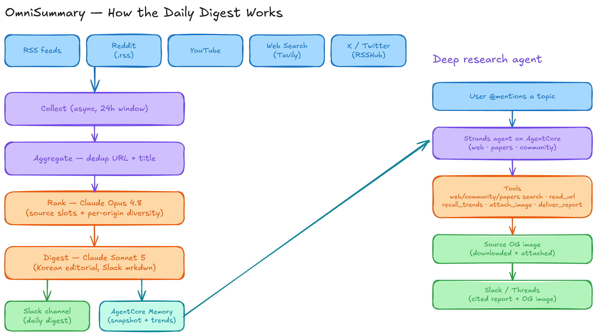

# OmniSummary

Proactive AI/ML daily digest system that collects content from multiple sources, ranks by importance using LLM, generates editorial-style digests, and delivers via Slack and Threads. Includes a Slack-triggered deep-research agent that researches a topic across the web, papers, and community, then posts a persona-voiced, cited report.

## Features

- **Multi-source collection**: Reddit (public .rss feed via proxy), YouTube, X/Twitter (via RSSHub), RSS/Substack, Web Search (Tavily)
- **LLM-powered ranking**: Claude Opus 4.8, multi-axis evaluation with source-slot + per-origin diversity caps
- **Editorial digest**: Claude Sonnet 5 Korean editorial with cross-day trend tracking
- **Multi-channel delivery**: structured digest rendered per channel — Slack (Block Kit) and Threads (image root + flat reply chain), each independently toggleable
- **Deep-research agent**: autonomous Slack-triggered Strands agent — rewrites the query, researches across web/papers/community/blogs, writes a persona-voiced cited report (same narrator as the digest), and posts to Slack (default) or Threads (on explicit request), attaching the source article's OG image
- **AgentCore-centric**: digest state persisted in Bedrock AgentCore Memory; agent runs on AgentCore Runtime
- **Operational excellence**: per-source health checks → SNS email alerts, structured JSON logging with correlation IDs, CloudWatch alarms, AWS WAF on the API
- **AWS deployment**: Lambda + EventBridge cron + Bedrock AgentCore (Runtime + Memory) + ECS (RSSHub)

## Architecture





## Quick Start

### Prerequisites

- Python 3.12+
- [uv](https://docs.astral.sh/uv/) package manager
- Docker (for RSSHub and AWS deployment)
- AWS account with Bedrock access
- Slack workspace with bot app

### Installation

```bash
git clone <repo-url> && cd omnisummary
uv sync
cp config/config-template.yaml config/config.yaml
cp .env.template .env  # Fill in API keys
```

### Configuration

Edit `config/config.yaml`:

```yaml
collectors:
  youtube:
    enabled: true
    channels:
      - "https://www.youtube.com/@AndrejKarpathy"
    lookback_hours: 24
  reddit:
    enabled: true
    subreddits:
      - LocalLLaMA
  rss:
    enabled: true
    feeds:
      - "https://feeds.feedburner.com/geeknews-feed"
  web_search:
    enabled: true
    trend_searches:
      - name: frontier_models
        queries: ["frontier AI model release GPT Claude Gemini Llama"]
        topic: news
  rsshub:
    enabled: true
    base_url: "http://localhost:1200"
    accounts:
      - username: "karpathy"
        platform: x

pipeline:
  top_n: 5
  min_score: 0.6
  ranking_model: "anthropic.claude-opus-4-8"
  digest_model: "anthropic.claude-sonnet-5"
  max_per_origin: 1   # cap items per channel/author/subreddit
  source_slots:
    web: 1
    x: 1
    rss: 1
    reddit: 1
    youtube: 1
```

Environment variables (`.env`) — see `.env.template`. **Required** to run at all; everything else is optional and degrades gracefully (the feature is skipped with a log line if its key is absent):

```
# --- Required ---
SLACK_BOT_TOKEN=xoxb-...           # digest delivery + agent (skip only with enable_slack_post=false)
SLACK_CHANNEL_ID=C...              # target channel for the digest
TAVILY_API_KEY=tvly-...            # web_search collector + agent community/news search

# --- Required only for the listed feature ---
SLACK_SIGNING_SECRET=...           # Slack-events API Gateway path (verifies the deep-research agent's inbound events)
YOUTUBE_API_KEY=AIza...            # YouTube collector (without it: RSS fallback, no transcripts)
OPENAI_API_KEY=sk-...              # daily visual gpt-image render (without it: no daily visual)
THREADS_ACCESS_TOKEN=...           # Threads delivery (60-day token; auto-refreshed to SSM in AWS)
THREADS_USER_ID=...                # Threads target user id
ALERT_EMAIL=you@example.com        # source-health SNS email alerts (AWS)
CLOUDFLARE_PROXY_URL=https://...   # AWS only — Reddit/.rss + YouTube RSS from datacenter IPs
CLOUDFLARE_PROXY_TOKEN=...
TWITTER_AUTH_TOKEN=...             # X/Twitter via RSSHub — x.com `auth_token` cookie (see RSSHub below)
TWITTER_CT0=...                    # x.com `ct0` cookie
S3_SYNC_ACCESS_KEY_ID=...          # optional — dedicated creds for the local→S3 sync (else AWS_PROFILE)
S3_SYNC_SECRET_ACCESS_KEY=...
```

> Secrets are **never baked into images**. For AWS, `scripts/deploy.py` reads these from `.env` and CDK writes them to SSM Parameter Store (`/{project}/{stage}/<name>`); the Lambdas/agent resolve them at runtime via `resolve_secret()` (env → SSM). Update a secret by re-deploying, or edit the SSM parameter directly.

### Setup Checklist

Minimum to produce a digest **locally** (Slack delivery, no X/visual):

1. `uv sync` and copy the template files (above).
2. Fill `SLACK_BOT_TOKEN`, `SLACK_CHANNEL_ID`, `TAVILY_API_KEY` in `.env`.
3. Ensure AWS Bedrock access in your region (`aws.bedrock_region`, default `us-west-2`) — the ranker/digest LLMs run on Bedrock even for a local run. Set `AWS_PROFILE` or standard AWS creds.
4. `uv run python main.py --dry-run --sources rss reddit` → prints the digest.

Add each optional capability by setting its key(s):

| Want… | Set | Notes |
|-------|-----|-------|
| YouTube items **with transcripts** | `YOUTUBE_API_KEY` + run the local sync | Transcripts only fetch from a residential IP; see RSSHub/sync below |
| X/Twitter items | RSSHub container (X cookies) + run the local sync | See **RSSHub Container** |
| Daily visual (gpt-image render) | `OPENAI_API_KEY` | gpt-image-2 |
| Threads delivery | `THREADS_ACCESS_TOKEN` + `THREADS_USER_ID` + `enable_threads_post: true` | Token is long-lived (60d), auto-refreshed in AWS |
| Slack on/off, Threads on/off | `pipeline.enable_slack_post` / `enable_threads_post` | Independently toggleable in `config.yaml` |

### RSSHub Container (X/Twitter)

X/Twitter is collected through a local [RSSHub](https://docs.rsshub.app/) container, which needs your x.com session cookies to read timelines: **`auth_token`** and **`ct0`**.

Get them from a logged-in browser on x.com (on macOS, F12 may be remapped — open DevTools from the menu or shortcut instead):
- **Chrome**: ⌥⌘I (or View → Developer → Developer Tools) → **Application** tab → Storage → **Cookies** → `https://x.com` → copy the `auth_token` and `ct0` values.
- **Safari**: enable Develop menu first (Settings → Advanced → "Show features for web developers"), then ⌥⌘I → **Storage** tab → Cookies → `x.com`.
- **Firefox**: ⌥⌘I → **Storage** tab → Cookies → `x.com`.

```bash
docker run -d --name rsshub --restart unless-stopped -p 1200:1200 \
  -e NODE_ENV=production -e CACHE_TYPE=memory \
  -e TWITTER_AUTH_TOKEN='<auth_token>' \
  -e TWITTER_CT0='<ct0>' \
  diygod/rsshub:latest

curl -s "http://localhost:1200/twitter/user/karpathy" | head   # smoke test
```

Without the cookies the container still starts, but X feeds return empty. Cookies expire periodically — if the RSSHub failure rate climbs (logged as a warning), refresh them and recreate the container. In AWS this same image runs on ECS Fargate (cookies via `TWITTER_AUTH_TOKEN`/`TWITTER_CT0` env at deploy).

### Local Usage

```bash
# Run digest pipeline (dry-run)
uv run python main.py --dry-run --sources rss reddit

# Run with Slack delivery
uv run python main.py

# Deep-research agent (local): research a topic, print the rendered report instead of posting
uv run python research_cli.py "<topic>" --dry-run
uv run python research_cli.py "<topic>" --channel both --dry-run   # preview Slack + Threads

# Local→S3 sync for sources that block datacenter IPs (X/RSSHub + YouTube transcripts)
./scripts/sync_all_to_s3.sh                  # runs both; one failing won't block the other
uv run python scripts/sync_rsshub_to_s3.py   # X/RSSHub only
uv run python scripts/sync_youtube_to_s3.py  # YouTube (with transcripts) only
```

### CLI Options

| Flag | Description |
|------|-------------|
| `--sources rss reddit youtube` | Select specific sources |
| `--dry-run` | Skip delivery, print to console |
| `--top-n 5` | Override number of items to select |
| `--date 2026-03-28` | Set digest date (default: today KST) |
| `--pin-url <url> [<url> ...]` | Force URL(s) into the top stories regardless of ranking score (YouTube URLs resolved via the YouTube Data API, others via Tavily). Local CLI only. |
| `--force-republish` | Re-post today's digest even if already posted (bypass the Threads idempotency guard) |

## Pipeline Stages

### 1. Collection

Each collector runs async in parallel. Lookback window is configurable per source.

| Collector | Source | Method |
|-----------|--------|--------|
| `RedditCollector` | Reddit public `.rss` feed | direct-first, Cloudflare-proxy fallback (no API/app needed) |
| `YouTubeCollector` | YouTube Data API v3 (channel id via `forHandle`) | reads S3 `youtube_items.json` in AWS (transcripts blocked from datacenter IPs); else live |
| `RSSCollector` | RSS/Atom feeds | feedparser |
| `RSSHubCollector` | X/Twitter via RSSHub | reads S3 `rsshub_items.json` in AWS; else local Docker (`localhost:1200`) |
| `WebSearchCollector` | Tavily API | Direct, with LLM query refinement |

### 2. Aggregation

`ContentAggregator` deduplicates by URL and normalized title (case-insensitive, punctuation-stripped, Unicode-normalized).

### 3. Ranking

`ContentRanker` uses Claude Opus for multi-axis evaluation:

- Technical substance, practitioner value, novelty
- Industry impact, research significance, source authority
- Hard filters: promotions, thin content, beginner questions → score ≤ 0.3
- Content bonuses: interviews, paper summaries, major model releases
- `origin_weights`: additive score nudge for known origins — `score + (weight-1.0) * origin_weight_nudge`, clamped to [0,1] (a tie-breaker, not a multiplier)
- `source_slots`: guaranteed minimum per source type

### 4. Trend Tracking

`TrendTracker` maintains structured trends in `trends.json` (slug-id `Trend` objects with dated evidence). The LLM only classifies today's items into existing/new trends; code owns all bookkeeping — date stamping, active/cooling/archived lifecycle, recency-decay momentum, and evidence/active caps. Active+cooling trends (momentum-sorted) feed the next digest for cross-day continuity.

### 5. Digest Generation

`DigestGenerator` uses Claude Sonnet to produce a Korean editorial digest as a structured `DigestContent` (Pydantic: `lead`, `headline_index`, `items[]` each with title/url/source_tag/metrics/body/implication):

- Opening: one editorial angle, not a summary of all items; an "AGI countdown" intro line is prepended in code (not the LLM)
- Per item: source tag + engagement metrics, core content, technical detail, implications (italic)
- The LLM writes only the prose; code stamps source tags/metrics. No Slack markup here — per-channel renderers (`output/renderers.py`) emit Slack **Block Kit** and **Threads** posts. `render_digest_text` produces the plain-prose system-of-record `digest_text` for trends/memory/agent. (`sanitize_slack_mrkdwn()` is used only on the free-form agent path.)

### 6. Daily Visual

`DailyVisualMaker` (best-effort, async off the digest critical path) illustrates the **headline** (`items[0]`, the lead's story) so the image, lead, and text stay in sync. The editor briefs *how* to draw it, preferring light/news topics over deep-tech and choosing the orientation freely per image, then `VisualGenerator` renders it via OpenAI gpt-image-2 and posts to Slack (and Threads when enabled).

### 7. Deep-Research Agent

Autonomous Strands Agent (on Bedrock AgentCore Runtime), triggered by a Slack mention with an AI/ML topic. It rewrites the query, researches across sources, writes a cited Korean report in the digest's narrator voice, and delivers it to Slack (default) or Threads (on explicit request), attaching the best source's OG image. It freely composes these 7 single-purpose tools — e.g. "diffusion LLM 최신 동향" → `web_search`/`search_papers`/`community_search` → `read_url` → `attach_image` → `deliver_report`:

| Tool | Function |
|------|----------|
| `web_search(query, recency)` | Tavily open web; `recency="news"` for recent news |
| `community_search(query)` | Tavily (Reddit, X, HN, Substack) |
| `search_papers(query)` | Semantic Scholar API |
| `read_url(url)` | Fetch + extract a primary source's full text (Tavily extract) |
| `recall_trends(query)` | Keyword match over the structured `trends.json` (active/cooling), momentum-ranked |
| `attach_image(source_url)` | Download a source's OG image and stage it for delivery |
| `deliver_report(report, channel)` | Render + post the report — Slack (default) or Threads |

Delivery is channel-aware in code (not prompt rules): Slack via Block Kit (`render_research_blocks`), Threads via a root + flat reply chain ≤500 chars (`render_threads_research`). If the agent finishes without delivering, the runtime posts the report to Slack as a fallback via `render_agent_blocks`.

## AWS Deployment

### Infrastructure (CDK)

Build and push BOTH images first (see Docker Images below), then deploy pinning the
pushed digest. CloudFormation will not redeploy the Lambda when the image *tag* string
is unchanged, so pass the pushed `sha256` digest via `DIGEST_IMAGE_REF`:

```bash
export DIGEST_IMAGE_REF=sha256:<pushed-digest>   # AGENTCORE_IMAGE_REF defaults to :arm64
AWS_PROFILE=<profile> uv run cdk deploy --all -a "uv run python scripts/deploy.py"
```

Resources created:
- **Lambda** (Docker): Digest pipeline, 15min timeout
- **Lambda** (Docker): Daily visual, 15min timeout (async, off the digest critical path; gpt-image render + Threads image-root reply-indexing can take several minutes)
- **Lambda**: Slack event handler, 60s timeout
- **Lambda** (Docker): Threads token refresh (~50-day EventBridge schedule, writes the renewed 60-day token back to SSM)
- **API Gateway** + **AWS WAFv2**: `POST /slack/events` with rate-limit + managed rules + throttling
- **EventBridge**: Daily digest cron (config-driven hour/minute) + Threads token-refresh schedule
- **Bedrock AgentCore**: Runtime (deep-research agent, arm64) + **Memory** (digest snapshot, read by `recall_trends`)
- **ECS Fargate**: RSSHub container
- **S3**: trends + RSSHub sync data + Threads image hosting
- **DynamoDB**: Slack event deduplication
- **SQS**: async DLQ — digest/visual Lambdas run `retry_attempts=0` (a retry would double-post to Threads, which has no idempotency key); failures land here for replay
- **SNS**: alert topic (email)
- **CloudWatch**: structured logs + 12 alarms (per-Lambda Errors ×4 + Timeout ×4, API 5xx, EmptyDigest, async DLQ, AgentErrors); all Lambdas have one-month log retention
- **ECR**: Docker images (amd64 for Lambda, arm64 for AgentCore)

### Docker Images

Two Dockerfiles for different architectures:

```bash
# Lambda (amd64)
docker build --platform linux/amd64 --provenance=false -t <ecr-uri>:latest .
docker push <ecr-uri>:latest

# AgentCore (arm64)
docker buildx build --platform linux/arm64 --provenance=false \
  -f Dockerfile.agentcore -t <ecr-uri>:arm64 . --push
```

### Cloudflare Workers Proxy

Reddit and YouTube are blocked from AWS datacenter IPs. A Cloudflare Worker acts as HTTP proxy:

```bash
cd cloudflare-proxy
npx wrangler login
npx wrangler deploy
```

### Local Cron Setup

X/Twitter (RSSHub) **and** YouTube transcripts block datacenter (Lambda) IPs, so both must be
collected locally on a residential IP and synced to S3 before the AWS digest runs. The digest
Lambda reads the parked `*_items.json` files. Schedule the unified sync a few minutes before the
digest's EventBridge time:

The AWS digest cron is `aws.digest_cron_hour`/`minute` interpreted as **UTC** (EventBridge), e.g. the default `10:00 UTC` = `19:00 KST`. Schedule the local sync a bit before that:

```bash
crontab -e
# 18:30 KST daily, 30 min before a 19:00 KST (10:00 UTC) digest. Runs both syncs; one failing won't block the other.
30 18 * * * /path/to/omnisummary/scripts/sync_all_to_s3.sh >> /tmp/omnisummary-sync.log 2>&1
```

`sync_all_to_s3.sh` defaults `AWS_PROFILE=research`, prepends common `uv` install dirs to `PATH`
(cron runs with a minimal PATH), and requires the local RSSHub container (`http://localhost:1200`,
with X cookies) up for the X sync; YouTube needs `YOUTUBE_API_KEY` in `.env`. Logs to
`/tmp/omnisummary-sync.log`. Each sync is independent — RSSHub being down never blocks the YouTube sync.

### External Services

| Service | Purpose | Cost |
|---------|---------|------|
| AWS Bedrock | LLM (Claude Opus/Sonnet) | Usage-based |
| Cloudflare Workers | HTTP proxy for Reddit/YouTube | Free (100K req/day) |
| Tavily | Web search | Free tier |
| Semantic Scholar | Paper search | Free |
| YouTube Data API v3 | Video metadata | Free (10K units/day) |
| Slack | Delivery + agent | Free |
| Threads (Meta) | Delivery (image root + reply chain) | Free |

## Project Structure

```
omnisummary/
├── main.py                     # CLI entry point (digest pipeline)
├── research_cli.py             # Deep-research agent local runner (--dry-run)
├── Dockerfile                  # Lambda (amd64)
├── Dockerfile.agentcore        # AgentCore (arm64)
├── collectors/                 # Source collectors
├── pipeline/                   # Aggregator, Ranker, DigestGenerator, TrendTracker, DailyVisual
├── agent/                      # Deep-research Strands agent (research_agent + research_tools), VisualGenerator, DigestStateManager
├── agent_runtime/              # Bedrock AgentCore HTTP server (deep-research entrypoint)
├── shared/                     # Config, models, formatting, prompts, state store, AgentCore memory, research (search), media (OG image)
├── output/                     # Per-channel renderers + Slack & Threads handlers + delivery routing
├── lambda_handlers/            # AWS Lambda handlers (digest, slack events, daily visual, threads refresh)
├── infrastructure/             # CDK stacks
├── scripts/                    # Deploy, RSSHub sync
├── cloudflare-proxy/           # CF Worker proxy
├── config/                     # YAML configuration
├── tests/                      # Unit + CDK assertion tests
└── docs/                       # design.md + diagrams/ (architecture + concept)
```

## Testing & CI

```bash
uv run python -m pytest tests/ -v        # unit + CDK assertion tests
uv run black --check . && uv run ruff check .
uv run python scripts/ci_synth.py        # offline CDK synth
```

CI (`.github/workflows/ci.yml`): lint, format check, tests + coverage gate, CDK synth, Docker build.

## License

[MIT License](LICENSE)
