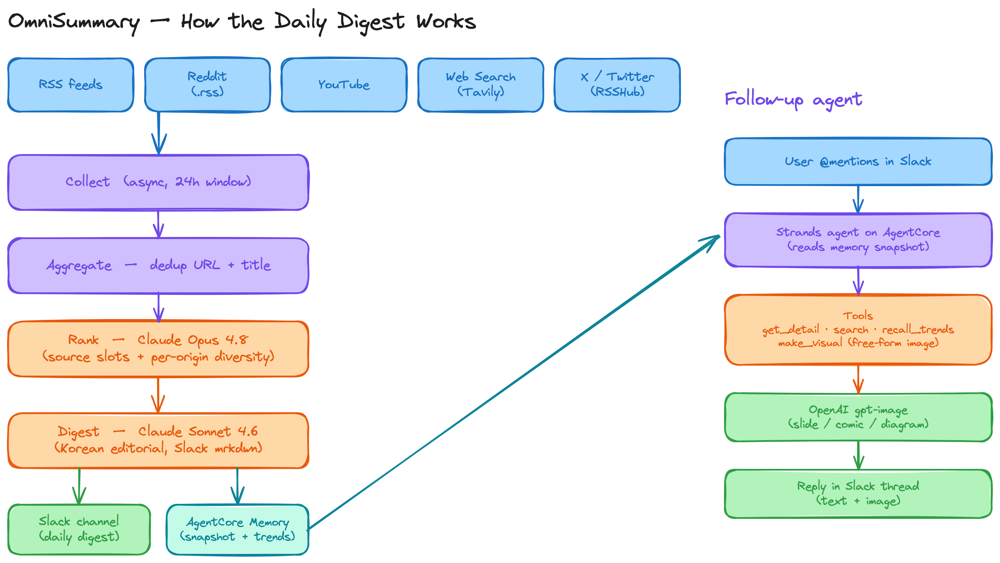
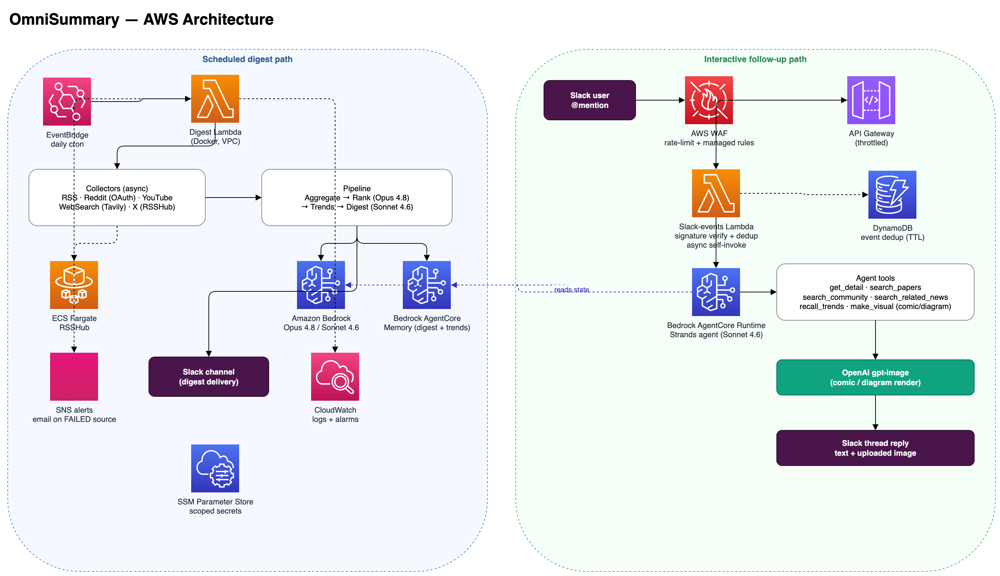

# OmniSummary — 기술 문서

> OmniSummary의 상세한 line-by-line 기술 레퍼런스를 담은 단일 문서입니다.
> 상위 수준 개요는 `README.md`와 `.claude/CLAUDE.md`에 있고, 이 문서는 심화 레퍼런스입니다.

## 1. 개요

OmniSummary는 능동형(proactive) AI/ML 일일 다이제스트 시스템입니다. 매일 정해진 스케줄에 5개 소스
계열에서 콘텐츠를 수집하고, 집계·중복 제거 후 LLM으로 순위를 매기고, 한국어 에디토리얼 다이제스트를
생성해 Slack으로 전달하며, 상태를 **Bedrock AgentCore Memory**에 저장합니다. 후속 에이전트(AgentCore
Runtime 위의 Strands)는 다이제스트 항목에 대한 질문에 답하고 시각화(만화, 다이어그램)를 생성할 수
있습니다. 운영 헬스는 소스별로 리포팅되며 SNS 이메일로 알림됩니다.

```
[EventBridge 크론] → [다이제스트 Lambda (Docker)]
   → 수집기 (RSS, Reddit, YouTube, WebSearch, X via RSSHub/S3)
   → 집계기 (URL + 제목 중복 제거)
   → 랭커 (Bedrock Claude Opus 4.8, 소스 슬롯 + origin 다양성)
   → 트렌드 트래커 (구조화 trends.json, StateStore)
   → 다이제스트 생성기 (Bedrock Claude Sonnet 4.6, 한국어 Slack mrkdwn)
   → Slack 전달
   → AgentCore Memory (다이제스트 스냅샷)
   → 데일리 비주얼 Lambda 비동기 트리거 (gpt-image-2)
   → 실패한 소스가 있으면 SNS 알림

[Slack 멘션] → [API Gateway + WAF] → [Slack Lambda]
   → 비동기 self-invoke → [Bedrock AgentCore Runtime: Strands 에이전트]
   → 도구: get_detail, search_papers, search_community, search_related_news, recall_trends, make_visual
   → AgentCore Memory에서 다이제스트 상태를 읽고, Slack에 답변/이미지를 게시
```

파이프라인 개념도(수집 → 랭킹 → 다이제스트 → 전달, 후속 에이전트 루프)
(`assets/concept-pipeline.excalidraw`,
`excalidraw-to-png assets/concept-pipeline.excalidraw assets/concept-pipeline.png --scale 2`로 렌더):



AWS 아키텍처(두 경로 — 스케줄 다이제스트 / 인터랙티브 후속) — draw.io
(`assets/architecture.drawio`,
`drawio -x -f png -s 2 -b 10 -o assets/architecture.png assets/architecture.drawio`로 렌더):



## 2. 저장소 구조

| 경로 | 책임 |
|------|------|
| `collectors/` | `BaseCollector` ABC + RSS, Reddit(.rss 피드), RSSHub(X/Twitter), YouTube, WebSearch(Tavily) |
| `pipeline/` | `ContentAggregator`, `ContentRanker`, `DigestGenerator`, `TrendTracker` |
| `agent/` | Strands 에이전트, 도구, `DigestStateManager`, `VisualGenerator`(자유형 이미지) |
| `agent_runtime/` | Bedrock AgentCore HTTP 서버(`BedrockAgentCoreApp`) |
| `shared/` | config, models, constants, utils(Bedrock 팩토리), logger, prompts, state_store, **memory**, proxy |
| `output/` | Slack 전달(텍스트 + 이미지 업로드) |
| `lambda_handlers/` | 다이제스트 핸들러, Slack 이벤트 핸들러, 일일 시각화 핸들러(`visual_handler`, 다이제스트 Lambda가 비동기 호출) |
| `infrastructure/` | CDK `foundation_stack` + `application_stack` |
| `scripts/` | `deploy.py`, `ci_synth.py`, `sync_rsshub_to_s3.py` |

## 3. 설정(Configuration)

`config/config.yaml` → `shared/config.py`의 Pydantic 모델로 `Config.load()`를 통해 로드됩니다. 시크릿은
`.env`(로컬) 또는 SSM Parameter Store의 `/{project}/{stage}/{name}` 경로(AWS)에서 옵니다.

**우선순위.** `config.yaml`의 값이 Pydantic 필드 기본값을 재정의합니다. 모델 ID는 코드에 하드코딩되어 있지
않습니다 — 예컨대 `PipelineConfig`는 `ranking_model`/`digest_model` 둘 다 Sonnet 4.6을 기본값으로 두지만,
`config.yaml`이 `ranking_model`을 Opus 4.8로 올려 잡고 있어 실제 배포에서 랭킹은 Opus 4.8로 돕니다.
아래 표기는 `config.yaml` 기준 실효값입니다.

주요 설정 그룹:
- `collectors.*` — 각각 `BaseCollectorConfig`를 상속(`enabled`, `lookback_hours`, `reference_time`,
  `request_timeout`, `max_retries`, `retry_backoff_sec`).
- `pipeline` — `top_n`, `min_score`, `ranking_model`(Opus 4.8), `digest_model`(Sonnet 4.6),
  `ranking_batch_size`(랭킹 배치 크기), `engagement_tiers`(참여도 임계값→점수 보정 구간),
  `ranking_categories`(랭킹 카테고리 라벨), `ranking_duplicate_score_penalty`(중복 항목 점수 페널티),
  `source_slots`, `source_cap_multiplier`, **`max_per_origin`**(채널/작성자/서브레딧당 상한),
  `origin_weights`, `origin_weight_default`, `origin_weight_nudge`(가산 보정 계수),
  `trend_model`, `item_text_max_tokens`, `trend_retention_days`, `trend_cooling_days`,
  `trend_max_evidence`, `trend_max_active_trends`, `trend_momentum_half_life_days`(트렌드 추적 설정).
  - 시각화 노브: `enable_daily_visual`(일일 시각화 on/off), `image_model`/`image_size`(gpt-image 모델·해상도),
    `visual_synopsis_source_max_tokens`/`visual_synopsis_context_max_tokens`(시놉시스 입력 토큰 상한),
    `visual_context_max_results`/`visual_context_preview_chars`(컨텍스트 검색 결과 수·미리보기 길이),
    `visual_synopsis_style_aesthetic`(이미지 프롬프트 기본 미감; 기본 "clean modern style").
  - 프롬프트 주입 노브(코드에 하드코딩하지 않고 템플릿 변수로 주입): `digest_language_rules`
    (다이제스트 언어 규칙 + 번역 용어집; 기본 한국어), `ranking_scoring_rubric`(점수 보정 구간 —
    `min_score`와 정합; 기본 디지스트 통과선 0.6), `ranking_target_count`(배치당 목표 통과 건수 문구),
    `ranking_audience_description`/`digest_audience_description`(랭킹·다이제스트 대상 독자),
    `visual_audience_description`(시각화 대상 독자), `visual_caption_language`/`visual_on_image_language`
    (캡션 언어 vs 이미지 내부 텍스트 언어 — 이미지 모델이 비라틴 글리프를 깨뜨리므로 분리),
    `visual_synopsis_style_guidance`/`visual_synopsis_humor_guidance`(시각화 톤/유머),
    `visual_moderation_softening_instruction`(이미지 모더레이션 차단 시 1회 완화 재시도 문구).
- `agent` — 검색/타임아웃 노브에 더해 `boto_read_timeout`/`boto_connect_timeout`/`boto_max_attempts`
  (AgentCore Bedrock 클라이언트의 boto 타임아웃·재시도; 이전엔 `agent.py`에 하드코딩).
- `aws` — region, profile, project/stage, **`timezone`**(예: `Asia/Seoul`), `digest_cron_hour/minute`,
  `api_throttle_*`, `waf_rate_limit`.

환경 변수(`.env`): `SLACK_BOT_TOKEN`, `SLACK_APP_TOKEN`, `SLACK_SIGNING_SECRET`, `SLACK_CHANNEL_ID`,
`TAVILY_API_KEY`, `YOUTUBE_API_KEY`, `OPENAI_API_KEY`, `ALERT_EMAIL`,
`CLOUDFLARE_PROXY_URL`/`CLOUDFLARE_PROXY_TOKEN`. `SLACK_SIGNING_SECRET`은 배포 시
`scripts/deploy.py`가 읽어 SSM에 적재하며, Slack 이벤트 Lambda가 서명 검증에 사용합니다. AWS에서는
`MEMORY_ID`, `ALERT_SNS_TOPIC_ARN`, `STATE_BUCKET`, `RSSHUB_BASE_URL`, `PROJECT_NAME`, `STAGE`를 CDK가
주입합니다(`RSSHUB_BASE_URL`은 `rsshub_base_url` CDK context로 재정의 가능). 로컬 개발에서는
RSSHub Docker 컨테이너가 `localhost:RSSHUB_PORT`(기본 `1200`, `shared/constants.py`)에서 동작해야 X 수집이 됩니다.

## 4. 수집기(Collectors)

모든 수집기는 `BaseCollector.collect() -> list[CollectedItem]`을 구현하고
`cutoff_datetime(lookback_hours, reference_time)`(`collectors/base.py`)로 필터링합니다.

- **RSS** (`rss.py`): `config.collectors.rss.feeds`에 대해 feedparser 사용; 메타데이터 `feed_url`, `feed_title`.
- **Reddit** (`reddit.py`): **공개 `.rss` 피드** 사용. Reddit이 셀프서비스 OAuth 앱 생성을 동결하고
  (Responsible Builder Policy, 2025-11) `.json` API는 데이터센터 IP를 차단했지만 `.rss` 피드는 열려 있음.
  `https://www.reddit.com/r/{sub}/{sort}/.rss`를 Cloudflare 프록시(`get_proxied_url`) 경유로 가져와 AWS
  Lambda IP에서도 동작. 자격증명·앱 등록 불필요. 트레이드오프: RSS엔 `score`/`num_comments`(engagement)가
  없어 랭킹은 LLM 품질 판단에 의존.
- **RSSHub** (`rsshub.py`): 로컬/컨테이너 RSSHub를 통한 X/Twitter 피드; S3에 사전 동기화된 스냅샷
  (`rsshub_items.json`)도 로드 가능. 실패/빈 계정을 자체 추적하며 `error_rate_threshold` 보유.
- **YouTube** (`youtube.py`): `YOUTUBE_API_KEY`가 있으면 YouTube Data API, 없으면 프록시 경유 RSS 폴백.
  `max_videos_per_channel=1`로 고빈도 채널이 후보 풀을 독점하지 못하게 함.
- **WebSearch** (`web_search.py`): LLM 쿼리 정제(`RefineQueryPrompt`)를 곁들인 Tavily 검색.

`gather_collector_results()`는 수집기를 동시 실행하고 작업별 예외를 삼킴(로깅만, 평탄한 리스트 반환).
헬스 리포팅용으로 `main.run_collectors_with_health()`가 동일 작업을 실행하되 `HealthReport`(§8 참조)를
반환 — `gather_collector_results`는 다른 호출자들을 위해 그대로 유지.

## 5. 파이프라인(Pipeline)

1. **집계기** (`aggregator.py`): URL → 정규화 제목 순으로 중복 제거; 중복의 메타데이터 병합.
2. **랭커** (`ranker.py`): 항목 포맷팅(engagement + origin 포함), Claude Opus 4.8로 `RankingPrompt` 호출,
   JSON 점수 파싱, `origin_weights`를 **가산 보정**으로 적용(`score + (weight-1.0)*origin_weight_nudge`를
   [0,1]로 클램프 — 곱셈 배수가 아님; 미등록 origin엔 `origin_weight_default`), `min_score` 필터,
   이후 `_apply_source_slots`:
   - `source_slots`로 소스별 기본 슬롯 채우기,
   - `source_cap_multiplier × slot`까지 오버플로 채우기,
   - **`max_per_origin`**으로 하나의 origin 키(채널/작성자/서브레딧)가 차지하는 항목 수 제한 — 단일 채널
     독점에 대한 근본 해결책. origin은 `_resolve_origin_key`로 해석(YouTube→channel_url, Reddit→subreddit,
     RSS→feed_url, X→author).
3. **트렌드 트래커** (`trend_tracker.py`): 구조화 `trends.json` 유지 — slug id, 증거 리스트, 날짜 기반
   상태(active/cooling/archived) 생명주기, momentum 감쇠 랭킹, active 캡 아카이브 (§7 참조).
4. **다이제스트 생성기** (`digest_generator.py`): Claude Sonnet 4.6로 `DigestPrompt` → 한국어 Slack mrkdwn;
   `sanitize_slack_mrkdwn`이 출력 정규화.
5. **데일리 비주얼** (`daily_visual.py`, `enable_daily_visual`): 다이제스트 전송 후, `VisualEditorPrompt`로
   스토리 1건을 고름(주로 뉴스 선호, 적합한 게 없으면 `skip`). 선택 시 Tavily로 추가 맥락 검색 →
   `VisualGenerator`(시놉시스 → gpt-image)로 1컷 밈/패러디/일러스트 또는 N컷 카툰 생성 → Slack 게시.
   완전 best-effort: OpenAI 키 없음/부적합/오류 시 조용히 건너뛰며 파이프라인을 막지 않음.

## 6. LLM 팩토리 (`shared/utils.py`)

`BedrockLanguageModelFactory.get_model(model_id, **kwargs)`는 모델 역량(`_LANGUAGE_MODEL_INFO`)에 맞게
구성된 `ChatBedrock`/`ChatBedrockConverse`를 반환합니다: thinking, 1M 컨텍스트, 성능 레이턴시, 프롬프트
캐싱. `BedrockCrossRegionModelHelper`가 가능 시 `global.`/`apac.` inference-profile ID를 해석합니다. 모델
ID는 `shared/constants.py`(`LanguageModelId`)에 열거되며, 최신은 Opus 4.8 / Sonnet 4.6입니다.

`resolve_secret(env_var, ssm_suffix)`는 env 우선, 그다음 SSM(`/{project}/{stage}/{suffix}`,
SecureString 복호화) 순으로 시크릿을 해석하는 공유 헬퍼입니다. OpenAI 키(`make_visual`)가 이를 사용합니다.

**프롬프트 캐싱.** Bedrock 프롬프트 캐싱은 Claude 기준 캐시 가능 프리픽스 최소치가 ~1024 토큰입니다.
효과가 있는 곳에만 적용했습니다: 후속 **에이전트**는 ~1.7K 토큰 시스템 프롬프트 + 도구 스키마가 매 ReAct
스텝마다, 그리고 멀티턴 세션 내내 재전송되므로 Strands `BedrockModel(cache_config=
CacheConfig(strategy="auto"))`(`agent/agent.py`)로 해당 프리픽스를 캐싱합니다(검증: 첫 호출에
`cacheWriteInputTokens`, 이후 `cacheReadInputTokens` 발생). 단발성 파이프라인 프롬프트(랭커/다이제스트/트렌드/
시각화 시놉시스, 모두 ≤~530 토큰이며 실행당 1회 호출)는 캐시 최소치 미만이고 호출 간 재사용도 없어
의도적으로 캐싱을 적용하지 않았습니다.

## 7. 메모리: 두 개의 분리된 저장소

트렌드 기억과 다이제스트 스냅샷은 **성격이 달라 서로 다른 저장소**에 둡니다.

**(a) 트렌드 — 구조화 `trends.json` (`StateStore`, 시스템 오브 레코드)**
`pipeline/trend_tracker.py`의 `TrendTracker`가 관리. LLM(`TrendClassifyPrompt`)은 오늘 아이템이 기존
트렌드(id) 확장인지 신규인지 **분류만** 하고, 부기는 전부 결정론적 Python이 담당합니다:
- 증거 날짜는 **코드가 스탬프**(LLM 아님), 상태(active/cooling/archived)는 `last_seen` vs
  `trend_cooling_days`/`trend_retention_days`로 계산, momentum은 recency 감쇠(`0.5^(age/half_life)`,
  `trend_momentum_half_life_days` 기본 7일), 트렌드당 증거 `trend_max_evidence` 캡, active 트렌드 수
  `trend_max_active_trends` 캡(최저 momentum 아카이브), 동일 날짜 재실행은 멱등(그날 증거 교체).
- `trends.json`(`TrendMemory`)이 진실의 원천이고 마크다운은 렌더된 뷰. 첫 실행 시 레거시 `trends.md`가
  있으면 `from_markdown`으로 1회 마이그레이션. 다이제스트 생성 시 active/cooling 트렌드를 momentum 순
  마크다운으로 렌더해 `DigestPrompt`에 주입.

**(b) 다이제스트 스냅샷 — AgentCore Memory (`shared/memory.py`)**
- **`AgentCoreMemoryStore`**: 오늘의 ranked 아이템 스냅샷을 단기 세션 이벤트로 기록(`create_event`,
  세션 `digest-<date>`, `_fit_to_limit`로 100k 한도 보장); `get_latest_digest()`가 최신 세션을 읽음.
  후속 에이전트(`get_detail`)와 데일리 비주얼 Lambda가 cross-Lambda로 이 스냅샷을 공유하는 수단입니다.
  **시맨틱 recall/장기 전략은 제거**됨(관리형 추출이 트렌드 흐름이 아닌 안정적 사용자-사실만 뽑아 부적합).
- **`LocalMemoryStore`**: 오프라인 폴백(`digest_*.json`만).

`recall_trends` 도구는 AgentCore가 아니라 **`trends.json`을 직접 쿼리**(키워드 매칭 + momentum 정렬,
`TrendMemory.search`)합니다. 메모리 리소스(`AWS::BedrockAgentCore::Memory`)는 이제 이벤트 전용(단기,
`event_expiry_duration` 90일)이며 시맨틱 전략/`RetrieveMemoryRecords` 권한은 없습니다.

## 8. 헬스 체크 & 알림

`shared/models.py`: `SourceStatus`(`ok`/`empty`/`failed`), `SourceHealth(name, item_count, status, detail)`,
`HealthReport(sources)`(`has_failures`, `summary()` 보유). `run_collectors_with_health`가 각 소스를 분류:
예외 → FAILED(잘린 detail 포함), 0 항목 → EMPTY(조용한 날엔 정상), 그 외 → OK. 다이제스트 Lambda에서
`_maybe_alert`가 소스가 FAILED일 때만, 그리고 빈 항목 조기 반환 이전에 `ALERT_SNS_TOPIC_ARN`으로
게시(아무것도 수집 못 해도 장애는 알림되도록).

## 9. 에이전트(AgentCore Runtime 위의 Strands)

`agent/agent.py`는 `BedrockModel`(Sonnet 4.6)과 도구로 Strands `Agent`를 구성합니다. SYSTEM_PROMPT는
**자율 에이전트** 철학을 따릅니다 — 고정 라우팅 없이 작은 단일 목적 도구들을 자유롭게 조합하도록 안내하고,
Slack mrkdwn 포맷 규칙과 응답 템플릿을 포함합니다.

도구(`agent/agent_tools.py`) — 모두 독립적이며 에이전트가 자유롭게 조합:
- `get_detail(item_number)` — `state_manager`에서 항목 본문 + 랭킹 메타데이터 로드.
- `search_papers(query)` — Semantic Scholar(429 시 retry/backoff).
- `search_community(query)` / `search_related_news(query)` — 공유 `_tavily_search(query, topic,
  include_domains)` 헬퍼를 감싼 얇은 래퍼.
- `recall_trends(query)` — 구조화 `trends.json`에 대한 키워드 매칭 + momentum 정렬(active/cooling 트렌드).
  시맨틱 recall이나 AgentCore 장기 메모리가 아님.
- `make_visual(instruction, item_number, context)` — 자유형 이미지 생성, §10 참조.

전형적 조합 예: "1번을 1페이지 슬라이드로" → `get_detail`(+필요시 `search_papers`/`search_related_news`로
보강) → `make_visual(instruction="...설명하는 1페이지 프리젠테이션 슬라이드...", item_number=1,
context=<수집한 리서치>)`. 고정 워크플로가 아니라 에이전트가 매번 계획을 세웁니다.

`agent_runtime/app.py`(`BedrockAgentCoreApp`): invoke 시 correlation id 설정, Memory에서 최신 다이제스트
상태 로드, `delivery_context`(미디어 도구용 채널/스레드) 설정, 에이전트 실행, Slack에 답변 게시. Slack
이벤트 Lambda(`slack_event_handler.py`)는 Slack 서명을 검증(HMAC, 타이밍 안전)하고 DynamoDB 조건부
쓰기로 중복 제거하며 비동기 self-invoke로 AgentCore 런타임을 호출합니다.

## 10. 시각화 파이프라인(자유형 시놉시스 → 이미지)

`agent/visuals.py`의 `VisualGenerator`는 **모드 없는 자유형** 생성기입니다. 고정된 comic/diagram 모드나
컷 수 파라미터가 없습니다 — 에이전트가 자연어 `instruction`으로 원하는 형식(1페이지 프리젠테이션 슬라이드,
N컷 만화, 개념 다이어그램, 인포그래픽, 포스터 등)을 묘사하고, source(다이제스트 항목)와 직접 수집한
`context`(논문/기사 리서치)를 넘깁니다.

`VisualGenerator.generate(instruction, source, context)`: `VisualSynopsisPrompt`로 Claude(Bedrock)가 단일
이미지 브리프(JSON: title·caption·prompt)를 생성 → `_parse_brief`(`extract_json_from_llm_output` +
`VisualBrief.model_validate`) → 브리프의 `prompt`로 **OpenAI
`gpt-image-2`**(1024x1536 portrait by default, `b64_json`) → PNG 바이트. `make_visual` 도구가
`output.slack_handler.send_image_to_slack`(`files_upload_v2`)로 **Slack에 이미지 업로드**. OpenAI 키
(`resolve_secret`로 env→SSM 해석)가 없으면 우아하게 비활성화. 새 출력 형식은 코드 변경 없이 instruction
문구만 바꾸면 됩니다(에이전틱).

## 11. 인프라(CDK)

**`foundation_stack`**: VPC, ECR 리포, DynamoDB 중복 제거 테이블(SSE + prod에서 PITR), S3 상태 버킷
(CDK 생성 시 S3-managed 암호화, 버저닝, 퍼블릭 차단, SSL 강제), ECS Fargate RSSHub 서비스 +
service-discovery, CodeBuild 이미지 빌드, SNS 알림 토픽(+ 선택적 이메일 구독), AgentCore **Memory** 리소스
+ 실행 역할, IAM 역할들. IAM은 최소 권한: `/{project}/{stage}/*`로 스코프된 `ssm:GetParameter*`,
foundation-model/inference-profile ARN으로 스코프된 `bedrock:InvokeModel*`, 스코프된 `lambda:InvokeFunction`
및 `bedrock-agentcore:InvokeAgentRuntime`/Memory 데이터플레인 액션, 프로젝트 로그 그룹 ARN으로 스코프된
CloudWatch Logs — 계정 전역 관리형 정책 없음.

**`application_stack`**: 다이제스트 Lambda(DockerImage), Slack 이벤트 Lambda, API Gateway(+ 스테이지
스로틀링), 스테이지에 연결된 **WAFv2 WebACL**(rate-limit + AWS 관리형 규칙셋: Common, KnownBadInputs,
IpReputation), EventBridge 일일 크론(설정 기반 시/분), AgentCore Runtime(설정 가능한
`agentcore_image_ref`로 이미지 바인딩), 시크릿용 SSM 파라미터, SNS로 향하는 CloudWatch 알람(Lambda 에러
×2, API 5xx). 시크릿은 평문 `String` SSM 파라미터입니다(CloudFormation은 SecureString 생성 불가) —
보완 통제는 스코프된 IAM 읽기 정책이며, 더 민감한 자격증명은 Secrets Manager로 승격 권장.

## 12. 관측성(Observability)

`shared/logger.py`: AWS에서는 구조화 JSON 로그(`is_running_in_aws()`), 로컬에서는 사람이 읽는 형식;
`ContextVar` 기반 correlation id(`set_correlation_id`/`get_correlation_id`)가 모든 레코드에 주입되고 Lambda
요청 id / AgentCore 페이로드에서 시드됩니다. CloudWatch 알람은 SNS 알림 토픽으로 라우팅됩니다.

## 13. 테스트 & CI/CD

`tests/`(pytest, `asyncio_mode=auto`): 수집기(모킹한 HTTP/feedparser), Slack 이벤트 핸들러(서명 검증/중복 제거),
집계기, 랭커 파싱 + 슬롯/origin-cap
로직, 헬스 리포트, logger, 메모리 스토어(로컬 + AgentCore 모킹), 다이제스트 핸들러 알림, 에이전트 도구,
visuals, AgentCore 엔트리포인트(`agent_runtime/app.py` — 상태 로드·Slack 토큰 env/SSM 해석·invoke
해피패스/예외 처리·correlation ID), trend_tracker(trim/evidence-cap/archived-merge), 그리고 CDK
assertion(`aws-cdk.assertions`로 두 스택 검증). 300+ 테스트, 커버리지 게이트 55%.

`.github/workflows/ci.yml`: lint(ruff), 포맷 체크(black `--check`), mypy 타입 체크, 테스트 + 커버리지 게이트,
오프라인 `cdk synth`(`scripts/ci_synth.py`, 더미 계정 — AWS 자격증명 불필요), Docker 빌드(amd64,
`--provenance=false`).

## 14. 주요 명령어

```bash
uv run python main.py --dry-run --sources rss reddit   # 부분 dry run
uv run python main.py                                   # 전체 파이프라인 + Slack
uv run python -m pytest tests/ -v                       # 테스트
uv run black --check . && uv run ruff check .           # lint/format
uv run mypy shared/ collectors/ pipeline/ agent/ output/ lambda_handlers/ main.py
uv run python scripts/ci_synth.py                       # 오프라인 CDK synth
# 프로파일은 config.aws.profile에서 오며, 환경 변수로 재정의할 수 있다 (기본값 research)
AWS_PROFILE=${AWS_PROFILE:-research} uv run cdk deploy --all -a "uv run python scripts/deploy.py"
```
