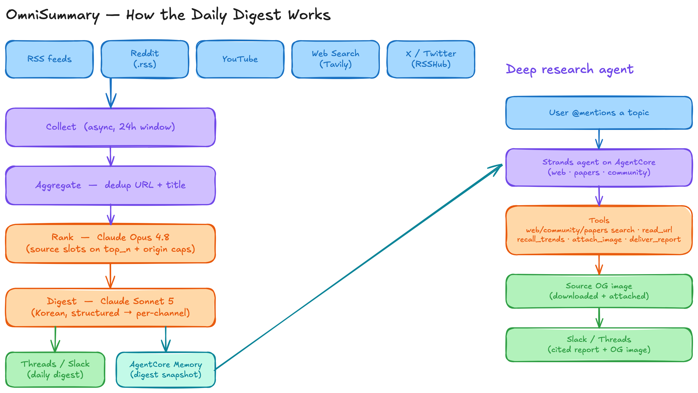
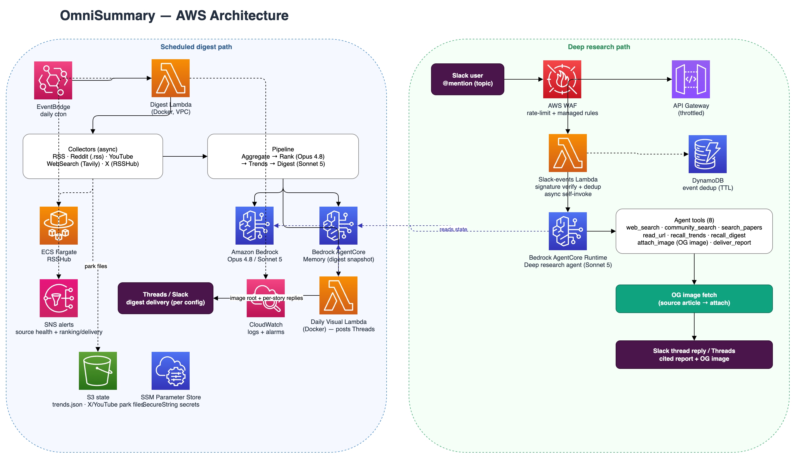

# OmniSummary — 설계 문서

> OmniSummary의 설계와 구현을 줄 단위까지 설명하는 단일 레퍼런스다. 상위 수준 개요는 `README.md`,
> 개발 규칙은 `.claude/CLAUDE.md`에 있고, "왜 이런 모양인가"에 대한 답은 여기에 있다.
>
> 읽는 방식에 대한 안내가 하나 필요하다. 이 코드베이스에는 실제로 무언가가 잘못된 뒤에 생긴 결정이 많고,
> 그런 대목은 무엇이 깨졌는지까지 함께 적어두었다. 배경 없이 코드만 보면 불필요하게 복잡해 보이고,
> 그러면 다음 사람이 선의로 되돌려놓는다.

## 목차

| 절 | 내용 |
|----|------|
| [1. 개요](#1-개요) | 두 개의 실행 경로와 전체 흐름 |
| [2. 저장소 구조](#2-저장소-구조) | 디렉터리별 책임 |
| [3. 설정](#3-설정) | `config.yaml` 전체 필드와 시크릿 |
| [4. 수집기](#4-수집기) | 다섯 소스, S3 park 파일, 실패 신호 |
| [5. 파이프라인](#5-파이프라인) | 집계에서 랭킹, 다이제스트, 렌더링, 비주얼, Threads까지 |
| [6. LLM 팩토리](#6-llm-팩토리-sharedutilspy) | 모델 구성, 비용 귀속, 토큰 카운트, 프롬프트 캐싱 |
| [7. 메모리](#7-메모리-세-개의-분리된-저장소) | 트렌드, 다이제스트 스냅샷, cross-day dedup |
| [8. 헬스 체크와 알림](#8-헬스-체크와-알림) | 소스 분류, SNS 알림, 메트릭 |
| [9. 딥 리서치 에이전트](#9-딥-리서치-에이전트) | Strands 에이전트, 도구 8개, 채널 인지 전달 |
| [10. 시각화 생성기](#10-시각화-생성기) | 자유형 시놉시스에서 이미지까지 |
| [11. 인프라](#11-인프라cdk) | CDK 두 스택 |
| [12. 관측성](#12-관측성) | 로깅과 알람 |
| [13. 테스트와 CI/CD](#13-테스트와-cicd) | 게이트, 그리고 그 게이트가 잡는 것 |
| [14. 주요 명령어](#14-주요-명령어) | 로컬과 배포 커맨드 |

## 1. 개요

OmniSummary는 능동형(proactive) AI/ML 일일 다이제스트 시스템이다. 사용자가 물어봐야 답하는 도구가 아니라
매일 정해진 시각에 스스로 읽을 거리를 만들어 보내는 쪽이다. 그래서 설계의 상당 부분이 아무도 보고 있지 않을
때 조용히 실패하지 않는 일에 쓰여 있다.

시스템에는 서로 독립적인 두 개의 실행 경로가 있다.

**첫째는 스케줄 다이제스트다.** EventBridge 크론이 다이제스트 Lambda를 깨우면 다섯 계열의 소스에서 콘텐츠를
수집해 중복을 제거하고, LLM으로 순위를 매긴 다음 한국어 에디토리얼 다이제스트를 구조화된 `DigestContent`로
생성한다. 그 콘텐츠를 채널별 렌더러가 각 채널의 포맷으로 바꿔 전달한다. 상태는 Bedrock AgentCore Memory에
저장하고, 소스별 헬스는 SNS 이메일로 보고한다.

여기서 비직관적인 지점이 하나 있다. Slack은 다이제스트 Lambda가 게시하지만 **Threads는 데일리 비주얼
Lambda가** 게시한다. Threads 게시물은 이미지 루트와 답글 체인이 한 세트로 나가야 하니, 이미지를 만든 쪽이
텍스트까지 함께 보내는 것 말고는 온전한 방법이 없다.

**둘째는 Slack 트리거 딥 리서치다.** Slack 멘션이 API Gateway로 들어오면 서명을 검증하고 중복을 걸러낸 뒤
AgentCore Runtime 위의 Strands 에이전트를 호출한다. 에이전트는 자유형 토픽을 받아 웹과 논문과 커뮤니티를
스스로 조사하고, 한국어로 합성한 출처 표기 리포트를 채널에 전달한다. 다이제스트와 완전히 분리된 독립 웹
리서치라서, 다이제스트가 다룬 항목에 묶이지 않는다.

```
[EventBridge 크론] → [다이제스트 Lambda (Docker)]
   → 수집기 (RSS, Reddit, YouTube, WebSearch, X via RSSHub/S3)
   → 집계기 (URL + 제목 중복 제거)
   → 랭커 (Bedrock Claude Opus 4.8, 소스 슬롯 + origin 다양성)
   → 트렌드 트래커 (구조화 trends.json, StateStore)
   → 다이제스트 생성기 (Bedrock Claude Sonnet 5, 한국어 구조화 DigestContent)
   → 채널별 렌더링 → Slack(Block Kit) 전달 (enable_slack_post)
   → AgentCore Memory (다이제스트 스냅샷)
   → 데일리 비주얼 Lambda 비동기 트리거 (gpt-image-2)
        └→ 이 Lambda가 이미지와 함께 Threads(root + reply chain)를 게시 (enable_threads_post)
   → FAILED 또는 STALE 소스가 있으면 SNS 알림

[Slack 멘션] → [API Gateway + WAF] → [Slack 이벤트 Lambda]
   → 서명 검증 → DynamoDB 중복 제거 → 즉시 ack 게시 → 비동기 self-invoke
   → [Bedrock AgentCore Runtime: Strands 딥 리서치 에이전트]
   → 도구: web_search, community_search, search_papers, read_url, recall_trends, recall_digest,
     attach_image, deliver_report
   → 다중 소스 리서치 후 채널별(Slack Block Kit / Threads) 리포트를 deliver_report로 게시
```

파이프라인 개념도(수집에서 랭킹, 다이제스트, 전달까지):



AWS 아키텍처(스케줄 다이제스트와 Slack 트리거 딥 리서치, 두 경로):



## 2. 저장소 구조

| 경로 | 책임 |
|------|------|
| `collectors/` | `BaseCollector` ABC와 공유 `load_items_from_s3`(로컬에서 S3로 올린 park 파일 로더), 그리고 RSS, Reddit(`.rss` 피드), RSSHub(X/Twitter), YouTube, WebSearch(Tavily) 구현 |
| `pipeline/` | `ContentAggregator`, `ContentRanker`, `DigestGenerator`, `TrendTracker`, `DailyVisualMaker` |
| `agent/` | 딥 리서치 Strands 에이전트(`research_agent.py`)와 도구 8개(`research_tools.py`), 다이제스트·비주얼 파이프라인용 인메모리 상태 `DigestStateManager`(`tool_state.py`), 데일리 비주얼이 쓰는 자유형 이미지 생성기 `VisualGenerator`(`visuals.py`) |
| `agent_runtime/` | Bedrock AgentCore HTTP 서버(`BedrockAgentCoreApp`). 딥 리서치 에이전트의 invoke 엔트리포인트 |
| `shared/` | config(공유 `KOREAN_STYLE_RULES` 포함), models, constants(`TRENDS_KEY` 포함), utils(Bedrock 팩토리), logger, prompts, state_store, memory, history_store(cross-day dedup 원장과 롤링 로그), research(`research_backends.py`, Tavily와 Semantic Scholar), media(`og_image.py`, OG 이미지 fetch), proxy |
| `output/` | 채널별 렌더러(`renderers.py`), 리서치 전달 오케스트레이션(`delivery.py`), Slack 전달(`slack_handler.py`), Threads 전달(`threads_handler.py`) |
| `lambda_handlers/` | 다이제스트 핸들러, Slack 이벤트 핸들러, 데일리 비주얼 핸들러(`visual_handler`, 다이제스트 Lambda가 비동기로 호출한다), Threads 토큰 갱신 핸들러(`threads_refresh_handler`) |
| `infrastructure/` | CDK `foundation_stack`과 `application_stack` |
| `scripts/` | `deploy.py`, `put_secrets.py`, `put_inference_profiles.py`, `ci_synth.py`, `sync_rsshub_to_s3.py`, `sync_youtube_to_s3.py`, `sync_all_to_s3.sh`(두 sync를 함께 실행한다) |

## 3. 설정

설정은 `config/config.yaml`에서 출발해 `shared/config.py`의 Pydantic 모델로 `Config.load()`를 통해 로드된다.
시크릿은 로컬에서는 `.env`, AWS에서는 SSM Parameter Store의 `/{project}/{stage}/{name}` 경로에서 온다.

`config/config.yaml`은 gitignore 대상이고 **`config/config-template.yaml`만 추적된다.** 그래서 CI synth와
인프라 테스트는 이 템플릿을 로드한다. 예전에는 그냥 `Config.load()`를 불렀는데, CI에는 `config.yaml`이
없으니 조용히 코드 기본값으로 떨어져 아무도 배포하지 않는 스택을 synth하고 있었다. 아무것도 증명하지 못하는
테스트였다.

값의 우선순위는 `config.yaml`이 Pydantic 필드 기본값을 재정의하는 쪽이다. 모델 ID는 코드에 하드코딩되어 있지
않다. 예컨대 `PipelineConfig`는 `ranking_model`과 `digest_model` 둘 다 Sonnet 5를 기본값으로 두지만
`config.yaml`이 `ranking_model`을 Opus 4.8로 올려 잡고 있어서, 실제 배포에서 랭킹은 Opus 4.8로 돈다. 아래
표기는 모두 `config.yaml` 기준 실효값이다.

`Config.load()`는 호출마다 YAML을 다시 읽고 전체를 재검증한다. 리서치 한 번을 실행하면 도구 호출마다 이
작업이 반복됐다. 그래서 값을 읽기만 하는 리프 호출자는 `lru_cache(maxsize=1)`로 감싼 `get_config()`를 쓴다
(`output/delivery.py`, `shared/research/research_backends.py`, `agent/research_tools.py`,
`shared/media/og_image.py`). 반면 Config를 변경하는 쪽은 자기 인스턴스가 필요하니 계속
`Config.load()`나 `from_yaml`을 쓴다. `main`과 핸들러의 `set_reference_time`, `ci_synth`의 `vpc_id`, 인프라
테스트의 버킷 오버라이드가 여기 해당한다. 테스트에서는 conftest의 autouse 픽스처가 매 테스트 전후로 캐시를
비운다.

### 3.1 `collectors.*`

각 수집기는 `BaseCollectorConfig`를 상속하고 그 위에 자기 필드를 더한다.

| 그룹 | 필드 | 설명 |
|------|------|------|
| 공통(상속) | `enabled`, `lookback_hours`, `reference_time`, `request_timeout`, `max_retries`, `retry_backoff_sec`, `park_max_age_hours`(기본 36), `error_rate_threshold`(기본 50.0) | 활성화 여부, 조회 윈도, 타임아웃, 재시도, S3 park 파일의 나이 예산(초과하면 항목은 쓰되 헬스를 STALE로 보고한다), 입력(피드·계정·채널·쿼리) 실패율 임계(넘으면 소스를 DEGRADED로 보고만 하고 항목은 그대로 전달한다) |
| `rss` | `feeds`, `max_concurrency`(기본 5) | RSS 피드 URL 목록과 동시 fetch 상한 |
| `reddit` | `subreddits`, `sort`, `limit` | 서브레딧, 정렬, 개수 |
| `youtube` | `channels`, `max_videos_per_channel`, `resolve_timeout`, `transcript_timeout`, `transcript_language` | 채널, 영상 수, 자막 관련 설정 |
| `web_search` | `trend_searches`, `max_results_per_query`, `max_refine_queries`, `min_search_score`, `refine_model` | Tavily 검색과 관련도 필터 |
| `rsshub` | `base_url`, `accounts`, `max_concurrency` | X 계정(로컬 컨테이너 또는 S3)과 동시 fetch 상한 |

`error_rate_threshold`는 RSSHub 전용이 아니라 `BaseCollectorConfig`의 공통 노브다. 같은 뜻의 숫자를 두 벌
만들지 않으려는 것이고, RSS와 YouTube와 web_search도 같은 임계로 DEGRADED를 보고한다.

`collectors.alert_on_empty`(기본 `[]`)는 EMPTY가 사건인 소스의 이름 목록이다(예: `["rss", "web_search"]`).
목록이 필요한 이유는 이렇다. 어두워진 소스는 예외도 남기지 않고 stale park 파일도 남기지 않고 실패율도
남기지 않아서 다른 어떤 신호에도 걸리지 않는다. 그렇다고 빈 소스면 무조건 알리게 두면 reddit이나 X처럼
조용한 날이 정상인 소스가 매일 페이징하고, 그러면 사람은 곧 알림을 무시한다. 그래서 명시적 opt-in 목록으로
두었고, 비어 있으면 EMPTY로는 절대 알리지 않는다.

### 3.2 `pipeline`

| 영역 | 필드 | 설명 |
|------|------|------|
| 모델 | `ranking_model`(실효 Opus 4.8), `digest_model`(Sonnet 5), `trend_model` | 단계별 모델 |
| 랭킹 | `ranking_batch_size`, `ranking_batch_token_budget_ratio`(기본 0.7), `ranking_context_window_fallback`(기본 200000), `ranking_max_concurrency`(기본 4), `ranking_max_retries`(기본 3), `ranking_retry_backoff_sec`(기본 5), `ranking_min_coverage_ratio`(기본 0.9), `engagement_tiers`, `ranking_categories`, `ranking_duplicate_score_penalty`, `ranking_scoring_rubric`, `item_text_max_tokens` | 병렬 배치, 배치가 채울 수 있는 컨텍스트 창 비율과 미등록 모델의 대체 창 크기, Bedrock fan-out 상한, 배치 재시도, 커버리지 재질의 기준, 참여도 보정, 카테고리, 점수 루브릭 |
| 선정과 다양성 | `top_n`, `min_score`, `source_slot_score_grace`(기본 0.1), `source_slots`, `source_cap_multiplier`, `max_per_origin`, `origin_weights`, `origin_weight_default`, `origin_weight_nudge` | 상위 N, 소스 슬롯, grace 밴드(슬롯 보유 소스가 `min_score` 위 항목이 전무하면 grace 밴드 안의 최선 1건을 구제한다), origin 상한, 가산 보정 |
| 다이제스트 버퍼와 중복 | `digest_candidate_buffer`(기본 3), `published_url_ttl_days`(기본 6), `recent_leads_window`(기본 5) | 랭커 오버선정 버퍼(소스 슬롯은 `top_n` 코어에만 적용하고 버퍼분은 `backfill` 플래그로 넘겨 병합 보충용임을 항목별로 알린다), cross-day dedup 원장 TTL, 반복 방지용 최근 lead 윈도 |
| 트렌드 | `trend_retention_days`, `trend_cooling_days`, `trend_max_evidence`, `trend_max_active_trends`, `trend_momentum_half_life_days` | 보존과 냉각 기간, 증거와 active 캡, momentum 반감기 |
| 전달 | `enable_slack_post`, `enable_threads_post` | 채널별 전달 on/off. 각각 독립 토글이고 코드 기본값은 Slack on / Threads off이며, 실제 상태는 배포 환경 설정을 따른다. Slack은 다이제스트 Lambda가, Threads는 데일리 비주얼 Lambda가 게시한다 |
| AGI 카운트다운 | `agi_countdown_date`(기본 `2029-01-01`), `agi_countdown_template`, `agi_countdown_after`, `agi_countdown_position`(`prefix`\|`suffix`, 코드 기본값과 배포 설정 모두 `prefix`) | 다이제스트 lead에 코드가 붙이는 "AGI N일 전" 인트로와, lead의 어느 쪽 끝에 붙일지([§5.7](#57-agi-카운트다운-인트로-sharedformattingpy-agi_countdown_intro) 참조) |
| 시각화 | `enable_daily_visual`, `image_model`, `image_sizes`, `visual_format_window`(기본 6), `visual_synopsis_source_max_tokens`, `visual_synopsis_context_max_tokens`, `visual_caption_emoji`, `visual_image_timeout_sec`(기본 300)과 `visual_image_max_retries`(기본 0), `visual_multi_panel_target_ratio`(기본 0.34), `visual_character_enabled`, `visual_character_sheet`, `visual_character_target_ratio` | 데일리 비주얼 on/off, gpt-image 모델, orientation에서 size로 가는 딕셔너리(키는 `VisualOrientation` 어휘로 고정이고 값만 튜닝한다), 포맷 변주 추적 윈도(orientation과 style), 입력 상한, 캡션 이모지, gpt-image HTTP 호출 상한. SDK 기본값 600초씩 2회는 비주얼 Lambda의 15분 예산을 넘길 수 있어서 config로 고정했다 |
| 프롬프트 주입 | `digest_language_rules`, `digest_voice_guidance`, `ranking_audience_description`, `digest_audience_description`, `visual_audience_description`, `visual_caption_language`, `visual_on_image_language`, `visual_synopsis_style_guidance`, `visual_synopsis_humor_guidance`, `visual_synopsis_style_aesthetic`, `visual_moderation_softening_instruction` | 언어 규칙과 대상 독자, 톤과 유머, 미감, 모더레이션 완화 문구. 하드코딩 대신 템플릿 변수로 주입한다. `digest_language_rules`는 한국어 규칙과 번역 용어집을 튜닝하는 자리이고 언어 스위치가 아니다. 프롬프트 자체가 한국어를 요구하고 트렌드 트래커도 한국어 재등장 문구를 주입하니, 이 값만 바꿔서 다른 언어로 갈 수는 없다. 한국어 전용이 의도한 제품이다. `digest_voice_guidance`는 Gruber 톤이며, 단일 냉소 프레임으로 기본 고정하지 말고 그날 사실이 정당화할 때만 각을 세우도록 쓰여 있다 |

캡션 언어와 이미지 내부 텍스트 언어를 `visual_caption_language`와 `visual_on_image_language`로 나눈 이유는
이미지 모델이 비라틴 글리프를 깨뜨리기 때문이다. 캡션은 한국어, 이미지 안에 들어가는 글자는 영어다.

### 3.3 `agent`

딥 리서치 에이전트 설정이다. 이 절의 값은 두 종류로 나뉘고 그 구분이 중요하다. `research_*`와 `og_image_*`의
소프트 노브는 강제되는 루프 한계가 아니라 에이전트가 가이던스로 따르도록 시스템 프롬프트에 보간되는 값이다
(그래도 이 값을 바꾸면 실제 동작은 바뀐다). 반면 `research_max_threads_posts`, `research_content_cap_chars`,
`research_max_staged_images`는 코드가 강제하는 하드 캡이다.

| 필드 | 설명 |
|------|------|
| `model_id` | 에이전트 모델(기본 Sonnet 5) |
| `research_breadth`, `research_max_iterations` | 프롬프트에 주입되는 검색 폭(쿼리 수)과 깊이(라운드 수) 가이던스 |
| `research_slack_target_words` | Slack 리포트의 목표 분량(단어) 가이던스 |
| `research_max_threads_posts` | Threads 게시물(root와 reply) 총수 하드 캡(기본 6). 너무 긴 리포트가 공개 게시물 수십 개로 퍼지지 않게 코드가 트림한다 |
| `research_content_cap_chars` | `read_url` 한 페이지의 추출 텍스트 상한(기본 50000) |
| `research_max_staged_images` | 한 리서치 실행이 stage할 수 있는 OG 이미지 수 캡(기본 4, invoke당 메모리 bound) |
| `og_image_timeout_sec`, `og_image_max_bytes` | OG 이미지 fetch 타임아웃과 최대 바이트(스트리밍 중 초과하면 중단한다) |
| `community_search_domains` | `community_search`의 도메인 허용 목록(reddit, x, HN, substack 등) |
| `search_result_limit`, `search_content_preview_chars`, `search_request_timeout`, `search_max_retries`, `search_retry_backoff_sec` | 검색 결과 수, 미리보기, 타임아웃, 재시도 |
| `search_paper_max_authors`, `search_paper_abstract_max_chars` | Semantic Scholar 결과 포맷 |
| `recall_memory_top_k` | `recall_trends`가 반환할 상위 K 트렌드 |
| `boto_read_timeout`, `boto_connect_timeout`, `boto_max_attempts` | AgentCore Bedrock 클라이언트의 boto 설정 |

### 3.4 `aws`

| 필드 | 설명 |
|------|------|
| `region`, `bedrock_region`, `profile`, `project_name`, `stage` | 리전, 프로파일, 프로젝트와 스테이지 |
| `timezone` | 다이제스트 날짜의 기준 TZ(예: `Asia/Seoul`) |
| `digest_cron_hour` / `digest_cron_minute` | EventBridge 크론(UTC 기준) |
| `threads_token_refresh_days` | Threads 장기 토큰(60일 만료)의 갱신 주기(기본 50일, 59 이하) |
| `rsshub_desired_count` | RSSHub Fargate 서비스의 태스크 수(기본 0, [§11](#foundation_stack) 참조) |
| `vpc_id`, `subnet_ids`, `state_bucket_name`, `s3_prefix` | 네트워킹과 상태 버킷 |
| `api_throttle_rate_limit` / `api_throttle_burst_limit`, `waf_rate_limit` | API Gateway 스로틀과 WAF 레이트리밋 |

### 3.5 시크릿과 환경 변수

| 변수 | 출처 | 용도 |
|------|------|------|
| `SLACK_BOT_TOKEN` | `.env` → SSM | Slack 메시지와 이미지 전송 |
| `SLACK_SIGNING_SECRET` | `.env` → SSM | Slack 이벤트 서명 검증 |
| `SLACK_CHANNEL_ID` | `.env` → SSM | 다이제스트와 비주얼의 대상 채널 |
| `TAVILY_API_KEY` | `.env` → SSM | 웹, 커뮤니티, 뉴스 검색 (아래 단서 참고) |
| `OPENAI_API_KEY` | `.env` → SSM | gpt-image 이미지 생성 |
| `THREADS_ACCESS_TOKEN` | `.env` → SSM | Threads 게시. 장기 토큰이며 50일 주기로 자동 갱신한 뒤 SSM에 재기록한다 |
| `THREADS_USER_ID` | `.env` → SSM | Threads 게시 대상 사용자 ID |
| `YOUTUBE_API_KEY` | `.env` → SSM | YouTube Data API |
| `ALERT_EMAIL` | `.env` → 배포 시 SNS 구독 | 소스 실패 알림 |
| `CLOUDFLARE_PROXY_URL` / `CLOUDFLARE_PROXY_TOKEN` | `.env` | Reddit과 YouTube 프록시(데이터센터 IP 우회) |
| `MEMORY_ID`, `STATE_BUCKET`, `S3_PREFIX`, `ALERT_SNS_TOPIC_ARN`, `RSSHUB_BASE_URL`, `PROJECT_NAME`, `STAGE` | CDK 주입(AWS) | 런타임 리소스 식별자 |

`TAVILY_API_KEY`에는 단서가 하나 붙는다. web_search 수집기만 이 키를 `resolve_secret(strict=True)`로
해석한다. SSM 읽기가 실패한 것(거부나 스로틀)과 키가 아예 없는 것은 반드시 구분되어야 하는데, 예전에는 둘 다
`[]`로 떨어져서 그날 웹 소스 전체가 경고 한 줄과 함께 사라졌다. 지금은 읽기 실패면 raise하고 헬스가 FAILED가
되어 알림으로 이어진다. 파라미터가 정말 없을 때만 `""`로 조용히 스킵한다. `shared/research` 백엔드와 에이전트
경로는 기존의 빈 문자열 degrade 계약을 그대로 유지한다.

Cloudflare 워커 쪽 토큰은 `wrangler secret put PROXY_TOKEN`으로 넣는다. `wrangler.toml`의 `[vars]`는 평문으로
버전 관리에 들어가니 거기에 토큰을 두지 않는다.

**`.env`의 시크릿은 CDK 스택을 통과하지 않는다.** CloudFormation 템플릿은 SecureString을 담을 수 없어서, 값을
스택에 넘기면 `cdk.out/*.template.json`과 CDK 스테이징 버킷, `cloudformation:GetTemplate` 응답에 평문으로
남는다. 실제로 Slack 봇 토큰과 Tavily·OpenAI·YouTube 키, Threads 토큰, X 세션 쿠키가 그렇게 남아 있었다.

그래서 스택은 파라미터 경로만 `SSM_PLACEHOLDER` 값으로 만들고, 실제 값은 `scripts/put_secrets.py`가
SecureString으로 기록한다. 재배포가 값을 되돌리지 않는데, CloudFormation은 템플릿 속성이 바뀐 리소스만
갱신하고 플레이스홀더는 변하지 않기 때문이다.

스크립트에는 안전장치가 두 개 있다. 첫째, 이미 SecureString인 파라미터는 건너뛴다. Threads 토큰은 갱신
Lambda가 제자리에서 회전시키니, 로컬 `.env` 사본을 다시 쓰면 만료된 토큰으로 되돌아간다(`--force`로만
덮어쓴다). 둘째, 비어 있는 환경 변수로 기존 값을 지우지 않는다. 여기에 `resolve_secret`이 플레이스홀더를
미설정으로 취급하니, put_secrets를 건너뛴 배포는 플레이스홀더를 API 토큰으로 보내는 대신 정상적인 '자격증명
없음' 경로로 degrade한다. Lambda와 AgentCore는 env를 먼저 보고 그다음 SSM을 본다.

X 세션 쿠키만 경로가 다르다. Fargate 태스크 정의의 `secrets` 블록으로 주입되며, 템플릿에는 ARN만 들어가고 값은
태스크 시작 시 ECS 에이전트가 가져온다. `RSSHUB_BASE_URL`은 `rsshub_base_url` CDK context로 재정의할 수 있고,
로컬 개발에서는 RSSHub Docker 컨테이너가 `localhost:RSSHUB_PORT`(기본 `1200`)에서 돌아야 X 수집이 된다.

## 4. 수집기

### 4.1 공통 계약

모든 수집기는 `BaseCollector.collect() -> list[CollectedItem]`을 구현하고
`cutoff_datetime(lookback_hours, reference_time)`(`collectors/base.py`)으로 시간 범위를 필터링한다.

### 4.2 S3 park 파일 로더

`collectors/base.py`의 `load_items_from_s3(filename, max_age_hours)`가 담당한다. X와 YouTube는 데이터센터
(Lambda) IP에서 차단되니, 로컬 sync 스크립트가 거주용 IP로 항목을 수집해 S3에 미리 적재하고 AWS에서는
수집기가 라이브 fetch 대신 이 파일을 읽는다. S3 키 규칙은 trends.json과 같다(`S3_PREFIX`의 부모 디렉터리에
파일명을 붙인다). 원래 RSSHub 전용 `_load_from_s3`였던 것을 공유 헬퍼로 일반화했다.

로더는 `ParkedItems(outcome, items, age_hours, detail, meta)`를 돌려준다. park 파일의 나이가 데이터와 함께
흐르게 하려고 명시적 모델로 만든 것이고, 그래서 모듈 전역이나 threadlocal에 staleness 플래그를 두지 않는다.
`outcome`은 네 값 중 하나다. `absent`는 버킷이 설정되지 않았거나 객체가 없는 경우, `fresh`와 `stale`은 이름
그대로이고, `error`는 읽지 못한 경우다. 호출자는 파생 프로퍼티로 분기한다. `usable`이면 park 항목을 쓰고
(fresh와 stale), `degraded`면 헬스를 STALE로 올린다(stale과 error). 수집기는 결과를 `self.park_status`에
남기고 `run_collectors_with_health`가 그것을 읽는다.

`meta`는 park 파일을 쓴 sync가 남긴 수집 방식 기록이며 선택적이다. RSSHub sync는 `accounts_total`,
`accounts_failed`, `accounts_empty`를 적고, 수집기는 그것을 되읽어 실패율이 `error_rate_threshold`(라이브
경고와 같은 노브다)를 넘으면 `degraded_detail`을 세워 헬스를 DEGRADED로 만든다. 신선한 park 파일만으로는
40개 계정 중 3개만 모은 sync를 건강한 sync와 구분할 수 없었다.

**신선도 봉투.** sync 스크립트는 `{generated_at, items, meta?}` 봉투(`dump_items_envelope`)로 적재한다.
`meta`는 비어 있으면 아예 쓰지 않아서 구버전 리더와 바이트 호환이다. 로더는 봉투와 레거시 bare-list를 모두
읽되, `generated_at`이 `park_max_age_hours`(수집기별 config, 기본 36시간이고 모듈 기본은
`S3_ITEMS_MAX_AGE_HOURS`)보다 오래되면 항목은 그대로 반환하면서 `stale`로 표시한다. 오래된 게 빈 것보다
낫다는 판단이다. 대신 이렇게 해두면 로컬 cron이 조용히 멈춰 며칠 지난 항목을 오늘 것으로 재수집하는 사고가
정상 실행처럼 보이지 않고 헬스 STALE과 SNS 알림으로 표면화된다.

**빈 park 파일에는 두 가지 의미가 있다.** 항목이 0건이면서 동시에 나이 예산을 넘긴 봉투는 부재(`absent`)로
취급해 라이브 수집으로 폴백한다. 그쪽에서 전면 장애면 FAILED로 알림이 간다. 로컬 sync가 멈춰 빈 파일만 남은
상태를 '오늘은 조용했다'로 오해하면 안 되기 때문이다. 반대로 신선한 0건 봉투는 정말 조용한 sync 날이니 그대로
반환해 거짓 FAILED 알림을 만들지 않는다.

**읽기 오류는 분류한다.** 손상된 JSON, 검증 실패, 예기치 않은 S3 오류(AccessDenied, 스로틀 등)는 `error`로
분류해 경고 로그를 남기고 헬스를 STALE로 올린다. 조용한 `absent`는 `NoSuchKey`와 `NoSuchBucket`, 404뿐이다.
분류는 로그 레벨과 보고 상태만 바꾸며, 어떤 ClientError도 raise하지 않고 항상 라이브 수집으로 폴백한다.
예전에는 권한 오류가 파일 없음과 똑같이 info 로그로 묻혔다.

**sync 스크립트는 빈 봉투도 올린다.** `sync_*_to_s3.py`는 항목이 0건이어도 봉투를 항상 업로드한다.
`generated_at` 스탬프가 sync가 돌았다는 사실의 유일한 증거이기 때문이다. 단 이는 `collect()`가 정상 반환한
경우뿐이고, 수집기 예외는 그대로 전파되어 직전의 좋은 park 파일을 덮어쓰지 않는다.

### 4.3 RSS (`rss.py`)

`config.collectors.rss.feeds`의 피드를 feedparser로 읽고 `feed_url`과 `feed_title`을 메타데이터로 남긴다.

**fan-out 상한(`max_concurrency`, 기본 5)이 필요한 이유.** 피드마다 `feedparser.parse`가 워커 스레드를
점유한다. 수십 개 피드를 한꺼번에 던지면 기본 asyncio executor(2 vCPU Lambda에서 6개)가 초과 구독되어 파싱이
시작되기도 전에 per-feed 타임아웃이 만료된다. 멀쩡한 피드가 FAILED로 집계되는 것이다. 그래서 세마포어를
`collect()` 안에서, 다시 말해 실행 중인 루프에서 만들고 per-feed 타임아웃보다 먼저 획득해서, 타임아웃이 큐 대기가 아니라
fetch 자체를 재게 한다. RSSHub와 같은 패턴이다.

**일시적 실패는 재시도한다.** 타임아웃과 일시적 상태 코드(429와 5xx로, YouTube 수집기의
`_RETRIABLE_STATUS_CODES`를 그대로 재사용한다)는 `retry_async`로 `max_retries`(기본 3)까지 재시도한다.
재시도가 타임아웃을 감싸니 매 시도가 자기 `request_timeout`을 온전히 갖는다. 예전에는 한 번의 blip이 그
피드의 하루치 항목을 통째로 잃었다. 반면 403이나 404, 파싱 불가 본문은 재시도해도 결론이 바뀌지 않으니 첫
응답에서 즉시 실패시킨다.

분류는 `collectors/base.py`의 `feed_status_failure(description, status)`와
`feed_parse_failure(description, bozo_exception)` 한 쌍이 소유하고 RSS와 Reddit, RSSHub가 함께 쓴다. 상태
코드는 `RETRIABLE_STATUS_CODES`(429와 5xx)로 판정한다. 전송 계층 실패도 여기서 갈린다. feedparser는 연결
오류에 예외를 던지지 않고 `status` 없이 `bozo_exception`에 `URLError`나 소켓 타임아웃을 담아 돌려주는데, 이를
영구 파싱 실패로 취급하는 동안에는 DNS 한 번의 흔들림이 그 피드를 하루 통째로 날렸다. 같은 피드의 HTTP 503은
세 번 시도하는 상황과 정확히 반대였다. 이제 전송 계층 예외(`OSError` 계열과 `HTTPException`)는 transient이고,
진짜 malformed 문서만 영구 실패다.

**최악 wall time.** 피드당 `max_retries * request_timeout + 선형 backoff`이므로 기본값에서
`3*30s + (5s+10s)` = 105초다. 피드는 `max_concurrency`개씩 도니 수집기 전체는
`ceil(feeds / max_concurrency) * 105s`다. 피드 수는 config가 정하니 여기에 숫자를 박지 않는다. 지켜야 하는 것은
경계 하나다. 이 곱이 다이제스트 Lambda의 15분 예산 안에 들어와야 한다. 모든 수집기가 병렬로 도니 수집 단계
전체가 그 예산을 나눠 쓴다. 넘긴다면 `max_concurrency`를 올리거나 피드를 줄여야 한다는 뜻이다.

**실패 신호.** 죽은 피드(HTTP 4xx/5xx, entries 없는 bozo)와 재시도를 소진한 타임아웃은 빈 결과가 아니라
예외로 올린다. `gather_collector_results(raise_if_all_failed=True)`가 전 피드 실패일 때만 이를 승격시키니,
일부 피드 장애는 로깅 후 건너뛰고 전면 장애만 FAILED로 알린다.

### 4.4 Reddit (`reddit.py`)

공개 `.rss` 피드(`https://www.reddit.com/r/{sub}/{sort}/.rss`)를 쓴다. Reddit이 셀프서비스 OAuth 앱 생성을
동결했고(Responsible Builder Policy, 2025-11) `.json` API는 데이터센터 IP를 차단했지만 `.rss` 피드는 열려
있기 때문이다. 그래서 자격증명도 앱 등록도 필요하지 않다.

경로는 `parse_feed_with_fallback`으로 직접 요청을 먼저 하고 Cloudflare 프록시를 폴백으로 둔다. 순서가 반대인
이유는 `.rss`가 프록시에서는 403이고 직접 요청은 200이기 때문이다. 이 조합이면 AWS Lambda IP에서도 동작한다.

**레이트리밋 대응.** 서브레딧을 `asyncio.gather`로 동시 요청하면 단일 IP의 버스트가 429를 유발하고, 관측상 매
실행마다 한 서브레딧을 잃었다. 그래서 순차로 수집하고 요청 사이에 간격을 두며, 각 fetch는 지터를 곁들여
재시도한다. 429와 5xx만 재시도하고, 지터는 서브레딧명을 시드로 한 결정적 값이며, 404 같은 영구 오류는 즉시
실패시킨다. `feedparser.parse`에는 타임아웃이 없어서 `asyncio.wait_for`로 감싸 매달린 fetch를 막고, 그
타임아웃도 재시도 대상이다. 전 서브레딧이 실패했을 때만 RuntimeError로 올려 헬스체크가 FAILED로 알린다.
일부만 실패한 실행은 `record_run_health(total, failed, empty, threshold, what="subreddits")`로 보고한다. 이
호출이 없던 동안에는 6개 중 4개가 프록시 429로 죽어도 소스가 OK로 읽혔고 아무것도 알리지 않았다.

**트레이드오프.** RSS에는 `score`나 `num_comments` 같은 engagement 값이 없어서, Reddit 항목의 랭킹은 LLM의
품질 판단에 더 의존한다.

### 4.5 RSSHub (`rsshub.py`)

로컬이나 컨테이너 RSSHub를 통해 X/Twitter 피드를 읽고, S3에 사전 동기화된 스냅샷(`rsshub_items.json`,
`scripts/sync_rsshub_to_s3.py`가 적재한다)이 있으면 공유 `load_items_from_s3`로 그것을 쓴다.

계정별 `feedparser.parse`를 `asyncio.wait_for(request_timeout)`로 감싸서(RSS와 같다) 매달린 피드 호스트가 워커
스레드를 무한 점유하지 못하게 한다. 타임아웃은 빈 결과가 아니라 실패로 집계한다. 그 타임아웃을 다시
`retry_async`가 감싸니 매 시도가 자기 `request_timeout`을 온전히 갖고, RSSHub 자신의 HTTP 상태도 분류한다.
429와 5xx는 재시도하고 그 밖의 4xx와 파싱 불가 본문은 즉시 실패시킨다. 예전에는 시도가 딱 한 번이라, 계정이
약 41개인 최대 소스에서 한 번의 blip이 그 저자를 하루 통째로 잃게 했고 `error_rate_threshold`까지 밀 수 있었다.
빈 본문의 502도 일반 파싱 실패로 올라와 재시도 대상이 아니었다.

degraded 힌트는 실제로 실패한 계정의 platform에서 뽑는다. Twitter 쿠키 만료를 무조건 단정하면 mastodon 같은
다른 라우트가 죽은 날에 운영자를 엉뚱한 컨테이너 설정으로 보낸다.

**팬아웃 상한.** 계정 수가 40개를 넘으니 모든 `parse`를 한 번에 띄우면 기본 asyncio executor가 과가입되고,
아직 시작도 못 한 fetch의 `wait_for`가 먼저 만료된다. 그래서 `collect()` 안에서, 임포트나 `__init__`이 아니라
실행 중인 루프에서 `asyncio.Semaphore(max_concurrency)`를 만들고 타임아웃보다 먼저 획득해서 타임아웃이 큐
대기가 아닌 실제 fetch를 재게 한다. 최악 벽시계는 `ceil(accounts / max_concurrency) × request_timeout`으로
Lambda 예산 안에 있다.

**헬스.** 실패한 계정과 빈 계정을 자체 추적하며 `error_rate_threshold`를 갖는다. 서비스
도달성(`_check_reachable`)은 OK인데 모든 계정이 실패하면 RuntimeError로 올려 FAILED로 알린다. 조용한 날과
구분하기 위함이다. 일부 실패는 허용한다.

### 4.6 YouTube (`youtube.py`)

AWS에서는 `scripts/sync_youtube_to_s3.py`가 거주용 IP로 자막까지 수집해 적재한 `youtube_items.json`을 공유
`load_items_from_s3`로 먼저 읽는다. 이 경로를 강하게 선호한다. 없으면 `YOUTUBE_API_KEY`로 라이브 수집하고,
키도 없으면 프록시 경유 RSS로 폴백한다.

**API 키 해석은 루프 밖에서 한 번만 한다.** `collect()`가 park 파일을 확인한 뒤 `asyncio.to_thread`로
`resolve_secret`(env를 먼저, 그다음 SSM)을 한 번 호출하고 결과를 `self.api_key`에 둔다. 예전에는 lazy
프로퍼티가 채널 fan-out 안에서 처음 접근될 때 블로킹 SSM 호출을 이벤트 루프 스레드에서 돌렸다. park 파일로
단축되는 경로는 SSM을 아예 건드리지 않는다.

**채널 ID 해석.** Data API의 `forHandle` 룩업으로 @handle을 canonical UC id로 해석한다. Lambda IP에서도
동작한다. 워치 페이지 HTML 스크레이프는 데이터센터 IP에서 차단되니, API가 해석에 실패할 때만(예: @handle이
없는 URL) 폴백으로 쓴다.

**자막 언어 폴백.** 설정 언어(`transcript_language`)를 먼저 시도하고, 없으면 영상에 존재하는 임의 자막으로
폴백한다. 비영어 채널이나 자동 생성 트랙이 그런 경우다. 'en' 트랙이 없다는 이유만으로 본문이 빈 채로 떨어져서는 안 된다. 라이브(데이터센터 IP) fetch는 차단되어 본문이 description으로 떨어지니 S3 park 파일이
선호된다.

**실패 신호.** API 거부(쿼터 소진, 키 폐기 등 non-200), 깨진 JSON, 채널 ID 해석 실패는 빈 결과가 아니라
예외다. 채널 하나의 실패는 허용하고, 모든 채널이 실패할 때만 FAILED로 승격한다.

**다양성.** `max_videos_per_channel=1`로 고빈도 채널이 후보 풀을 독점하지 못하게 한다.

### 4.7 WebSearch (`web_search.py`)

LLM 쿼리 정제(`RefineQueryPrompt`)를 곁들인 Tavily 검색이다.

날짜 파싱에 주의점이 있다. `_parse_date`는 Tavily의 date-only 문자열(`2026-07-10`)과 tz 없는 ISO 문자열을
UTC로 정규화한다. naive datetime을 tz-aware cutoff와 비교하다 TypeError가 나서 결과가 조용히 드롭되는 일이
있었다.

쿼리 재시도는 재시도로 결과가 바뀔 수 있는 실패만 대상으로 한다. 타임아웃(`asyncio`와 Tavily 양쪽)과 전송
계층 오류(`httpx.HTTPError`)다. 폐기된 키나 401, 사용량 초과는 판정이라 첫 응답에서 끝낸다. `retry_on`이
`(Exception,)`이던 동안에는 그런 판정에도 쿼리마다 세 번씩 시도해 약 15초를 태웠고, 그만큼 헬스가 DEGRADED를
보고하는 시점이 늦어졌다. RSS와 YouTube의 재시도 조건이 애초에 피하려던 패턴이 바로 이것이다.

### 4.8 동시 실행과 헬스

`gather_collector_results(tasks, labels, raise_if_all_failed=False)`가 작업을 동시 실행하고 작업별 예외를
로깅한 뒤 건너뛴다. 반환값이 평탄한 리스트가 아니라 `CollectorRunResult(items, total, failed, empty)`인 것이
핵심이다. 몇 개의 입력이 응답했는지가 항목과 함께 흘러야 하는데, 항목 수만으로는 40개 피드 중 2개만 답한
실행과 건강한 실행을 구분할 수 없었다. `raise_if_all_failed=True`(RSS와 YouTube, web_search 수집기가 쓴다. Reddit은 순차 수집이라 같은 규칙을 직접
구현한다)면
모든 작업이 실패했을 때만 RuntimeError를 올려 소스가 EMPTY가 아니라 FAILED로 분류되게 한다. 부분 실패 허용은
그대로다.

`BaseCollector.record_run_health(total, failed, empty, threshold, what, hint)`와
`flag_degraded_park(parked, ...)`는 실패율이 `error_rate_threshold`를 넘으면 `degraded_detail`을 세우고, 같은
카운트를 `run_meta`(park-meta 키)에 남겨 sync 스크립트가 항목과 함께 park하게 한다. 원래 RSSHub 전용 코드였던
것을 모든 수집기가 쓰는 한 구현으로 올렸다. 한 소스만 반쪽 상태를 보고하고 나머지는 침묵하는 일을 없애야 했다. 이 메서드들은 보고만 하고 어떤 항목도 필터링하지 않는다.

`main.run_collectors_with_health()`는 헬스 리포팅을 위해 동일 작업을 실행하되
`HealthReport`([§8](#8-헬스-체크와-알림) 참조)를 반환한다. `gather_collector_results`는 다른 호출자들을 위해
그대로 유지된다.

## 5. 파이프라인

### 5.1 집계기 (`aggregator.py`)

URL로 먼저, 그다음 정규화된 제목으로 중복을 제거한다.

**URL 정규화.** 모듈 레벨 `normalize_url`이 scheme과 host case, trailing slash, 추적 파라미터(`utm_*`,
`fbclid`, `ref` 등), fragment를 접어서 같은 기사가 https 기준으로 일치하게 만든다. cross-day 원장도 같은
정규형을 공유한다.

**cross-day dedup.** `aggregate(items, exclude_urls=...)`에서 호출자(`main.run_pipeline`)가 넘긴 정규화 URL
집합(최근 발행 기사들)을 랭킹 이전에 제외한다. 같은 스토리가 며칠 간격으로 재요약되지 않게 하는 것이
목적이고, 부수적으로 랭커 토큰도 절약된다([§7.3](#73-cross-day-dedup-히스토리-sharedhistory_storepy) 참조). 다만 핀
항목(`--pin-url`)은 URL과 제목 dedup을 모두 우회한다. 사용자가 오늘 명시적으로 요청한 URL이니, 최근
발행됐거나 제목이 겹쳐도 살아남아 랭커의 핀 복구 단계까지 도달해야 한다.

**중복이 걸리면 어느 쪽을 남기는가.** 먼저 온 항목을 무조건 유지하지 않고 품질을 기준으로 승자를 고른다
(`_pick_survivor`: 핀이 먼저고, 그다음 본문이 더 긴 쪽, 그다음 먼저 온 쪽). 얇은 Reddit `.rss` 링크 포스트가
같은 기사의 전문 RSS나 웹 항목을 수집 순서만으로 밀어내면 안 된다. 랭커와 다이제스트가 읽는 것은
승자의 `text`다. 동점이면 먼저 온 것을 유지해 결정성을 지킨다. 패자의 메타데이터는 승자에 없는 키만 채우니
origin이나 engagement 값이 덮어써지지 않는다.

### 5.2 랭커 (`ranker.py`)

**입력 포맷.** 항목을 engagement와 origin을 포함해 포맷팅한다. `Origin` 줄은 `format_origin_label`이 만들고
web-search 항목도 포함한다. URL 호스트를 쓰며 `resolve_origin_key`와 똑같이 `netloc`에서 `www.`만 제거한다.
도메인 권위 표도, PSL 로직도 없다. 프롬프트가 "Source Authority"를 채점하는데 web 항목만 매체명이 빠져 있어서
콘텐츠 팜과 통신사 기사가 구별되지 않았기 때문이다. 반면 Tavily의 relevance score는 의도적으로 넣지 않는다.
검색 적합도는 소스 권위가 아니고, 검증되지 않은 신호를 랭킹 입력에 더하는 일이 된다.

**점수 산출.** Claude Opus 4.8로 `RankingPrompt`를 병렬 배치 호출하고 JSON 점수를 파싱한다.

**배치 재시도와 fan-out 상한.** 각 배치의 Converse 호출은 `retry_async`로 재시도한다(`ranking_max_retries`
기본 3, `ranking_retry_backoff_sec` 기본 5초 선형 백오프). 예전에는 한 번의 스로틀이나 일시적 5xx가 `[]`로
삼켜져 경고 한 줄만 남기고 후보 40건이 그날 풀에서 조용히 사라졌다. 동시에 in-flight 배치 수를
`ranking_max_concurrency`(기본 4)로 묶어 큰 날에 스스로 ThrottlingException을 유발하지 않게 한다. 세마포어는
`rank()` 안, 실행 중인 루프에서 만든다.

**전면 실패만 승격한다.** 재시도까지 실패한 배치가 있으면 ERROR로 남기고 사라진 후보 수까지 로그에 적은 뒤
나머지 배치 결과로 계속 진행한다. 모든 배치가 실패했을 때만 RuntimeError로 올려 실행이 FAILED로 잡히게 한다.
`gather_collector_results(raise_if_all_failed=True)`와 같은 규칙이다. 같은 판정을
`ContentRanker.health`(`RankingHealth`)에 남겨 `run_pipeline`이 `DigestResult.ranking_health`로 실어 보내고,
다이제스트 Lambda가 파이프라인 이후에 별도 SNS 알림으로 게시한다. 배치 하나가 사라진 다이제스트도 겉보기엔
완전히 정상이기 때문이다. 파싱 실패, 다시 말해 모델이 JSON이 아닌 문자열을 반환한 경우는 예전처럼 빈 결과로
모두 실패한 것으로 집계한다. 첫 응답과 커버리지 재질의가 둘 다 파싱되지 않으면 그 배치를 RuntimeError로
올린다. 예전에는 `[]`를 반환했고, 그러면 `failures`가 비고 `items_lost`가 0이라 `RankingHealth`가 깨끗해 보여서
후보 한 배치가 사라진 날에도 알림이 전부 침묵했다. 핀 복구 경로는 그대로다. 그 배치의 핀을 `min_score`로
되살린다.

**배치 구성(`_make_batches`).** 항목 수(`ranking_batch_size`)와 누적 입력 토큰 예산을 모두 상한으로 쓴다. 수만
상한으로 두면 `ranking_batch_size` x `item_text_max_tokens`가 모델 컨텍스트 창을 넘길 수 있고, 넘친 배치는
Converse 호출부터 실패한다. 예산은 컨텍스트 창의 `ranking_batch_token_budget_ratio`(기본 0.7)이고, 모델이
레지스트리에 없으면 `ranking_context_window_fallback`을 쓴다. 두 값 모두 config다. 항목별 토큰 카운트는
`asyncio.to_thread`로 병렬 측정한다. `count_tokens`와 `truncate_to_tokens`는 동기 boto3 CountTokens 호출이라,
하루치 후보(관측상 약 90건)를 직렬로 재면 첫 Converse가 나가기도 전에 이벤트 루프가 90여 번의 왕복 동안 막혔다.

**오버선정, 그리고 코어와 백필의 구분.** `rank(items, select_count, core_count)`은
`top_n + digest_candidate_buffer`(기본 3)만큼 넘기되, 소스 슬롯 보장은 `core_count`(= `top_n`) 코어에만
적용한다. 슬롯을 `top_n + buffer` 전체에 적용하면 어떤 소스의 보장 슬롯이 에디터가 끝내 쓰지 않는 후보로
충족될 수 있고, 그러면 독자가 받는 다이제스트에는 그 보장이 존재하지 않는다. 버퍼분은 그대로 전부 넘기고
`RankedItem.backfill=True`로 표시하며, 프롬프트에 문장을 추가하는 대신 `_format_ranked_items`가 항목별
`BACKFILL:` 필드로 알린다. `MUST INCLUDE`와 같은 방식이다. 백필 후보도 완전히 사용 가능하니 병합 후 보충하는
동작은 그대로다.

**origin 가산 보정.** `origin_weights`를 곱셈 배수가 아니라 가산 보정으로 적용한다.
`score + (weight-1.0)*origin_weight_nudge`를 [0,1]로 클램프하고, 미등록 origin에는 `origin_weight_default`를
쓴다. 동점을 가르는 장치이지 순위를 뒤집는 장치가 아니다.

**grace 구제 (`_grace_candidates`, `source_slot_score_grace` 기본 0.1).** 슬롯을 보유한 소스가 `min_score`
위에 단 하나도 없으면, grace 밴드(`min_score - grace`) 안의 최선 항목 1건을 후보로 admit한다. 절대 점수
프롬프트가 체계적으로 저평가하는 대화체 소스가 전부 차단되는 일을 막는다. 영상이나 팟캐스트 transcript는
짧은 기사에 비해 구조적으로 불리하다. 다만 grace 항목은 자기 소스의 보장 슬롯만 채울 수 있고, 아래의 완화된
fallback fill에서는 제외된다. 조용한 날 약한 항목으로 패딩하지 않기 위한 제약이다.

**선정과 다양성 (`_apply_source_slots`).** 순서는 이렇다. 먼저 `source_slots`로 소스별 기본 슬롯을 채우고
`source_cap_multiplier × slot`까지 오버플로를 채운다. 그리고 `max_per_origin`으로 하나의 origin 키가 차지하는
항목 수를 제한한다. 단일 채널 독점에 대한 근본 해결책이 이것이다.

fill 패스는 하나의 `fill(respect_origin, respect_source)` 루프로 통일되어 있고 어떤 캡을 지키는지만 다르다.
① 캡 둘 다 지키기, ② per-origin 캡만 완화하고 source 캡은 유지, ③ 최후 수단으로 source 캡까지 완화하되 이때도
`max_per_origin`을 만족하는 후보를 먼저 고르기. ③은 `len(selected) < limit`일 때만 들어가고 발동하면 INFO 한
줄을 남긴다. 그래야 수집기 부분 장애가 눈에 보인다. 남은 후보가 전부 한 소스에 몰린 날 다양성 캡이 읽을
스토리 수를 깎지 않게 하는 장치다. grace 항목은 ②와 ③에서 모두 제외된다.

origin은 `resolve_origin_key`로 해석한다. YouTube는 channel_url, Reddit은 subreddit, RSS는 feed_url, X는
author, Web은 URL 호스트(`urlparse().netloc`에서 `www.` 제거)다. PSL이나 등록가능도메인 휴리스틱을 쓰지 않으니
서브도메인은 별개 origin이다. 호스트 키가 없던 시절 web 항목은 origin 캡을 전부 우회해 한 매체가 여러 슬롯을
차지할 수 있었다.

**핀 항목도 캡에 계수한다.** 핀은 `rank()`가 앞에 붙이고 이 fill을 통과하지 않으니 origin과 source가
계수되지 않았고, 그 결과 핀과 같은 origin의 항목이 나란히 실렸다. 지금은 카운터를 핀으로 먼저 채운 뒤
채우며, 캡 때문에 미달이 되면 마지막 완화 패스가 `top_n`까지 메운다.

### 5.3 트렌드 트래커 (`trend_tracker.py`)

구조화된 `trends.json`을 유지한다. slug id와 증거 리스트를 가진 `Trend` 객체들이다. 날짜 기반 상태
(active, cooling, archived), momentum 감쇠 랭킹, active 캡 아카이브가 전부 여기 있고, 자세한 규칙은
[§7.1](#71-트렌드--구조화-trendsjson)에 정리했다.

### 5.4 다이제스트 생성기 (`digest_generator.py`)

Claude Sonnet 5로 `DigestPrompt`를 호출해 구조화 `DigestContent`를 얻는다. Pydantic 모델이며 `lead`, 코드가
항상 1로 고정하는 `headline_index`, 그리고 각각 title, url, source_tag, metrics, body, implication을 가진
`items[]`로 이루어진다.

**LLM은 산문만 쓴다.** lead와 body, implication만 모델이 작성하고 source tag와 metrics는
코드(`_fill_source_metadata`)가 URL로 매칭해 채운다. 매칭 키는 집계기의 `normalize_url`이다. 에디터가 URL을
되쓸 때 생긴 trailing slash나 http에서 https로의 차이, utm 파라미터 때문에 소스 줄이 통째로 사라지면 안 되기 때문이다. URL이 이미 동일하면 동작에 변화가 없다. 랭킹 소스와 끝내 매칭되지 않는 항목은 최후 수단으로
`urlsplit(url).netloc`을 태그로 쓴다. 도메인 매핑 표는 두지 않는다.

**파싱 견고성 (`_parse_content`).** LLM JSON은 `parse_json_from_llm_output`으로 파싱한다(`strict=False`로
두어 문자열 값 안의 raw 제어문자를 허용한다). 그리고 items를 개별 검증해, 한 항목이 malformed여도 그 항목만
스킵하고 나머지는 유지한다. url이나 body가 빠진 경우가 그렇다. 전체를 0-item으로 무너뜨리지 않는 것이다.

단 `items[0]`(헤드라인)이 검증에 실패하거나 lead가 없거나 JSON이 통째로 깨지면 `DigestContentError`를
raise한다. 예전의 minimal 폴백(`lead=raw[:1000], items=[]`)이 바로 2026-08-13과 08-17에 다섯 스토리를 전부
잃은 채로 게시된 경로였다. 지금은 호출자가 `digest_max_retries`만큼 재질의하고, 계속 실패하면 실행 자체가
실패로 남아 깨진 게시물이 나가지 않는다.

**JSON 키 순서가 load-bearing이다.** 프롬프트는 `items`를 먼저, `lead`를 마지막에 요청한다. 이미 쓴 스토리에
대한 논평으로 lead를 쓰게 만드는 장치이고 측정된 효과가 있다. 헤드라인 reply와의 단어 겹침이 0.21–0.41에서
0.03–0.21로 떨어졌다. `headline_index`는 프롬프트에서 아예 빼고 코드가 1로 고정한다. 그래야 에디터가 lead와
비주얼을 서로 다른 스토리로 가리킬 수 없다.

⚠️ `DigestContent`의 필드 선언 순서(lead, headline_index, items)에 맞춰 프롬프트 키 순서를 되돌리지 말 것.
모델은 쓰는 순서대로 사고하니 그 '정리'는 겹침 회귀다.

**예산은 코드가 계산해서 넘긴다.** 항목 산문 예산은 추정치가 아니라 코드가 소유한 고정 파트에서 파생한다
(`_item_prose_budget`은 `THREADS_MAX_POST_CHARS`에서 후보 중 최악의 `URL + 소스 줄 + 빈 줄 구분자`, 즉
`threads_item_overhead_chars`를 뺀 값이다). 그 캡과 계산에 쓰는 채널 무관 프리미티브는 `shared`에 있다.
`shared/constants.py`의 `THREADS_MAX_POST_CHARS`(500)와 `THREADS_POST_SEPARATOR`,
`shared/formatting.py`의 `split_sentences`, `truncate_at_word`, `strip_slack_mrkdwn`,
`threads_item_overhead_chars`다. 예산 계산이 `output/renderers.py`의 private 헬퍼를 import하던 동안에는
파이프라인이 출력 채널의 내부 이름에 의존했고, 500이라는 같은 숫자가 렌더러와 게시기에 따로 박혀 있었다. 이 숫자에는 에디터가 쓰는 title도 포함된다. 예전에는 body와
implication만 세어서 한국어 제목이 예산 밖에서 소비되었고, 표본 95건 중 5건이 마지막 문장을 잃었다.
`digest_item_prose_max_chars`(기본 380)는 상한 ceiling일 뿐이고 0이면 채널 캡이 없다. lead도 예산을
받는다(`_lead_budget`은 500에서 코드가 붙이는 카운트다운 개그와 그 앞의 빈 줄을 뺀 값이다).

**target_count와 recent_leads, recent_titles.** `generate(..., recent_leads=..., recent_titles=...)`으로 세
가지를 함께 넣는다.

- `target_count`는 기본적으로 `min(top_n, 후보수)`다. 다만 사용자가 `top_n`보다 많은 URL을 핀하면 헤드라인
  1개와 전체 핀을 담도록 상향해서 핀도 헤드라인도 트림에 밀리지 않게 한다. 에디터는 오버선정 후보를 병합해
  정확히 `target_count`개의 distinct 스토리를 내되, 모델이 초과 emit하면 코드가 트림한다
  (`_trim_keeping_pinned`는 결정론적 상한이고, items[0] 헤드라인을 우선 보존한 뒤 나머지 슬롯에 핀을 보존한다).
- `recent_leads`는 최근 며칠의 lead를 "이 오프닝 각은 피하라"는 뜻으로 보여준다. 특정 문구를 금지하지 않고
  일반화하는 방식이다. 각 lead의 첫 문장만 보여주는데, 달라야 하는 것은 오프닝 각이고 그것이 첫 문장이기
  때문이다. 잘라내기는 저장 포맷이 아니라 포맷 시점(`_format_recent_leads`)에 일어나니 전문으로 저장된 기존
  이력도 그대로 동작하고 마이그레이션이 필요 없다. `RECENT_LEAD_PREVIEW_CHARS`는 문장 경계가 없는 산문용
  백스톱이다.
- `recent_titles`는 직전 다이제스트가 실은 스토리 제목 목록이며, 오늘이 그것의 재방송이 되지 않게 하려는
  것이다. 프레이밍은 한 줄이고 임계나 유사도 휴리스틱은 없다. 실제로 재발행을 막는 것은 여전히 URL 원장이고
  여기서는 정보로만 준다. `main.run_pipeline`이 cross-day dedup이 이미 가져온 스냅샷에서 뽑으니 추가 호출도
  없다.

**Slack 마크업이 없다.** 다이제스트 경로는 `sanitize_slack_mrkdwn`을 호출하지 않는다. 그 정규화는 이제 딥
리서치 경로 전용이다. `output/delivery.py`의 `_deliver_slack`이 모델이 흘린 마크업을 1차로 보정하고
`agent_runtime/app.py`의 폴백이 동일 정규화를 적용한다. 채널별 마크업은 각 렌더러가 붙인다.

**시스템 오브 레코드.** `render_digest_text`가 구조화 콘텐츠를 평문 산문으로 렌더해 `digest_text`를 만들고,
트렌드 분류기와 AgentCore 스냅샷이 그것을 쓴다.

**그라운딩(옵션, `enable_grounding_check`).** 산문 필드의 구체적 주장을 소스 항목과 코드가 산출한 트렌드
사실에 대조해, 근거 없는 부분만 외과적으로 수정한다.

### 5.5 채널별 렌더링 (`output/renderers.py`)

구조화 `DigestContent`를 채널 포맷으로 변환한다. 다이제스트 경로는 채널마다 다른 렌더러를 통과한다.

**`render_slack_blocks`.** Slack Block Kit을 만든다. header와 lead section, 이미지가 있으면 이미지, 그리고
항목마다 divider와 title 링크, source, metrics context, `rich_text_quote`로 감싼 body, implication 순이다.
메시지당 블록 상한에 맞춰 청크로 분할한다. `output/slack_handler.send_digest_to_slack`이 쓴다.

**`render_threads_posts`.** root는 lead이고 항목마다 평탄한 reply 하나를 만든다. 500자 이하로 문장 경계에서
트림하며 title과 소스 줄, URL은 유지하고 Slack 마크업은 없다. 여기서 결정이 하나 있다. implication은 body와 한
단락으로 이어 붙이지 않고 빈 줄로 분리해 자기 블록으로 내보낸다. 이어 붙이면 목소리 줄이 그냥 본문의 마지막
문장처럼 읽혀서 항목이 착지하는 지점이 사라졌다. 이 추가 구분자는 `threads_item_overhead_chars`(에디터에게
알려주는 파생 예산)와 `_item_post_overflows`(트림 카운트)에도 똑같이 반영되어 예산이 정확히 유지된다. 산문이
캡에 걸려 잘린 항목이 있으면 개수만 WARNING으로 남기고 본문 텍스트는 로깅하지 않는다. 에디터가 산문 예산을
넘겼다는 신호다.

**`render_research_blocks`.** 딥 리서치 리포트(Slack mrkdwn)를 다이제스트와 같은 룩의 Block Kit으로
렌더한다. header 블록(`:satellite: OmniSummary Deep Research`) 뒤로, 번호 매긴 섹션 제목(`*N. ...*`)마다 그 앞에
divider를 넣어 한 덩어리 텍스트가 아니라 깔끔히 구획된 형태로 보이게 한다. header 바로 아래의 divider는 빈
띠로 보이니 억제한다. 산문은 `SLACK_MAX_SECTION_CHARS`(2900) 단위로 단락 패킹하고 메시지당 블록 캡으로 청크
분할한다. 리서치 Slack 경로(`output/delivery.py`의 `_deliver_slack`)의 기본 렌더러다.

**`render_threads_research`.** 딥 리서치 리포트를 Threads용 root와 평탄한 reply chain(각 500자 이하)으로
렌더한다. 에이전트가 `---`만 있는 줄로 자기 게시물 경계를 표시하니(번호와 제목과 본문이 한 게시물에 묶인다)
렌더러는 그 경계를 존중하고, 500자를 넘긴 게시물만 문장 경계로 재분할하면서 인용 URL을 보존한다. 구분자가 없는
구버전 출력은 문장 패킹으로 폴백한다. `max_posts`(0보다 큰 값)로 총 게시물 수를 하드 캡하고 초과분은
드롭한다. Slack 마크업은 `strip_slack_mrkdwn`으로 제거한다(`<url|label>`은 `label (url)`로 바꾸고
`*bold*`와 `_italic_`, `` `code` `` 마커를 제거하되 URL은 보호한다).

**`render_agent_blocks`.** 구조가 없는 자유형 에이전트 텍스트를 Block Kit section으로 단순 단락 패킹하고
래핑하는 폴백 전용 래퍼다. 이제 `agent_runtime/app.py`의 Slack 폴백(`_send_slack_message`, 에이전트가
`deliver_report`를 끝내 호출하지 않았거나 Slack 전달이 실패한 경우)에서만 쓰인다. 정상 리서치 Slack 경로는
`render_research_blocks`를 쓴다.

### 5.6 데일리 비주얼 (`daily_visual.py`, `enable_daily_visual`)

다이제스트 전송 후에 실행되며 그날 다이제스트에 붙는 일러스트를 만든다.

**무엇을 그리는가.** 헤드라인(`items[0]`)을 그린다. lead와 이미지와 텍스트가 한 스토리로 일치하도록 강제하는
것이 목적이다. 에디터는 무엇을 그릴지가 아니라 어떻게 그릴지만 브리핑하고, 프롬프트에서 `item_number`를 아예
요구하지 않는다. 헤드라인은 상류에서 마킹되고 코드는 그 값을 읽지 않았다. 다이제스트 프롬프트의 헤드라인
선정은 중요도 우선이고, 시각화 용이성은 동등하게 중요한 스토리 사이의 tie-break만 한다. 그 이상으로 몰면
deep-tech 뉴스가 헤드라인에서 밀리고 에디터의 드문 `skip` 경로가 흔해진다. 적합한 그림이 없으면 `skip`한다.

**포맷 변주 (`visual_formats.json`, `RollingLog`, `visual_format_window` 기본 6).** 최근 비주얼의
orientation과 format을 추적하고, 가장 오래 안 쓴 orientation을 에디터 프롬프트(`format_guidance`)와 생성
instruction에 주입해 연속된 비주얼이 모양과 구성에서 실제로 달라지게 한다. LRU는 orientation별 마지막 사용
인덱스로 계산한다. 윈도의 첫 항목을 그대로 집으면 나중에 다시 쓴 orientation을, 그러니까 가장 최근 것을 고르게 된다.
게시 후 선택한 포맷을 `date`로 dedup해 기록하니 같은 날 재실행은 교체가 되고 변주 윈도를 잠식하지 않는다.
상태 스토어 초기화가 실패하면 히스토리 없이 degrade하고 크래시하지 않는다.

**멀티패널 비율 유도 (`visual_multi_panel_target_ratio` 기본 0.34).** 에디터는 방치하면 단컷 구성으로
기울기 때문에, 최근 윈도의 멀티패널 비중이 목표보다 낮으면 시퀀스나 반전, 설정과 응수가 있으면 멀티패널
만화로 가라는 쪽으로, 높으면 단컷 쪽으로 프롬프트를 soft-steer한다. 쿼터가 아니라 유도이고 최종 결정은
스토리가 한다. 0이면 유도가 없어서 순수하게 에디터 판단이 되고, 히스토리에 해당 키를 기록한 항목이 없으면
근거가 없으니 유도를 건너뛴다.

**재등장 캐릭터 (`visual_character_enabled`, `visual_character_sheet`, `visual_character_target_ratio`).**
에디터가 이 스토리에 맞다고 판단한 날(`use_character`)에만 등장하며, 캐릭터 시트를 instruction에 주입해
이미지 모델이 같은 인물을 그리게 한다. 정체성은 시그니처 소품에 실려서 매일 바뀌는 화풍을 견딘다. 시트는
의도적으로 얇게 유지한다. 두껍게 쓰면 참조 과적합과 해부 붕괴를 유발했다(`0d79b33`). 등장 빈도도 최근 윈도
기준으로 목표 비율을 향해 soft-steer하되(0이면 유도 없음) 스토리에 맞지 않으면 에디터가 여전히 건너뛴다.

**편집 관점을 함께 넘긴다.** 다이제스트의 리드에서 카운트다운 접두를 제거한 것과 헤드라인 항목의
`implication`을 instruction에 정보로 넘긴다. 아트 디렉터가 원본 기사만 보던 탓에 표면 사실만 그리는 문제를
막으려는 것이다. 2026-08-15에 논지는 "출시 주기가 격차의 원인"인데 그림은 4자 동시 골인이었다. 결국 "다 비슷하다"로
나왔다. 다만 일치를 강제하지는 않는다. 이미지가 리드의 논지를 논증해야 한다는 제약은 과하다고 판단했다.

**가드레일 (`visual_guardrails`, 비우면 미적용).** 스타일 지시도 논지 요구도 아니라, 이미지가 하지 말아야 할
두 가지다.

1. 받은 편집 관점의 정서를 뒤집지 말 것. 2026-08-18 실행이 순환 벤더 파이낸싱에 대한 리드("누가 위험을
   지는지는 다음 다운턴에야 드러난다")를 로켓과 지폐가 쏟아지는 승리 포스터로 그렸다. "논지를 논증하라"보다
   훨씬 약한 요구이며, 그 강한 규칙은 과한 제약으로 기각됐다.
2. 기업이나 국가를 인종으로 코딩된 인물로 의인화하지 말 것. 2026-08-15 비주얼이 모델 경쟁을 각 랩 국적의
   육상 선수로 그렸다. 반면 실존 인물을 알아보게 그리는 것은 허용하고 권장한다. 시사만평의 표준 관행이고
   계정 주인의 편집 판단에 속한다.

⚠️ 이 문구의 인과 효과는 미증명이다. 문제가 났던 케이스로 A/B를 시도했지만 에디터가 합성 content가 아닌
`ranked_items` 헤드라인을 그려서 실험이 무효였고, 이미지 생성이 확률적이라 팔당 1샘플로는 노이즈와 구분되지
않는다. 비용이 0이고 config로 즉시 해제할 수 있고 지시문 포함 여부는 테스트로 고정돼 있다는 근거로 남겨둔
것이며, 효과를 주장하지는 않는다.

**맥락 보강.** 에디터가 고른 리서치 스텝(papers, community, news)을 실행해 맥락을 수집한다.

**생성과 게시.** `VisualGenerator`(시놉시스에서 gpt-image로)로 1컷 밈이나 패러디, 일러스트, 또는 N컷 카툰을
만들어 Slack에 게시하고, `enable_threads_post`가 켜져 있으면 Threads에도 게시한다.

**플랜 파싱이 실패하면 그냥 건너뛴다.** 에디터 JSON을 못 읽으면 `{"skip": True}`로 취급한다. 재질의로 LLM을 한
번 더 부르지도 않고, 일반 폴백 instruction으로 gpt-image를 태우는 낭비 렌더도 하지 않는다.

**비주얼 실패가 다이제스트를 삼키지 않는다.** 이미지는 첨부물이고, 이 함수가 Threads의 유일한 게시 경로다.
OpenAI 키가 없거나 에디터 호출이 실패하거나 에디터가 skip하거나 렌더가 실패하는 경우는 모두 `_make_visual`
안에서 흡수되어 `(None, None)`으로 떨어지고, `run()`은 그대로 텍스트만으로 Threads(lead와 스토리별 reply)를
게시한다. 예전에는 이 세 경우가 게시 이전에 `return False`였기 때문에, 비주얼만의 문제로 그날 다이제스트가
조용히 사라졌다. OpenAI 키는 `strict=True`로 읽어서 미설정과 SSM 읽기 실패를 구분한다. 느슨한 읽기는 둘 다
`""`여서 파라미터 스토어 장애가 의도된 설정처럼 보였다. 그러면서도 `SecretUnavailableError`는 `_make_visual`
안에서 잡는다. 엄격한 시크릿 읽기가 텍스트 다이제스트를 비용으로 삼는 일은 없어야 한다.

**instruction 빌더는 하나뿐이다(`_build_instruction`).** 편집 관점과 가드레일, 포맷 유도, 캐릭터 시트를 붙여
최종 아트 디렉터 instruction을 만드는 부분은 I/O 없는 순수 함수로 분리돼 있다. `scripts/sample_visual_brief.py`가
프로덕션이 실제로 보내는 문자열을 채점할 수 있어야 하기 때문이다. 예전 샘플러는 맨 `plan["instruction"]`만
브리핑해서, 편집 관점도 가드레일도 포맷 유도도 캐릭터도 없는 프롬프트, 즉 배포되지 않는 것을 평가했다. 샘플러는
다이제스트를 먼저 생성해 실제 `DigestContent`를 넘기며 없는 편집 관점을 지어내지 않고, 테스트가 두 경로의
출력이 바이트 단위로 같음을 고정한다.

**이미 게시된 날은 조기 종료한다.** `run()` 맨 앞에서 게시할 것이 남아 있지 않다는 조건을 확인하면 에디터
호출과 gpt-image 렌더 비용을 아예 쓰지 않는다. Threads 원장에 오늘이 있고 `enable_slack_post`가 꺼져 있으며
force가 아닌 경우다. 게이트는 의도적으로 좁게 두었다. Slack 전달이 켜져 있으면 이미지에는 Threads 마커와
무관한 별도 목적지가 있으니 그대로 진행한다.

**스토리 없는 날은 렌더를 사지 않는다.** `_render_would_be_wasted(content)`가 판정한다. 스토리가 0건이면
Threads는 의도적으로 게시하지 않고, `enable_slack_post`가 꺼져 있으면 이미지에 남은 목적지가 없다. 두 조건이
동시에 참일 때만 렌더 이전에 종료한다. Slack이 켜져 있으면 업로드가 실제 목적지이니 그대로 진행한다. 판정은
순수 predicate로 두고 로깅과 `threads_outcome = ThreadsDelivery(0, 1)` 기록은 `run()`이 한다. predicate 안에서
상태를 바꾸지 않으며, 이 기록 덕분에 그날의 전달 알림이 no-op이 되지 않는다.

**헤드라인 매핑.** `content.headline_index`(큐레이션 items 기준)를 `normalize_url`로 랭킹 항목에 되매핑한다.
끝내 매칭되지 않으면 예전의 `or 1`(랭킹 1위이므로 lead와는 다른 스토리)로 떨어지지 않고, 큐레이션 헤드라인 자신의
title과 body, implication을 소스로 브리핑해 이미지와 텍스트의 동기화를 지킨다. 이때 에디터에게 넘기는 헤드라인
마커는 0으로, 없다는 뜻이다.

**성공 판정.** `run()`은 활성화된 채널 중 하나라도 게시에 성공하면 True다. Slack만 보던 시절에는
`enable_slack_post: false` 구성에서 Threads가 성공해도 skipped로 기록됐다. 게시 결과(`ThreadsDelivery`)는
`maker.threads_outcome`으로 노출되어 비주얼 Lambda가 부분 전달을 알림으로 올린다.

전체적으로 best-effort다. 파이프라인을 막지 않으며 실패는 항상 로깅된다.

### 5.7 AGI 카운트다운 인트로 (`shared/formatting.py` `agi_countdown_intro`)

"AGI 등장 N일 전이다" 식의 인트로를 LLM이 아니라 코드가 계산한다(`agi_countdown_date` 기본 `2029-01-01`,
`agi_countdown_template`). D-day 이전에는 카운트다운, D-day 당일과 이후에는 `agi_countdown_after`로
카운트업한다("AGI 등장 예정일 D+N일째, 아직이다"). `agi_countdown_date`가 비면 비활성이다. 템플릿은 운영자가
편집하는 config 문자열이니 `.format()`을 try/except로 감싼다. 잘못된 placeholder나 괄호 같은 오타가 있으면
인트로를 비우고 생성 도중 크래시하지 않는다. 수집과 랭킹과 LLM 비용을 다 쓴 뒤에 죽는 것이 최악이다.

**언제 붙는가.** 다이제스트 생성 시점에 `content.lead`에 붙이며(`digest_generator.generate` →
`place_countdown_intro`) 그 실행의 KST `digest_date`로 계산한다. 인트로가 저장 콘텐츠의 일부가 되니 모든
채널(Slack Block Kit, Threads root)에 함께 나가고, 트렌드 재등장 수치와 같은 시계(같은 날짜)를 쓴다.

**위치 노브(`agi_countdown_position`, 코드 기본값과 배포 설정 모두 `prefix`).** 접두로 두면 Threads root의 첫
줄, 곧 피드 독자가 유일하게 보는 줄을 매일 같은 고정 문장이 차지한다. 실제로 연속 40개 게시물이 동일 문장으로
시작했다. 그럼에도 `prefix`가 기본이고 배포 설정도 그대로다. 카운트다운은 이 계정의 서명이고, 소유자가 첫 줄
도달률 논리보다 알아볼 수 있는 브랜딩을 위에 뒀다. 첫 줄을 그날의 각으로 열고 싶은 배포는 `suffix`로 두면
개그를 문구 그대로 lead의 맺음말로 옮긴다. 위치만 노브로 두고 cadence나 "N일마다 생략", 랜덤은 두지 않는다.
매직 넘버가 된다.

**양 끝에서 제거한다(`editorial_lead`).** 최근 lead 신선도 비교와 비주얼의 편집 관점 전달은 개그를 뺀 각만
봐야 하니, 접두든 접미든 어느 쪽에 붙어 있어도 제거한다. 저장된 lead가 설정 변경 이전 것일 수 있다.

**넘치면 개그가 먼저 나간다.** Threads root가 500자를 넘으면 `_fit_lead`가 코드 소유의 카운트다운 줄을 먼저
버리고 에디터의 산문, 곧 그날의 논지를 지킨다. 개그를 버리는 조건은 마지막 줄이 그 개그임을 식별할 수 있을
때뿐이다. 호출자(`daily_visual`)가 계산한 인트로 문자열을 `render_threads_posts(content, countdown)`로 넘겨
비교한다. 마지막 줄을 무조건 버리는 방식은 `prefix` 위치나 개그 비활성 상태에서 진짜 산문을 삭제하니 쓰지
않는다. 식별되지 않으면 앞에서부터 온전한 문장만 남기니 접두 개그는 살아남는다. 트림이 발생하면 WARNING을
남긴다. 에디터가 산문 예산을 넘겼다는 신호다.

### 5.8 Threads 전달 (`output/threads_handler.py`, `enable_threads_post`)

**누가 부르는가.** 다이제스트 Lambda가 아니라 데일리 비주얼 Lambda(`DailyVisualMaker.run`)가 게시한다.
Threads 게시물은 이미지 root와 reply chain이 한 세트라 이미지를 만든 쪽이 함께 보내야 한다. 따라서 Threads
전달에는 `enable_threads_post`와 `enable_daily_visual`이 둘 다 필요하다.

**흐름(`post_to_threads`).** 이미지 root를 게시하고 스토리당 reply 하나로 평탄한 chain을 만든다. reply는
서로가 아니라 모두 root에 매단다. reply-of-reply로 중첩되면 첫 개만 보인다.

**이미지 호스팅.** Threads는 바이트 업로드를 받지 않고 공개 URL만 fetch하니, PNG를 S3에 올리고 단기 presigned
URL을 Meta에 한 번 넘긴다(`_upload_image_for_hosting`).

**인덱싱 지연 폴링.** 방금 게시된 이미지 root는 곧바로 reply 대상이 되지 못해서 Meta가 "media not
found"(code 24 / subcode 4279009)를 반환할 수 있다. reply의 create-container 쓰기를 blind하게 재시도하면 매
시도가 낭비 쓰기에 sleep까지 붙으니, 대신 값싼 GET으로 root가 addressable해질 때까지 한 번
폴링하고(`_wait_until_addressable`) 그다음 reply chain을 시작한다. 준비 여부는 root의 속성이니 chain 전체가
하나의 예산(`THREADS_INDEXING_BUDGET_SEC`, 약 270초)을 공유하고, 비주얼 Lambda의 15분 타임아웃이 총량을
bound한다. 이미지가 없는 TEXT-only root는 거의 즉시 인덱싱되니 폴링을 생략한다. reply에는 GET이
200을 준 뒤에도 드물게 나는 eventual-consistency 경계용으로 짧은 안전망 재시도만
남겼다(`_publish_reply_with_retry`, 기본 3회).

**per-reply best-effort와 전달량 회계(`ThreadsDelivery`).** reply 게시는 건별로 try/except다. 한 reply가
실패해도 나머지를 포기하지 않아 댓글 chain이 중간에 끊기지 않는다. 반환값은 bool이 아니라 root를 포함한
`(posted, expected)` NamedTuple이며, `published`(root와 reply chain이면 최소 1건)와 `partial`(게시됐지만 일부
누락)을 구분한다. 예전에는 5개 중 4개만 붙어도 그냥 성공이라 truncated chain을 아무도 알 수 없었다.

⚠️ 호출자는 값 자체의 truthiness로 분기하면 안 된다. NamedTuple은 `(0, 5)`도 truthy다. `daily_visual`과
`delivery` 모두 `.published`를 명시적으로 읽으며, `published`가 아니면 ledger 마커를 롤백해 그날을 재시도
가능하게 둔다. 이미지만 있고 스토리가 없는 다이제스트를 게시됨으로 굳혀서는 안 된다. 부분 전달과 전면
실패는 ERROR로 로깅되고, 비주얼 Lambda가 `ALERT_SNS_TOPIC_ARN`이 있을 때 SNS 알림을 올린다. 없으면 no-op이다.

**best-effort 계약.** API 오류는 로깅 후 건너뛰고 절대 raise하지 않는다. `output/delivery.py`의 리서치 경로가
이 계약에 의존한다. 단 자격증명(`THREADS_ACCESS_TOKEN`, `THREADS_USER_ID`) 부재는 ERROR로 올린다.
`enable_threads_post`가 켜진 구성에서 그날 다이제스트가 어디에도 전달되지 않는 상태인데, 예전에는 평범한
INFO "skipping" 한 줄이었다.

**토큰 갱신.** `lambda_handlers/threads_refresh_handler.py`와 약 50일 주기 EventBridge 스케줄이 60일 만료
장기 토큰을 갱신해 SSM에 재기록한다([§11](#application_stack) 참조).

## 6. LLM 팩토리 (`shared/utils.py`)

### 의존성 경계

이 프로젝트는 `langchain-core`(프롬프트, 출력 파서, 러너블, 콜백)와 `langchain-aws`(모델 클래스)만 쓴다.
**최상위 `langchain` umbrella 패키지는 의존성이 아니며 다시 추가하지 말 것.** 한 번도 import되지 않으면서
`langchain-text-splitters`와 `sqlalchemy`를 끌고 왔고, 그 둘이 이 코드가 도달하지 않는 경로(`prompts.loading`,
`HTMLHeaderTextSplitter.split_text_from_url`)의 권고를 실어 와 `security` 잡을 빨갛게 만들었다.

### 모델 팩토리

`BedrockLanguageModelFactory.get_model(model_id, **kwargs)`가 모델 역량(`LANGUAGE_MODEL_INFO`)에 맞게 구성된
`ChatBedrock` 또는 `ChatBedrockConverse`를 반환한다. 구성하는 역량은 thinking과 1M 컨텍스트, 성능 레이턴시,
프롬프트 캐싱이다. 리전은 `BedrockCrossRegionModelHelper`가 가능하면 `global.`이나 `apac.`
inference-profile ID로 해석한다.

**생성자 표면은 테스트로 고정한다.** 두 클래스 모두 pydantic `extra="forbid"`이니 프레임워크 메이저
업그레이드가 kwarg 하나를 renaming하면 즉시 깨진다. 그런데 나머지 테스트는 전부 config 딕셔너리만 검증하니,
그 딕셔너리를 실제 클래스에 넣어보지 않으면 그린으로 배포된다. 그래서 `tests/test_model_factory.py`의
`TestModelClassConstructorSurface`가 모든 조합으로, 배포 환경에서만 도는 profile ARN 경로까지 포함해 실제
인스턴스를 생성한다.

**모델 ID.** `shared/constants.py`의 `LanguageModelId`에 열거되어 있고 최신은 Opus 5와 Sonnet 5다(Opus 4.8도
유지한다). Opus 5의 역량 플래그는 버전 번호로 추정하지 않고 Converse로 직접 검증했다. `temperature`와 레거시
`thinking.type="enabled"`/`budget_tokens`는 둘 다 ValidationException이고, `adaptive`와
`output_config.effort`만 통과한다. Opus 4.7과 4.8, Sonnet 5도 같다. 단가도 Opus 4.8과 같으니 비용 옵션이
아니라 품질 옵션이다.

**샘플링 파라미터 게이팅.** Sonnet 5와 Opus 4.7/4.8은 비기본 `temperature`와 `top_k`, `top_p`를 400으로
거부한다. 그래서 해당 모델은 `LanguageModelInfo.supports_temperature=False`로 표시하고, 팩토리가
`temperature`와 `top_k`를 함께 생략한다.

### 단계 태깅과 사용량 로깅

`get_model(model_id, stage="ranking"|"digest"|"trends"|"visual-editor"|"visual-synopsis"|"query-refine")`처럼
단계를 함께 받는다. 붙은 콜백이 호출마다
`LLM usage stage=... model=... input=... output=... cache_read=... cache_write=...`를 남긴다.

이유는 단순하다. 청구는 모델 단위인데 Sonnet 5 하나를 다이제스트와 그라운딩, 트렌드, 비주얼, 쿼리 정제,
리서치 에이전트가 공유한다. 이 태그 없이는 토큰 총량을 쓴 주체로 되짚을 수 없다(실측으로 실행당 Sonnet 입력이
157k, 랭커가 82k였다). 텔레메트리는 설계상 best-effort이며 어떤 읽기 실패도 생성을 막지 못한다.

### 비용 귀속 (application inference profile)

온디맨드 `InvokeModel`은 과금 대상 리소스가 없어서 비용 할당 태그가 붙지 않는다. 그래서
`BedrockCrossRegionModelHelper`가 시스템 프로필을 해석한 뒤, 이 프로젝트의 application inference
profile(`{project}-{stage}-{model-slug}`, `scripts/put_inference_profiles.py`가 `Project`와 `Stage` 태그와 함께
생성한다)을 찾아 그 ARN을 반환한다.

해석이 이 한 곳뿐이라는 점이 중요하다. LangChain 팩토리와 Strands 리서치 에이전트가 동시에 커버된다.
에이전트는 `get_model`을 우회하니 단계 로깅으로는 잡히지 않는다. 프로필이 없거나 조회가 거부되면 시스템
프로필로 조용히 폴백한다. 리포팅이 생성을 막아서는 안 된다. `ChatBedrockConverse`는 ARN에 `provider`를
요구하니 config 빌더가 `provider="anthropic"`을 붙인다.

⚠️ IAM 주의. `application-inference-profile`은 `inference-profile`과 다른 ARN 리소스 타입이라 정책에 따로
넣어야 한다. 누락하면 프로필이 존재하는 순간 모든 Bedrock 호출이 AccessDenied가 된다.

### 토큰 카운트

`count_tokens(text)`와 `truncate_to_tokens(text, max_tokens)`는 로컬 휴리스틱이 아니라 Bedrock CountTokens
API로 권위 있는 카운트를 얻는다. 일부 베이스 모델만 CountTokens를 노출하니(Sonnet 4.6은 지원하고 Opus 4.8은
AccessDenied 또는 'doesn't support counting tokens'로 거부한다) 호출자 모델과 무관하게 항상
`TOKEN_COUNT_MODEL`(Sonnet 4.6)로 카운트한다. `model_id` 파라미터는 두 함수에서 제거됐다.

**토크나이저 주의.** Sonnet 5는 토크나이저가 달라서 같은 텍스트를 더 많은 토큰으로 센다. 따라서 이 카운트는
Sonnet 5의 실제 사용량을 약간 과소평가한다. 다만 `item_text_max_tokens` 컷이 더 넉넉한 상한이 되니 컨텍스트
초과 위험은 없고 보수적인 방향이다.

cross-region `global.`이나 `us.` 같은 프리픽스는 베이스 id로 스트립하고, 오류가 나면 char/4 추정으로
폴백한다. `truncate_to_tokens`는 문자 컷 지점을 이진 탐색으로 찾는다.

**메모이제이션.** 결과를 팩토리 인스턴스에 텍스트 해시로 캐시한다. 프롬프트 빌드가 같은 항목 텍스트를
랭커와 다이제스트, 그라운딩 단계에서 반복 카운트하고 `truncate_to_tokens`의 이진 탐색이 겹치는 prefix를 여러
번 재는데, 각각 별도로 API 과금될 것을 캐시가 흡수한다. 팩토리는 Lambda invoke당 한 번 생성되니 캐시도 그
범위로 bounded다.

### 시크릿 헬퍼

`resolve_secret(env_var, ssm_suffix)`는 env를 먼저 보고 그다음 SSM(`/{project}/{stage}/{suffix}`,
SecureString 복호화)을 본다. OpenAI 키는 이제 데일리 비주얼의 gpt-image 렌더에서만 쓰이고(에이전트 측 이미지
생성 도구는 제거됐다), Tavily 키는 리서치 백엔드와 웹서치 수집기에서 env를 먼저, 그다음 SSM으로 해소된다.

### 프롬프트 캐싱

Bedrock 프롬프트 캐싱은 Claude 기준으로 캐시 가능 프리픽스 최소치가 약 1024 토큰이다. 그래서 효과가 있는
곳에만 적용한다.

**에이전트에는 적용한다.** 약 1.7K 토큰의 시스템 프롬프트와 도구 스키마가 매 ReAct 스텝마다, 그리고 멀티턴
세션 내내 재전송되니 그 프리픽스를 캐싱한다.
`BedrockModel(cache_config=CacheConfig(strategy="anthropic"))`(`agent/research_agent.py`)이다.

여기서 `"auto"`가 아니라 `"anthropic"`인 것이 중요하다. Strands는 `"auto"`를 model id 문자열에 `claude`나
`anthropic`이 있는지로 판단하는데, 배포되는 id는 application inference profile
ARN(`arn:...:application-inference-profile/<opaque-id>`)이고 그 안에는 둘 다 없다. 그래서 `"auto"`는 이 모델이
캐싱을 지원하지 않는다고 결론 내려 cache point를 전부 조용히 버렸다. 비용 귀속 프로필을 도입한 바로 그
경로에서 생긴 회귀다. 리서치 턴은 시스템 프롬프트와 누적된 도구 결과 전체를 매번 재전송하니 모르고 잃기에
가장 비싼 항목이다. 이 레지스트리의 모든 모델이 Anthropic이니(Bedrock 팩토리도 ARN id에
`provider="anthropic"`을 붙이며 같은 사실을 단언한다) 문자열 추측에 맡기지 않고 명시한다. 검증은
`AgentResult.metrics.accumulated_usage`로 한다. 첫 호출에 `cacheWriteInputTokens`, 이후
`cacheReadInputTokens`가 발생한다.

**파이프라인에는 적용하지 않는다.** 단발성 프롬프트(랭커와 다이제스트, 트렌드, 시각화 시놉시스로 모두 약 530
토큰이며 실행당 한 번 호출한다)는 캐시 최소치에 미달하고 호출 간 재사용도 없으니 의도적으로 캐싱하지 않는다.

## 7. 메모리: 세 개의 분리된 저장소

기억해야 할 것이 세 종류이고 성격이 서로 달라서 저장소도 셋으로 나뉘어 있다. 트렌드는 여러 날에 걸쳐 누적되는
구조화된 상태이고, 다이제스트 스냅샷은 Lambda 사이에 넘기는 그날의 사진이며, cross-day dedup 히스토리는 짧은
TTL의 원장이다.

### 7.1 트렌드 — 구조화 `trends.json`

`StateStore`에 저장되며 시스템 오브 레코드다. 관리 주체는 `pipeline/trend_tracker.py`의 `TrendTracker`다.

**스토어 선택(`create_state_store`).** `STATE_BUCKET`(env), `config.aws.state_bucket_name`, 로컬 파일 폴백
순으로 버킷 유무만 보고 결정한다. 예전의 `is_running_in_aws()` 플랫폼 감지는 Lambda가 아닌 호출자(AgentCore
런타임, 컨테이너, 실 버킷을 향한 로컬 실행)가 `STATE_BUCKET`을 들고 있어도 trends.json을 로컬 파일시스템에
써서 트렌드 히스토리를 통째로 잃게 만들었다. AWS 밖에서는 세션을 `config.aws.profile`과 `region`으로 만들어
`.env`에 `STATE_BUCKET`을 둔 개발자가 자격증명을 잃지 않게 하고, AWS 안에서는 실행 역할, 곧 기본 세션을 쓴다.
prefix 규약은 env 경로(`S3_PREFIX`가 곧 digest-state prefix)와 config 경로(`s3_prefix`에 `/digest_state`를
붙인다)가 서로 다르니 그대로 유지한다.

**읽기 실패는 히스토리 없음과 다르다(`StateReadError`).** 예전에는 스로틀되거나 거부된 S3 GET이 `None`을
반환해 키가 없는 것과 구분되지 않았고, 다음 read-modify-write가 그 공백을 영구화했다. 발행 URL 원장과 최근
lead, 비주얼 포맷 윈도, Threads 멱등 마커가 한 번의 실패 읽기로 비워졌다.

지금은 `read`와 `exists`가 `NoSuchKey`와 404만 조용히 없음으로 처리하고, 그 외 `ClientError`(및 로컬
`OSError`)는 `StateReadError`를 raise한다. 소비자는 전부 동일하게 처리한다. ERROR를 로깅하고, 히스토리는
모른다고 보고, 쓰기를 생략한다. 이 예외는 게시 경로로는 절대 전파되지 않는다. `RollingLog.entries()`는 `[]`,
`ThreadsPostLedger.already_posted()`는 `False`를 반환한다. 중복 게시는 복구할 수 있지만 미게시는 그렇지 않기
때문이다. 그리고 `TrendTracker`는 그 실행의 trends.json 쓰기를 건너뛴다.

**LLM의 역할은 분류뿐이다.** `TrendClassifyPrompt`는 오늘 아이템이 기존 트렌드(id)의 확장인지 신규인지만
분류한다. 부기는 전부 결정론적 Python이다.

- 증거 날짜는 코드가 스탬프한다. LLM이 아니다.
- 상태(active, cooling, archived)는 `last_seen`을 `trend_cooling_days`와 `trend_retention_days`에 비교해
  계산한다.
- momentum은 recency 감쇠다. `0.5^(age/half_life)`이고 `trend_momentum_half_life_days` 기본값은 7일이다.
- 트렌드당 증거는 `trend_max_evidence`로 캡한다.
- active 트렌드 수는 `trend_max_active_trends`로 캡하며, 초과분은 최저 momentum부터 아카이브한다.
- **아카이브 purge.** 아카이브는 status만 바꾸고 증거를 유지하니 "증거 없는 트렌드 제거" 규칙에 걸리지 않아
  영구히 잔존하고, `trends.json`이 무한 성장했다. 그래서 `last_seen`이 retention의 2배를 넘긴 아카이브
  트렌드는 완전히 제거한다. 짧게 아카이브됐다 되살아날 여지를 남기는 grace다.
- 동일 날짜 재실행은 멱등이다. 그날 증거를 교체한다.

**로드 견고성.** 전체 `TrendMemory.model_validate_json`이 실패하면(스키마 드리프트나 제거된 enum 값 등) 모든
history를 버리지 않고 트렌드별로 관대하게 복구한다(`_recover_trends`가 개별 검증해 살아남는 것만 유지한다).
레코드 하나가 나빠도 누적 history가 통째로 날아가지 않아야 한다.

**진실의 원천.** `trends.json`(`TrendMemory`)이 원천이고 렌더된 텍스트는 뷰다.

**주입, 이른바 recurrence ammunition.** 다이제스트 생성 시 active와 cooling 트렌드를 momentum 순으로 렌더해
`DigestPrompt`에 주입하되, 각 트렌드에 코드가 증거에서 산출한 재등장 사실을 붙인다(`_render_ammunition`).
추적 N일째, 서로 다른 N일 재등장, 이번 달 N회 같은 값이다. 이 수치가 lead의 날카로운 근거로 쓰이고 LLM이
지어내지 않는다.

다이제스트용 블록만 `trend_max_active_trends`로 캡한다. 새 노브를 만들지 않고 기존 active 캡을 재사용했다.
`visible`에는 cooling도 들어가서 20줄을 넘길 수 있고 대부분은 에디터가 쓰지 않는 식은 실이다. 반면 분류기용
`_render_existing`은 캡하지 않는다. 거기서 cooling 트렌드를 숨기면 그 실이 고아가 되고 모델이 같은 주제에
중복 id를 새로 만든다.

### 7.2 다이제스트 스냅샷 — AgentCore Memory (`shared/memory.py`)

`AgentCoreMemoryStore`가 오늘의 ranked 아이템 스냅샷을 단기 세션 이벤트로 기록한다(`create_event`, 세션
`digest-<date>`, `_fit_to_limit`으로 100k 한도를 보장한다). 목적은 데일리 비주얼 Lambda가 cross-Lambda로 이
스냅샷을 읽어 맥락을 공유하는 것이다.

**읽기는 그 날짜의 세션을 직접 읽는다.** `get_digest(date)`가 `digest-YYYY-MM-DD` 세션을 직접 읽는다. 비주얼
Lambda는 자기가 트리거된 날짜의 콘텐츠를 게시해야 하니 최신을 읽고 날짜를 비교하는 방식은 쓸 수 없다.
`digest_result.generated_at`이 UTC라서 09:00 KST 이전 실행에서는 KST 다이제스트 날짜와 항상 어긋난다. 없으면
`None`이며 최신으로 폴백하지 않는다. 어제 스토리를 오늘 게시하는 것을 막는다.

읽기 자체가 실패하면(스로틀이나 거부) `None`이 아니라 `MemoryReadError`를 raise한다. 예전에는 그 날
다이제스트가 없는 것과 구분되지 않아서 비주얼 Lambda가 게시를 건너뛰고 200을 반환했다. 게시 경로는 그대로
터뜨려 Errors 알람과 DLQ로 보내고(`retry_attempts=0`이다), 보강용 읽기인 `main.py`의 cross-day dedup 시드만
catch해서 degrade한다.

`get_latest_digest()`도 남아 있고, `_digest_session_ids`는 `list_sessions`를 NextToken으로 페이지네이션한다.
세션은 삭제되지 않으니 100개를 넘기면 단일 페이지가 최신 세션을 놓칠 수 있다. `MAX_SESSION_PAGES` 안전 캡이
있다.

**세션 안에서도 최신 이벤트를 고른다.** 한 세션은 보통 이벤트 1건이지만 같은 날 재실행이 두 번째를
append하고, `list_events`는 순서를 보장하지 않는다. `maxResults=1`은 그날의 첫 시도, 즉 폐기된 쪽을 서빙할 수
있었다. 지금은 작은 페이지(`EVENTS_PER_SESSION`)를 읽고 `eventTimestamp`로 최신을 고르며, 동률일 때만
페이로드의 `digest_result.generated_at`으로 선택적 tie-break를 한다. 그 필드 없이 저장된 기존 스냅샷도 그대로
로드된다. 페이지 크기를 작게 둔 이유는 `get_recent_digests`가 세션마다 이 페이지를 읽기 때문이다. 이력이
늘어도 세션당 비용이 커지지 않아야 한다. 파싱 불가 이벤트는 건너뛰되, 그래서 아무것도 남지 않으면 예외를 올려
읽기 실패가 빈 날로 읽히지 않게 한다.

**제거된 것.** 시맨틱 recall과 장기 전략은 제거했다. 관리형 추출이 트렌드 흐름이 아닌 안정적 사용자-사실만
뽑아서 이 용도에 부적합했다.

`LocalMemoryStore`는 오프라인 폴백이며 `digest_*.json`만 다룬다.

**윈도 조회.** `get_recent_digests(n, exclude_date, after_date)`가 cross-day dedup
시드를 제공한다([§7.3](#73-cross-day-dedup-히스토리-sharedhistory_storepy)). `exclude_date`는 오늘 자기 스냅샷을 빼서 같은 날 재실행이
자기 스토리를 살리게 하고, `after_date`는 원장과 같은 TTL 윈도로 하한을 둔다.

### 7.3 cross-day dedup 히스토리 (`shared/history_store.py`)

`StateStore` 위에 작은 구조 세 개가 올라간다.

**`PublishedUrlLedger` (`published_urls.json`).** 정규화 URL에서 마지막 발행 ISO 날짜로 가는 롤링 맵이고 TTL은
`published_url_ttl_days`(기본 6)다. `recent_urls(today)`는 엄격히 더 이른 날(`0 < age < ttl`)만 반환한다. 같은
날(age 0)을 제외하니 같은 날 재실행이 자기 다이제스트를 재현할 수 있다. within-run 중복은
집계기가 처리한다. `record()`가 발행 URL을 오늘로 스탬프해 병합하고 TTL 밖 항목을 prune한다.

**`RollingLog`.** 한 JSON blob에 담는 capped FIFO다. 반복 방지용 최근 lead(`recent_leads.json`)와 비주얼 포맷
변주(`visual_formats.json`)에 쓴다. `append(record, dedup_key=...)`로 같은 키 값의 기존 항목을 교체할 수 있고,
leads는 `date`로 dedup해서 `--force-republish` 재실행이 같은 날 lead를 중복 추가해 반복 방지 윈도를 잠식하지
않게 한다.

**`ThreadsPostLedger` (`threads_posted.json`).** 데일리 Threads 게시의 멱등 마커다. `{date: owner_run_id}`
맵으로 저장하고 레거시 bare-list도 읽는다. 호출자(비주얼 Lambda)가 여러 분에 걸친 게시 전에 날짜를 마크하고
실패하면 롤백하는데, `unmark`은 소유권 스코프다. 자기 `run_id`(correlation id)일 때만 해제한다. 동시
invocation의 실패 롤백이 성공한 게시의 마커를 지우면 다음 실행이 중복 게시하게 된다.
read-modify-write는 여전히 원자적이 아니지만(락이 없다) 남의 성공을 내 실패가 지우는 구멍은 닫혔다.

**`published_urls_from_snapshots`.** 과거 다이제스트 스냅샷의 `content.items[].url`을 뽑아, dedup이 원장뿐
아니라 AgentCore Memory 히스토리로도 self-heal되게 한다. 원장이 비어도 작동한다.

**시드와 기록(`main.run_pipeline`).** exclude 집합을 원장과 최근 AgentCore Memory 스냅샷 양쪽에서
시드한다(`get_recent_digests(ttl, exclude_date=today, after_date=today-ttl)`으로 같은 TTL 윈도로 날짜를
한정한다). 생성 후에는 발행된 `content.items` URL을 원장에 기록하고, lead를 `recent_leads.json`에 append하되
AGI 카운트다운 프리픽스를 제거한다(`_editorial_lead`). novelty 신호가 고정 보일러플레이트가 아니라 편집 각이
되어야 한다.

### `recall_trends`는 어디를 보는가

혼동하기 쉬운 지점이라 따로 적어둔다. `recall_trends` 도구는 AgentCore가 아니라 `trends.json`을 직접
쿼리한다(키워드 매칭과 momentum 정렬, `TrendMemory.search`). 메모리 리소스(`AWS::BedrockAgentCore::Memory`)는
이제 이벤트 전용이며(단기, `event_expiry_duration` 90일) 시맨틱 전략이나 `RetrieveMemoryRecords` 권한이 없다.

## 8. 헬스 체크와 알림

### 모델 (`shared/models.py`)

- `SourceStatus`는 `ok`, `empty`, `failed`, `stale`, `degraded` 중 하나다.
- `SourceHealth(name, item_count, status, detail)`.
- `HealthReport(sources)`는 `has_failures`, `stale_sources`, `degraded_sources`, `empty_sources`, `summary()`를
  갖는다.
- `RankingHealth(batches_total, batches_failed, items_total, items_scored, items_lost, min_coverage_ratio)`는
  `coverage`와 `degraded`, `summary()`를 갖고 `DigestResult.ranking_health`로 실려 나간다. `degraded`는 두 가지
  경우다. 재시도까지 실패한 배치가 있거나, 채점 커버리지가 `min_coverage_ratio`(랭커가 config 값을 실어 준다)
  아래로 떨어진 경우다. 기본값 0.0은 커버리지만으로는 degrade하지 않는다는 뜻이고, 직접 만든 값이나 예전
  스냅샷이 그렇다.

STALE과 DEGRADED는 실패가 아니니 `has_failures`를 켜지 않는다. FAILED 승격 경로와 분리되어 있다.

### 소스 분류 (`run_collectors_with_health`)

- 예외가 나면 **FAILED**이고 잘린 detail을 담는다.
- park 파일이 `degraded`(stale은 나이 예산 초과, error는 읽기 불가)면 **STALE**이고 항목 수와 park detail을
  담는다. 항목은 나왔지만 그 sync가 멈춰 있다는 뜻이라 OK도 FAILED도 아닌 별도 상태다.
  `_build_collector_tasks`가 코루틴과 함께 수집기 인스턴스를 반환하고, 이 함수가 각 인스턴스의
  `park_status`를 읽어 판정한다.
- 수집기가 `degraded_detail`을 남겼으면 **DEGRADED**이고 항목 수와 detail을 담는다. 항목은 제때 나왔지만 그
  소스의 입력 중 일부만 응답한 경우로, RSSHub 계정 피드가 대부분 실패한 상황이 그렇다. 40개 계정이 3개로
  줄어도 OK로 보였던 구멍을 메운다. STALE 판정이 더 조치 가능하니 park가 degraded면 STALE이 우선한다. 이
  판정은 보고와 알림만 바꾸며 집계기에 도달하는 항목은 그대로다.
- 0 항목이면 **EMPTY**이고, 조용한 날엔 정상이다. 단 `collectors.alert_on_empty`가 이름을 지목한 소스는
  어두워진 것이 사건이니 로컬 실행에서도 ERROR 한 줄을 남기고 Lambda는 알림을 올린다.
- 그 외에는 **OK**다.

### 알림

**소스 알림(`_maybe_alert`, 다이제스트 Lambda).** 소스가 FAILED거나 STALE, DEGRADED일 때, 그리고 빈 항목 조기
반환 이전에 `ALERT_SNS_TOPIC_ARN`으로 게시한다. 아무것도 수집하지 못한 날에도 장애가 알림되어야 한다.
메시지는 실패와 stale, degraded, empty 소스 목록을 각각 분리해 담는다. `has_failures`만 보던 게이트에서는 죽은
로컬 cron이 며칠간 무음이었다. EMPTY는 `collectors.alert_on_empty`가 지목한 소스만 포함한다. reddit이나 X의
조용한 날이 매일 페이징하지 않게 하는 config 게이트다.

**랭킹 헬스 알림(`_maybe_alert_ranking`, 파이프라인 이후).** 위 수집기 알림은 파이프라인 이전 호출을 그대로
두고, 랭킹 판정은 별도로 게시한다. 파이프라인 예외가 수집기 알림을 삼켜서는 안 된다. 재시도까지
실패한 배치가 있거나(약 후보 40건 소실) 채점 커버리지가 `ranking_min_coverage_ratio` 아래면 겉보기 정상인
다이제스트에도 알림이 간다.

### 핸들러 예외 전파

다이제스트와 비주얼, Threads 갱신 핸들러는 실패를 correlation id와 함께 로깅한 뒤 다시 raise한다. 500 body를
반환하면 Lambda 입장에서는 정상 종료라 Errors 알람도 비동기 DLQ도 절대 울리지 않았다. 세 함수 모두
`retry_attempts=0`이니 재시도로 인한 이중 게시 위험은 없다.

### 게시량 메트릭과 날짜 전달 (다이제스트에서 비주얼 Lambda로)

**`DigestItemsPublished`(EMF)는 큐레이션된 스토리 수(`digest.content.items`)를 센다.** 랭커 후보 수를 세던
탓에 2026-08-13과 08-17에 스토리 0건으로 게시된 날에도 만점처럼 보고되어 `EmptyDigestAlarm`이 울리지 않았다.
타임스탬프는 UTC다.

**짧은 다이제스트는 성공으로 로깅되지 않는다.** `_parse_content`에서 emit된 항목이 드롭되면 ERROR다. 그 뒤
다이제스트는 겉보기 정상이라 이 줄이 유일한 흔적이다. 반면 동일 사건 병합으로 target보다 적어진 것은 정당하니
`run_pipeline`이 WARNING으로만 남긴다. 코드가 명시적으로 허용하는 경우다.

**날짜를 명시적으로 넘긴다.** `_trigger_visual(digest_date)`는 날짜를 페이로드에 담아 비동기로 invoke한다.
비주얼 Lambda는 `_requested_date`로 그 값과 날짜가 명시됐는지를 나타내는 플래그를 읽고(DLQ 재생 시에는 봉투의
`requestPayload` 아래 값도 인정한다) 해당 날짜의 스냅샷만 로드한다. 스냅샷이 없을 때 날짜가 명시된 invoke면
raise한다. 방금 persist한 실행이 부른 것이니 그날 무출력이라는 뜻이다. 오늘로 폴백한 invoke, 곧 로컬이나
수동 실행은 조용히 종료한다.

**`_trigger_visual`은 best-effort가 아니다.** AWS(`is_running_in_aws()`)에서 `VISUAL_FUNCTION_NAME`이 비었거나
invoke가 실패하면 raise한다. 스냅샷은 이미 persist된 시점이라 잃는 것이 없고, 이것이 Errors 알람과 DLQ 재생을
켜는 유일한 신호다. 로컬에서는 `main.py`가 비주얼을 인라인으로 실행하니 env 미설정이 정상이고 조용히
no-op이다.

**스냅샷 persist가 실패하면 비주얼을 트리거하지 않고 시끄럽게 실패한다.** 비주얼 Lambda가 이 스냅샷으로
게시하는 유일한 Threads 경로이니, persist가 실패한 날 트리거하면 다른 날짜의 스토리를 게시하게 된다. 트리거를
건너뛰고 예외를 다시 raise해 Errors 알람과 DLQ(재생 가능)로 남긴다. 조용히 넘기면 '어제 콘텐츠 게시' 대신
'완전 무출력인데 아무 신호 없음'이 된다.

**Threads 부분 전달 알림과 게시 결과 메트릭.** 비주얼 Lambda는 `ThreadsDelivery`(posted/expected)를 보고
누락이 있으면 `ALERT_SNS_TOPIC_ARN`으로 SNS 알림을 올린다. env가 없으면 no-op이라 로컬 실행은 조용하다.
그리고 `ThreadsPostsPublished`와 `ThreadsImagePublished`(root가 그날 이미지를 실었는지 0/1)를 하나의 EMF
레코드로, 결과가 없는 실행(0건)에도 무조건 남긴다. EMF stdout 전용이며 아직 알람이나 CDK 연결은 없다.
데이터포인트를 아예 찍지 않으면 CloudWatch에서는 0이 아니라 "데이터 없음"으로 읽히는데, 그 경우가 바로 측정
가치가 가장 큰 날이다.

타임스탬프는 `datetime.now(UTC)`를 쓴다. naive 로컬 시계로 찍으면 UTC epoch ms로 해석돼 엉뚱한 시각에
기록된다. `digest_handler._emit_digest_items_metric`도 같은 버그였고 같은 방식으로 고쳤다.

`_post_threads`는 콘텐츠가 있었는데 아무것도 게시되지 않은 경로(스토리 0건, 게시 예외)에서도
`threads_outcome`을 남기니(`expected>=1`) 알림과 메트릭이 조용히 넘어가지 않는다. 반면 이미 게시된 날의 스킵과
채널 비활성 스킵은 실패가 아니니 outcome을 남기지 않는다. 무음이다.

**남은 실행 시간으로 게시 경로를 bound한다.** 비주얼 Lambda는 자기 `context.get_remaining_time_in_millis()`를
평범한 monotonic float 하나로 바꿔(`_remaining_deadline`이고, context 객체는 파이프라인에 넘기지 않는다)
`run(deadline=...)`에서 `_post_threads`, `post_to_threads`로, 그리고 이미지 생성기로 흘린다.
`deadline=None`이면(로컬 실행과 `main.py`, research_cli) 동작은 이전과 완전히 같다. 딜라인이 있을 때만 인덱싱
예산이 `min(270초, 남은 시간 − 게시 예비분)`으로 줄고(예비분 `THREADS_PUBLISH_RESERVE_SEC`은 기존
`THREADS_MEDIA_PROCESS_WAIT_SEC`과 reply 재시도 상수에서 산출한다), 남은 시간이 충분하면 270초를 절대 깎지
않는다. 인덱싱 인내심 부족이 애초에 스토리를 잃은 원인이었다. 이미지 쪽에서는 moderation 재렌더(추가
`visual_image_timeout_sec` 한 판)를 시간이 없으면 포기한다.

## 9. 딥 리서치 에이전트

Slack 멘션으로 트리거되는 자율 딥 리서치 에이전트다. 자유형 토픽을 받아 열린 웹과 학술 문헌, 커뮤니티를 스스로
리서치한 뒤 한국어로 합성한 출처 표기 리포트를 채널에 전달한다. 다이제스트와 분리된 독립 웹 리서치이며
다이제스트 항목에 묶이지 않는다. 예전의 "후속 에이전트"는 제거됐다. AgentCore Runtime 위에서 Strands로 돈다.

### 구성 (`agent/research_agent.py`의 `create_research_agent`)

`BedrockModel`(기본 Sonnet 5, `config.agent.model_id`)을 streaming과
`CacheConfig(strategy="anthropic")`([§6의 프롬프트 캐싱](#프롬프트-캐싱) 참조)으로 구성하고 도구 8개로 Strands
`Agent`를 만든다. `max_tokens`는 `LANGUAGE_MODEL_INFO`에서 모델 역량으로 가져오고, 미등록 모델이면
`_DEFAULT_MAX_OUTPUT_TOKENS`(64000)로 폴백한다. cross-region inference-profile id는
`BedrockCrossRegionModelHelper`로 해석한다.

boto 세션은 AWS에서는 env 리전으로, 로컬에서는 `config.aws.bedrock_region`과 `profile`로 만들고
`boto_read_timeout`, `boto_connect_timeout`, `boto_max_attempts`를 적용한다.

**도구 목록은 프롬프트에서 파생된다.** `_render_tools_block(tools)`이 실제로 바인딩된 도구의 Strands tool
spec에서 이름과 인자, 한 줄 요약을 뽑아 `<tools>` 블록을 만든다. 예전에는 프롬프트에 손으로 쓴 번호 목록이
`create_research_agent`의 하드코딩 목록과 나란히 있었고 둘을 일치시키는 장치가 없었다. 그래서 도구 이름을
바꾸거나 추가하거나 지우면 모델이 호출할 수 없는 메뉴를 읽고 있었다. 지금은 이름과 인자, 설명이 각 도구의
시그니처와 docstring에서, 다시 말해 한 번만 적힌 곳에서 나온다.

### `SYSTEM_PROMPT_TEMPLATE`

자율 에이전트 철학을 따르되 리서치 리포트에 특화된 구획을 가진다.

- **`<role>`** — Slack 트리거 딥 리서치 에이전트이며 다이제스트와 무관한 독립 리서치임을 밝히고, 토픽과 각을
  메시지에서 추론하게 한다. 되묻지 않는다.
- **`<context>`** — 오늘 날짜와 타임존을 코드가 시계에서 계산해 주입한다. 없던 동안에는 모델이 "최신"을 학습
  시점 기준으로 판단했고 `recall_digest`에 넘길 절대 날짜(YYYY-MM-DD)를 추측해야 했다. 추측이 틀리면 조용히
  아무것도 recall하지 않는다.
- **`<voice>`** — 데일리 다이제스트와 동일한 반복 내레이터 페르소나를 쓴다
  (`config.pipeline.digest_voice_guidance` 주입). 단 리포트 길이에 맞게 적응시키며, 반복 금지와 선형 전개,
  산문체, 섹션 번호 매김 규율이 여기 있다.
- **`<tools>`와 `<flow>`** — 도구 8개와 권장하되 강제하지 않는 흐름이다. 이해와 재작성, 다중 소스 리서치,
  아웃라인, 작성, 이미지 첨부, 전달 순이다. 검색 폭 `research_breadth`와 깊이 `research_max_iterations`를
  가이던스로 주입한다.
- **`<delivery>`** — 기본 채널은 Slack이고, 사용자가 "쓰레드"나 "스레드", "threads"를 명시할 때만 Threads다.
  추가 요청이면 둘 다, 대체 요청이면 Threads만이다. 리서치는 채널과 무관하게 한 번만 깊게 하고, Slack
  (`research_slack_target_words` 분량)과 Threads(게시물당 500자 이하, `---` 구분,
  `research_max_threads_posts` 캡)는 같은 사실과 수치, 출처, 결론을 담되 포맷과 길이만 다른 두 아티팩트로 쓴다.
- **`<language>`, `<formatting>`, `<citations>`** — 한국어 규칙(공유 `KOREAN_STYLE_RULES` 주입), Slack mrkdwn과
  Threads 평문의 차이, 출처 구분(검증과 주장, 추론)과 날조 금지.

### 도구 (`agent/research_tools.py`)

모두 `@tool` 비동기 함수이고 에이전트가 자유롭게 조합한다.

**`web_search(query, recency)`** — 열린 웹 검색이다. `recency="news"`면 Tavily `topic="news"`를 쓴다. 공유
`tavily_search`(`shared/research/research_backends.py`)에 위임한다. 결과 포맷(`_format_search_results`)은
Tavily가 일부 페이지에 주는 명시적 null title/url/content를 `or ''`로 흡수한다. `None[:n]`이 쿼리 전체를
실패시키면 에이전트가 배경지식 폴백으로, 결국 환각으로 밀려난다.

**`community_search(query)`** — Reddit과 X, HN, Substack의 반응과 여론을 본다. `community_search_domains`를
`include_domains`로 `tavily_search`에 전달한다.

**`search_papers(query)`** — Semantic Scholar다(`semantic_scholar_search`, 429면 retry와 backoff).

**`read_url(url)`** — 특정 페이지의 전문을 가져온다(`extract_url`로 Tavily extract를 호출하고
`research_content_cap_chars`로 캡한다).

**`recall_trends(query)`** — `shared/constants.py`의 `TRENDS_KEY`(`trends.json`)를 직접 쿼리한다. 키워드
매칭과 momentum 정렬로 active와 cooling 트렌드 중 상위 `recall_memory_top_k`를 준다. 시맨틱 recall이나
AgentCore 장기 메모리가 아니다. cross-day 트렌드 메모리의 "이전 동향" 각을 위한 도구다.

**`recall_digest(digest_date)`** — 그 날짜의 다이제스트 스냅샷(AgentCore Memory)에서 lead와 스토리 제목을
되읽는다. "X일에 뭘 다뤘나"에 답하는 단일 목적 도구이고 모드나 파라미터가 없다. 출력은 bounded다(`top_n`개
스토리, 줄당 `search_content_preview_chars`). 없는 날은 다른 날짜로 폴백하지 않고
`No digest stored for <date>.` 문자열을 돌려준다. 엉뚱한 날을 그날의 커버리지로 인용하는 것보다 recall 실패가
낫다. 그리고 읽기 실패는 없는 날과 다른 문장으로 degrade한다. 스로틀이나 거부, 설정 오류를 "그날은 아무것도
안 다뤘다"로 보고하면 리포트가 실제로 다룬 주제를 안 다뤘다고 주장하게 된다. 잘못된 날짜 형식도 평문 한 줄로
degrade한다.

**`attach_image(source_url)`** — 소스 페이지의 대표 이미지(og:image)를 받아 전달 컨텍스트에
stage한다(`fetch_og_image`). `research_max_staged_images` 캡에 도달하면 거부한다.

**`deliver_report(report, channel)`** — 완성된 리포트를 채널("slack"이 기본이고 "threads"도 가능)에 게시한다.
`output.delivery.deliver_research_report`에 위임한다. 알 수 없는 채널이면 에이전트가 스스로 고치도록 오류
문자열을 반환하고 조용히 강등하지 않는다. 반환 문자열은 실제 전달량(`DeliveryStats`의 rendered, delivered,
dropped, trimmed)을 담는다. 예전에는 캡을 넘겨 드롭된 게시물과 500자 컷으로 잘린 게시물, 붙지 않은 reply가 모두
"Delivered the report"로 보고돼서 에이전트가 최종 답변에서 완전한 전달을 단정했다. 불완전하면 그렇게 말하고
재전송은 하지 않는다. `delivered_channels` 가드로 두 번째 호출은 no-op이니 재전송 경로 자체를 만들지 않는다.

`DeliveryContext`와 `current_delivery_context`, `request_context`는 전달 계약을 소유한 `output/delivery.py`에
살고, 에이전트 엔트리포인트와 도구가 바인딩하도록 여기서 re-export된다.

### 9.1 채널 인지 전달 (`output/delivery.py`)

**`DeliveryContext`(dataclass)** — invoke별 전달 타깃과 staging을 담는다. `channel_id`와 `thread_ts`,
`staged_images`(attach_image가 쌓은 OG 이미지), `delivered_channels`(성공 게시된 채널이며 채널별 폴백 판단에
쓴다), `last_report`(deliver_report에 넘긴 마지막 리포트로, 런타임 폴백이 한 줄 확인 메시지가 아니라 실제
리포트를 재게시하게 한다), `dry_run`(로컬 CLI에서 stdout으로 단락)이 있다. `request_context`는 contextvar로
바인딩해 동시 invoke가 글로벌을 공유하지 않게 하고, `current_delivery_context`는 바인딩이 없으면 새 인스턴스를
반환한다. warm 컨테이너에서 모듈 싱글톤이 staged_images와 채널을 누적하면 안 된다.

**`DeliveryStats`** — 마지막 전달 시도의 결과다(`channel`, `rendered`, `delivered`, `dropped`, `trimmed`,
`complete`). `DeliveryContext.last_stats`로 실려서 `deliver_report`의 반환 문자열과 부분 전달 알림의 근거가
된다.

**`deliver_research_report`** — 채널별 디스패치를 한다. 채널별로 멱등이며 `channel in delivered_channels`면
재게시를 스킵한다. 재시도나 중복 도구 호출이 이중 게시를 만들어서는 안 된다. 성공하면
`delivered_channels`에 기록하고, 이 집합이 런타임의 마지막 폴백이 필요한지 판단하는 신호가 된다. 성공했지만
`last_stats.complete`가 아니면 `_notify_incomplete_delivery`가 요청자의 같은 스레드(`thread_ts`)에 한 줄
안내를 남긴다.

**`_deliver_slack`** — 순서가 있다. staged OG 이미지를 먼저 각각 파일 업로드한다. 소스 크레딧 캡션을 붙이고
`extension_for(content_type)`으로 파일 확장자를 결정한다. 그다음 리포트에 `sanitize_slack_mrkdwn`을 적용해
모델이 흘린 마크업(## 헤딩, `**bold**`, `[text](url)`, 이모지)을 코드로 보정한다. 폴백 경로와 같은 처리이고,
`[text](url)`을 `<url|text>`로 바꿀 때 URL 안의 균형 괄호를 보존해 위키피디아나 arXiv, DOI 인용이 첫 `)`에서
잘리지 않게 한다. 마지막으로 `render_research_blocks(header=":satellite: OmniSummary Deep Research")`로 Block
Kit 청크를 게시한다. 알림과 프리뷰 텍스트는 `strip_slack_mrkdwn`으로 평문화한다. best-effort이며 실패하면
False를 반환한다.

**`_deliver_threads`** — `render_threads_research(report, max_posts=research_max_threads_posts)`로 root와
평탄한 reply chain(각 500자 이하), 그리고 드롭·트림 수(`ThreadsResearchRender`)를 얻는다. staged 이미지가
있으면 첫 1장만 root에 태운다. Threads 미디어 인덱싱이 느려서 나머지는 Slack 전용으로 둔다. PNG나 원본
content_type 바이트를 S3 키(`{prefix}threads/research_<sha>.<ext>`)로 host하고 `post_to_threads`에
`image_content_type`을 함께 넘긴다. 상태 버킷이 없으면 텍스트만으로 게시한다.

**`_dry_run_print`** — 실제 게시 대신 렌더 결과를 stdout으로 낸다. Threads는 root와 reply를, Slack은 sanitize
후 header와 섹션 블록을 보여주고, Threads는 첫 이미지만 첨부됨을 명시한다.

### 9.2 진입 Lambda (`lambda_handlers/slack_event_handler.py`)

**스탠드얼론 zip 제약이 먼저다.** 이 핸들러는 `lambda_handlers/`만 담긴 독립 zip으로 패키징되니 `shared`는
물론 어떤 형제 패키지도 import해서는 안 된다. zip에 없으니 cold start에서 `ImportModuleError`로 깨진다. 그래서
의존성 없는 stdlib `logging` 로거를 자체적으로 둔다.
`tests/test_slack_event_handler.py::test_handler_has_no_sibling_package_imports`가 이 규약을 가드한다.

ingress 흐름은 이렇다.

**서명 검증.** Slack 서명을 HMAC-SHA256으로 타이밍 안전하게 비교한다(`x-slack-signature`와
`x-slack-request-timestamp`, `SIGNATURE_EXPIRATION_SEC` 윈도). 비숫자 timestamp가 `float()` ValueError로 502가
되지 않게 try/except로 감싸서 깨끗하게 401을 반환한다. `url_verification` 챌린지는 즉시 echo한다.

**중복 제거.** `app_mention` 이벤트의 `event_id`, 그리고 비동기 단계에서는 `event_id:text` 해시를 DynamoDB
조건부 쓰기(`attribute_not_exists`와 TTL)로 멱등 처리한다. dedup 마커는 디스패치 성공을 전제로 다루니,
self-invoke가 throw하면 `_release_event_marker`로 마커를 해제하고 500을 반환해 Slack 재시도가 깨끗한 상태로
들어오게 한다. 마커가 먼저 굳어 재시도가 영구 드롭되는 것을 막는다. dedup 스토어 자체의 오류는 fail-open이다.
진짜 이벤트를 막지 않는다.

**즉시 ack.** 비동기 단계에서 AgentCore를 호출하기 전에 `_post_ack`가 원 스레드에 "딥 리서치를 시작합니다"와
모래시계 힌트를 게시한다. 딥 리서치가 수 분 걸리는 동안 스레드가 침묵하지 않게 하려는 것이고 best-effort다.

**비동기 self-invoke.** 첫 호출은 200을 즉시 반환하고 `action=invoke_agentcore`로 자기 Lambda를
`InvocationType="Event"`로 재호출한다. 비동기 단계에서 멘션(`<@...>`)을 스트립하고
`invoke_agent_runtime`(`AGENTCORE_RUNTIME_ARN`, `qualifier="DEFAULT"`)으로 `prompt`와 `channel_id`,
`thread_ts` 페이로드를 전달한다.

**폴백.** 런타임 invoke 자체가 throw하면(스로틀이나 cold-start 타임아웃) 외부 Slack 요청은 이미 200을 받았으니,
`_post_fallback`이 원 스레드에 가시적인 오류 메시지를 게시한다.

### 9.3 런타임 (`agent_runtime/app.py`, `BedrockAgentCoreApp`)

`@app.entrypoint invoke(payload)`의 순서는 이렇다.

1. payload의 `correlation_id`로 correlation id를 시드한다.
2. `DeliveryContext(channel_id, thread_ts)`를 만들고 `create_research_agent()`로 에이전트를 생성한다.
3. `request_context(delivery)`로 contextvar 스코프 안에서 에이전트를 실행한다. 동시 invoke가 한 요청의 채널을
   다른 요청으로 누출하면 안 된다. 응답은 `sanitize_slack_mrkdwn`을 거친다. `AgentResult`를 버리지 않고
   누적 usage와 cycle 수, 도구별 호출 수를 파이프라인 단계들과 같은 형식(`LLM usage stage=research ...`)으로
   남기고 EMF(`AgentInputTokens`, `AgentOutputTokens`, `AgentCycles`, `AgentToolCalls`)로도 찍는다. 예전에는
   `str(agent(prompt))`로 끝내서, 가장 비싼 구성요소가 유일하게 지출이 기록되지 않는 단계였다. EMF는 로그 한
   줄이라 새 AWS 리소스가 필요하지 않다. 예외가 나면
   `_emit_agent_error_metric`(EMF `OmniSummary/AgentErrors`)을 찍고 raw 예외 문자열이 아닌 일반 안내 메시지로
   응답한다. 모델 ID나 ARN, 백엔드 오류 바디가 Slack에 새지 않게 한다.

**Slack 폴백.** 에이전트가 어떤 채널에도 전달하지 못했을 때만 `_send_slack_message`로 게시해 사용자가 최소한
무언가는 받게 한다. 조건은 `channel_id and not delivery.delivered_channels`로, `deliver_report`를 끝내
호출하지 않았거나 모든 전달이 실패한 경우다. Slack이 타깃이 아니었다는 이유만으로는 폴백하지 않는다. Threads
전용 요청이 Threads에 성공했으면 Threads 포맷 리포트를 Slack에 중복 투척해서는 안 되기 때문이다. 이때 한 줄
확인 메시지가 아니라 `delivery.last_report`(실제 리포트)를 우선 사용하고 `sanitize_slack_mrkdwn`으로
게시한다. `_send_slack_message`가 `render_agent_blocks` 폴백 래퍼를 쓴다.

이 마지막 폴백 게시도 try/except로 감싸서 여기서의 raise가 invocation을 하드 에러로 만들지 않게 한다. 다만 그
경우에는 어떤 채널에도 아무것도 도달하지 못했으니 `_emit_agent_error_metric()`을 찍어 알람이 울게 한다.
엔트리포인트는 여전히 텍스트를 반환하니, 그러지 않으면 완전히 무증상이다.

### 9.4 OG 이미지 첨부 (`shared/media/og_image.py`)

**`fetch_og_image(url)`** — 페이지를 브라우저 UA로 fetch해 메타 태그를 파싱한다. 우선순위는 `og:image`,
`og:image:url`, `twitter:image`, `twitter:image:src` 순이고 상대 URL은 페이지 URL로 절대화한다. 이미지는
스트리밍으로 받아 oversize 바디를 다 버퍼링하지 않고 중간에 중단한다(Content-Length 선검사와 스트림 누적 검사,
`og_image_max_bytes`와 `og_image_timeout_sec`). 렌더 가능한 래스터 타입(jpeg, png, webp, gif)만 통과시킨다.
SVG 같은 벡터나 이색 타입은 Slack 프리뷰와 Threads fetcher가 다루지 못한다. 어떤 오류든, 미존재든, 비이미지든,
oversize든 `None`을 반환하고 절대 raise하지 않는다. 반환 타입은
`ImageAsset(data, source_url, image_url, content_type, alt)`다.

**`extension_for(content_type)`** — 이미지 MIME을 파일 확장자로 바꾼다(기본 `png`). Slack 파일명과 Threads S3
키에 쓰이며, content_type이 다운스트림까지 일관되게 전달되게 한다.

### 9.5 공유 한국어 스타일 (`shared/config.py` `KOREAN_STYLE_RULES`)

모든 한국어 출력 표면이 공유하는 상수다. 데일리 다이제스트와 딥 리서치, Slack과 Threads가 함께 쓰는 산문 규약 상수다. 번역투
회피, `~다` 평서체(존댓말 금지), 콜론 나열 금지가 들어 있다. 다이제스트의 `digest_language_rules`와 리서치
에이전트의 `<language>` 블록 양쪽에 합성되어 두 기능이 register와 어조에서 갈라지지 않게 한다. 같은 작성자,
같은 규칙이다.

## 10. 시각화 생성기

`agent/visuals.py`의 `VisualGenerator`는 모드 없는 자유형 이미지 생성기다. 이제 데일리 비주얼
파이프라인(`pipeline/daily_visual.py`의 `DailyVisualMaker`,
[§5.6](#56-데일리-비주얼-daily_visualpy-enable_daily_visual))이 구동한다. 예전의 에이전트 측 이미지 생성 도구는
제거됐다.

**설계.** 고정된 comic이나 diagram 모드, 컷 수 파라미터가 없다. 대신 자연어 `instruction`으로 원하는 형식을
묘사한다. 1페이지 프리젠테이션 슬라이드, N컷 만화, 개념 다이어그램, 인포그래픽, 포스터 같은 것들이다. 데일리
비주얼에서는 에디터(`VisualEditorPrompt`)가 헤드라인 스토리를 어떻게 그릴지 브리핑한다. source(다이제스트
헤드라인 항목)와 수집한 `context`(논문과 기사 리서치)를 함께 넘긴다.

**생성 흐름 (`VisualGenerator.generate(instruction, source, context)`).**

1. **브리프** — `VisualSynopsisPrompt`로 Claude(Bedrock)가 단일 이미지 브리프를 만든다(JSON으로 title과
   caption, prompt).
2. **파싱** — Bedrock 구조화 출력(`with_structured_output(VisualBrief)`)으로 검증된 객체를 받는다. 손으로
   JSON을 파싱하지 않는데, 브리프의 `prompt`가 최대 4000자 자유 문구라서 escape되지 않은 인용부호나 개행에
   파서가 깨졌기 때문이다.
3. **필드 유출 방어(`VisualBrief` 검증기)** — 구조화 출력이 다음 필드 값을 앞 문자열에 흘리는 슬립이
   반복됐다. 2026-08-17에는 태그 형태(`</caption>\n<parameter name="orientation">landscape`)가 Threads에 그대로
   게시됐고, 08-18 로컬 실행에서는 태그 없는 형태로 캡션 맨 끝에 `\nportrait`가 나왔다. 그래서 `title`과
   `caption`은 두 단계로 정리한다. 먼저 태그 유사 마크업을 제거하되 `<2%` 같은 산문은 보존하고, 그다음
   마지막 줄 전체가 orientation 필드의 허용값 중 하나면 그 줄을 떨어뜨린다. 후보값은 하드코딩 단어 목록이
   아니라 `typing.get_args`로 Literal(`shared/constants.py`의 `VisualOrientation`)에서 파생한다. 비교 대상을 파싱된 `orientation` 하나로 두면 08-17처럼
   값이 어긋난 유출(캡션은 `landscape`, 필드는 기본값 `portrait`)을 놓친다. 산문 중간에 그 단어가 들어간
   경우는 건드리지 않고, 실제로 값을 떨어뜨린 경우에만 WARNING을 남긴다.
4. **이미지** — 브리프의 `prompt`로 OpenAI `gpt-image`를 호출해(`b64_json`) PNG 바이트를 얻는다. 30초에서
   120초가 걸리는 블로킹 호출이라 `asyncio.to_thread`로 이벤트 루프에서 분리한다. 그러지 않으면 동시 Slack이나 Threads I/O가
   렌더 동안 멈춘다. orientation(square, landscape, portrait)은 브리프가 시각에 맞게 고르고
   `image_sizes` 딕셔너리로 gpt-image size에 매핑한다. 어휘는 한 곳에만 있다. `VisualBrief.orientation`이
   `shared/constants.py`의 `VisualOrientation`으로 타이핑되고, `PipelineConfig`가 `image_sizes`의 키 집합이
   정확히 그 어휘이고 값이 `<width>x<height>` 꼴인지 검증한다. 키를 하드코딩 Literal과 별개로 두던 동안에는
   config에서 키 이름 하나만 바꿔도 브리프가 검증에 실패하거나 조용히 기본 orientation으로 coerce됐다. 매핑에
   없는 orientation이 들어오면 렌더는 WARNING을 남기고 브리프의 orientation을 실제 렌더한 값으로 덮어쓴다.
   변주 넛지가 만들어진 적 없는 모양을 학습하지 않게 하려는 것이다. 매핑이 비어 있으면 raise한다.
   모더레이션 차단은 간헐적으로 나니 완화된 브리프로 한 번 재생성한다.
5. **게시** — `DailyVisualMaker`가 `output.slack_handler.send_image_to_slack`(`files_upload_v2`)으로 Slack에
   업로드하고, `enable_threads_post`가 켜져 있으면 Threads에도 게시한다.

**기본값을 두 벌 두지 않는다.** 열 개 넘는 비주얼 노브를 모두 필수 키워드 인자로 받는다. 예전에는 같은
기본값을 여기와 `PipelineConfig`에 두 벌 뒀다가 드리프트했고(`style_aesthetic`이 "clean modern style"로 썩었다)
일부 인자만 넘기는 호출자가 그 낡은 사본을 조용히 받았다. 이제 `PipelineConfig`가 단일 원천이다.

**호출 상한.** OpenAI 클라이언트를 `visual_image_timeout_sec`과 `visual_image_max_retries`로 생성한다. SDK
기본값 600초씩 2회는 15분 Lambda를 넘길 수 있다.

**비용 가시성과 결정성.** `quality`는 `visual_image_quality`가 설정될 때만 보낸다. 비우면 OpenAI의 `auto`가
티어를 고르는데 장당 단가가 약 4배 차이다. 우리 사이즈 기준으로 medium이 $0.041–0.053, high가 $0.165–0.211이다.
그래서 월 청구가 하루 1장에 약 $1.3에서 $5.2 사이로 불확정이고, 코드가 어느 티어를 산 건지 말할 수 없다. 값을
고정하면 결정적이 된다. 어느 쪽이든 렌더는 응답이 보고하는 실제 티어와 과금 토큰 수를 로그에 남긴다
(`_usage_summary`. usage가 없거나 필드명이 바뀌면 `"unknown"`으로 degrade한다. SDK 변경이 그날 이미지를
날려서는 안 된다).

OpenAI 키(`resolve_secret`으로 env를 먼저, 그다음 SSM에서 해석한다)가 없으면 우아하게 비활성화된다. 새 출력
형식이 필요하면 코드 변경 없이 instruction 문구만 바꾸면 된다.

## 11. 인프라(CDK)

### `foundation_stack`

VPC와 ECR 리포, DynamoDB 중복 제거 테이블(SSE와 prod에서 PITR), S3 상태 버킷(CDK가 생성하는 경우 S3-managed
암호화와 버저닝, 퍼블릭 차단, SSL 강제), ECS Fargate RSSHub 서비스와 service-discovery, CodeBuild 이미지 빌드,
SNS 알림 토픽과 선택적 이메일 구독, AgentCore Memory 리소스와 실행 역할, 그리고 IAM 역할들을 만든다.

**RSSHub 서비스는 `aws.rsshub_desired_count`(기본 0)로 스케일된다.** 다이제스트는 이 서비스에 도달하지 않는다.
`RSSHubCollector`는 S3 park 파일을 먼저 읽고, 쓸 수 있으면 도달성 확인조차 하기 전에 리턴하며, 로컬 sync cron이
매 실행 직전에 그 파일을 갱신한다. 2026-08-17 파일은 19:00 실행을 위해 18:30에 올라왔고 다이제스트 로그의 X
항목은 그 파일에서 나왔다. 이 서비스가 계정의 유일한 상시 Fargate 태스크로 월 약 $40이었다. 태스크 정의는
그대로 배포되니 1로 올리면 로컬 sync가 멈춘 날의 AWS 폴백이 복구된다. 그 상태는 이미 헬스 STALE로 표면화된다.

**IAM은 최소 권한으로 잡는다.**

- `ssm:GetParameter*`는 `/{project}/{stage}/*`로 스코프한다.
- `bedrock:InvokeModel*`은 foundation-model과 inference-profile, application-inference-profile ARN으로
  스코프한다. 마지막 것은 별도 리소스 타입이며 필수다. 모델 리졸버가 비용 귀속용 application inference
  profile을 선호하니, 빠뜨리면 프로필이 존재하는 순간 모든 Bedrock 호출이 AccessDenied가 된다. 그날
  다이제스트 전체가 죽는다는 뜻이다.
- `lambda:InvokeFunction`은 데일리 비주얼 함수 하나(`{project}-{stage}-visual`)로 스코프한다. 파이프라인
  역할의 유일한 cross-function 호출이 그 비동기 fan-out이다. 예전의 `{project}-{stage}-*`는 공개 API Gateway
  뒤의 Slack 핸들러와 토큰 갱신 Lambda까지 포함했다. ARN은 application_stack이 붙이는 리터럴 이름으로
  만든다. 함수 객체를 참조하면 `fnd → app` 순환 의존이 된다.
- S3 객체 접근은 프로젝트 루트 prefix(`config.aws.s3_prefix`에 `/*`를 붙인 것)로 스코프한다. 상태 버킷은 기존
  공유 버킷일 수 있고, 이 prefix가 프로젝트가 만지는 모든 키를 덮는다. state_store의 `digest_state`와 수집기
  park 파일, 데일리 비주얼의 `threads/*.png`가 그 안에 있다. 버킷 레벨 List는 CDK가 붙이고 그대로 둔다.
- `bedrock-agentcore:InvokeAgentRuntime`과 Memory 데이터플레인 액션.
- CloudWatch Logs는 프로젝트 로그 그룹 ARN으로 스코프한다.
- 계정 전역 관리형 정책은 쓰지 않는다.

### `application_stack`

다이제스트 Lambda(DockerImage)와 데일리 비주얼 Lambda(DockerImage, 비동기), Slack 이벤트 Lambda, Threads 토큰
갱신 Lambda(DockerImage), API Gateway와 스테이지 스로틀링, 스테이지에 연결된 WAFv2 WebACL(rate-limit와 AWS
관리형 규칙셋 Common, KnownBadInputs, IpReputation), EventBridge 일일 다이제스트 크론(설정 기반 시와 분),
EventBridge Threads 토큰 갱신 스케줄(`threads_token_refresh_days` 기본 약 50일 주기로, 60일 만료 안쪽에서
토큰을 갱신해 SSM에 재기록한다), AgentCore Runtime(설정 가능한 `agentcore_image_ref`로 이미지를 바인딩한다),
시크릿용 SSM 파라미터, 그리고 SNS로 향하는 CloudWatch 알람([§12](#12-관측성) 참조)을 만든다.

**재시도와 DLQ.** 다이제스트와 비주얼, Slack 이벤트 Lambda는 `retry_attempts=0`에 SQS
DLQ(`foundation.async_dlq`로 `on_failure`)를 붙인다. Threads 갱신 Lambda도 `retry_attempts=0`인데, 명시값이
없으면 비동기 재시도 2회가 기본이라 갱신 엔드포인트를 재호출한다. 파이프라인이 멱등이 아니고 Threads는
idempotency key가 없어서 재시도가 이중 게시를 일으키니, 자동 재시도 대신 실패 건을 DLQ에 남겨 점검과 수동
리플레이를 한다. 핸들러는 [§8](#핸들러-예외-전파)처럼 raise해서 Errors 알람이 뜨게 한다. 모든 Lambda는
`log_retention=ONE_MONTH`다.

**RSSHub 보안그룹 ingress.** 다이제스트 Lambda SG에서 RSSHub Fargate 서비스 SG(`RSSHUB_PORT`)로 가는 인그레스를
이 스택에서 `CfnSecurityGroupIngress`로 추가한다. 규칙이 없어서 AWS에서 X 피드 fetch가 전부 타임아웃했다. 실제
X 항목은 S3 park 파일이 공급했다. `connections.allow_from()`은 규칙을 foundation 쪽에 붙여 `fnd → app` 순환
참조가 되니 명시적 인그레스 리소스를 쓴다. Lambda SG는 기본이 전체 egress라 ingress만 빠진 반쪽이었다.

**시크릿 처리.** 스택은 파라미터 경로만 만들고 값은 `SSM_PLACEHOLDER`로 둔다. CloudFormation은 SecureString을
만들 수 없고, 값을 스택에 넘기면 템플릿과 CDK staging 버킷, `GetTemplate` 응답에 평문으로 박힌다. 실제 값은
배포 후 `scripts/put_secrets.py`가 SecureString으로 out-of-band 기록한다(`--dry-run` 미리보기, `--verify` 읽기
전용 점검, `--force`로만 기존 SecureString 덮어쓰기).

재배포는 값을 건드리지 않는다. 플레이스홀더가 바뀌지 않으니 CloudFormation이 리소스를 업데이트하지 않는다.
⚠️ 그래서 이 리소스의 템플릿 속성은 무엇도 추가하거나 변경하면 안 된다. Description 하나만 붙여도
CloudFormation이 PutParameter를 다시 실행해 살아 있는 시크릿 위에 플레이스홀더를 쓴다.
`tests/test_infrastructure.py`가 렌더된 속성 집합을 고정해 그 편집을 배포 전에 잡는다.

`String`에서 `SecureString`으로 가는 타입 변경은 SSM이 `ValidationException`으로 거절한다. 그래서 스크립트는
CloudFormation이 남긴 정확한 상태, 곧 `Type == String`이면서 `Value == SSM_PLACEHOLDER`일 때만 파라미터를
삭제하고 SecureString으로 재생성한다. 이것이 "시크릿은 SecureString"이라는 주장을 실제로 참으로 만드는
단계다. 그 밖의 `String`은 실제 값을 담고 있으니 절대 삭제하지 않고 값만 제자리에 쓰고 시끄럽게 알린다. 살아
있는 자격증명을 잃는 것은 암호화되지 않은 것보다 나쁘다. 삭제는 됐는데 재기록이 실패한 경우는 파라미터 자체가
없는 가장 나쁜 상태이니 `FAILED` 목록과 non-zero 종료, 그리고 복구 명령 전문
(`aws ssm put-parameter --name … --type SecureString …`)을 출력한다. 한 파라미터의 실패로 루프가 죽지 않는다.
예전에는 첫 거절에서 루프가 죽어 그 뒤 시크릿이 전부 플레이스홀더로, 런타임에서는 미설정인 상태로 남았다.
`--verify`는 값이 있어도 `String`이면 PLAINTEXT로 따로 보고하고 non-zero로 끝낸다. 설정된 것과 암호화된 것은
다르다. 보완 통제는 스코프된 IAM 읽기 정책이다.

Threads 갱신 Lambda는 갱신된 토큰을 `put_parameter(Overwrite=True)`로, `Type`을 지정하지 않고 덮어쓴다.
`Type=SecureString`을 얹는 것은 타입 변경이라 파라미터가 아직 `String`이면 SSM이 `ValidationException`으로
거절하고, 그러면 토큰이 갱신되지 않은 채 60일 뒤 Threads 전달이 끊긴다. `Type`을 생략하면 기존 타입(마이그레이션
후에는 SecureString)을 유지하고 값만 갱신한다. 다만 그 생략은 암호화되지 않은 파라미터도 조용히 보존하니,
기록 후 타입을 확인해 `SecureString`이 아니면 ERROR로 남긴다. best-effort이며 확인 실패가 성공한 갱신을 에러로
바꾸지는 않는다.

## 12. 관측성

### 로깅 (`shared/logger.py`)

AWS에서는 구조화 JSON 로그를 쓰고(`is_running_in_aws()`) 로컬에서는 사람이 읽는 형식을 쓴다. correlation id는
`ContextVar` 기반(`set_correlation_id`와 `get_correlation_id`)으로 모든 레코드에 주입되며, Lambda 요청 id나
AgentCore 페이로드에서 시드된다.

id는 서비스 경계를 넘어 전달된다. 다이제스트 Lambda는 비주얼 Lambda 호출 payload에 자기 `correlation_id`를
넣고(비주얼은 DLQ 봉투의 `requestPayload`까지 포함해 그 값을 자기 요청 id보다 먼저 쓴다), Slack 인그레스는
요청 id에서 하나를 만들어 self-invoke payload와 AgentCore payload, `runtimeSessionId`에 함께 싣는다. 런타임은
원래부터 payload의 `correlation_id`를 읽었지만 그것을 보내는 쪽이 없었다. 그래서 매 홉이 새 id를 만들었고 한
번의 다이제스트나 리서치 실행을 서비스 간에 추적할 수 없었다.

### 알람

CloudWatch 알람 12개가 모두 SNS 알림 토픽으로, 그리고 이메일로 라우팅된다(`_add_alarms`).

- **Lambda별 Errors 4개와 Timeout 4개** — digest와 slack-events, visual, threads-refresh 각각에 대해
  예외(Errors)와 타임아웃 임박(max Duration이 설정 타임아웃의 90% 이상) 알람을 둔다. 타임아웃은 Errors로
  집계되지 않으니 별도가 필요하다.
- **API 5xx** — API Gateway server-error.
- **EmptyDigestAlarm** — EMF `OmniSummary/DigestItemsPublished`(실행당 한 번)에 대한 24시간 윈도 알람이다.
  CloudWatch가 `evaluation_periods × period ≤ 86400s`로 제한하니 그 이상은 배포 시 거부된다. 0건 게시와 그날
  미실행을 모두 포착한다(missing-data=BREACHING).
- **AsyncDLQAlarm** — async DLQ에 메시지가 쌓이면 알린다. 실패한 digest나 visual 실행이 대기 중이라는 뜻이다.
- **AgentErrorsAlarm** — EMF `OmniSummary/AgentErrors`다. AgentCore 런타임이 자체 예외를 잡아 에러 메시지로
  응답하니 체계적 장애가 EMF 메트릭으로만 보인다.

## 13. 테스트와 CI/CD

### 테스트 (`tests/`, pytest, `asyncio_mode=auto`)

1000개 이상의 테스트가 있고 커버리지 게이트는 80%다. 측정값은 약 90%다. `tests/conftest.py`의 autouse 픽스처가
앰비언트 시크릿과 인프라 env를 monkeypatch로 비우고 SSM 클라이언트를 막아 hermetic하게 만든다. 개발자의 `.env`나
AWS 프로파일에 결과가 좌우되지 않고, 실 SSM 왕복으로 낭비하던 수십 초도 사라졌다.

커버하는 영역은 다음과 같다.

- 수집기(HTTP와 feedparser를 모킹한다).
- Slack 이벤트 핸들러(서명 검증과 중복 제거, 그리고 형제 패키지 import 금지 가드
  `test_handler_has_no_sibling_package_imports`).
- 집계기와 랭커 파싱, 슬롯과 origin-cap 로직, 그리고 배치 재시도와 전면 실패 승격, fan-out 상한.
- **`main.run_pipeline` 오케스트레이션(`test_run_pipeline.py`)** — 집계 후 빈 입력과 임계 미달 조기 반환,
  원장과 leads 기록, 트렌드 갱신, 원장과 AgentCore 스냅샷 양쪽에서 시드하는 cross-day dedup(URL 정규화 포함),
  dry-run이 상태를 쓰지 않고 아무 채널에도 보내지 않음, 로컬 인라인 비주얼 실행과 그 실패의 non-fatal성. LLM과
  네트워크 협력자만 스텁하고 원장과 롤링 로그, 집계는 임시 디렉터리 StateStore로 실제 실행한다.
- **`StateStore`(`test_state_store.py`)** — `S3StateStore`의 키 prefix와 UTF-8 인코딩, NoSuchKey와 기타
  ClientError의 구분, `create_state_store`의 버킷 기반 선택(AWS 밖에서도 `STATE_BUCKET`이면 S3와 프로파일 세션).
- **WebSearch `collect()`(`test_web_search.py`)** — 쿼리별 fan-out과 URL dedup, per-trend domains와 topic 전달,
  전면 실패 승격, 부분 실패 허용, LLM 정제 2단계와 그 실패의 non-fatal성.
- **Slack 이벤트 중복 제거(`test_slack_event_handler.py`)** — 조건부 PutItem과 TTL 마커, 중복 판정, dedup 스토어
  장애 시 fail-open, 마커 릴리스, Slack 재전송이 실제로 한 번만 dispatch되는 end-to-end.
- 헬스 리포트와 logger.
- 메모리 스토어(로컬과 AgentCore 모킹).
- 다이제스트 핸들러 알림.
- 딥 리서치 에이전트 — 구성과 프롬프트 보간(`test_research_agent.py`), 도구 8개(`test_research_tools.py`),
  리서치 백엔드(`test_research_backends.py`), 채널별 전달(`test_delivery.py`), 렌더러(`test_renderers.py`의
  research와 threads 블록), OG 이미지(`test_og_image.py`), 리서치 CLI(`test_research_cli.py`),
  `VisualGenerator`(`test_visuals.py`).
- AgentCore 엔트리포인트(`agent_runtime/app.py`의 에이전트 생성과 Slack 토큰 env/SSM 해석, invoke 해피패스와
  예외 처리, correlation ID, Slack 폴백, 실행 usage 로그와 EMF).
- trend_tracker(trim과 evidence-cap, archived-merge).
- CDK assertion(`aws-cdk.assertions`로 두 스택을 검증한다).

### CI (`.github/workflows/ci.yml`)

**락파일 고정.** `uv lock --check`와 모든 잡의 `uv sync --frozen`으로, 리뷰되고 테스트된 것과 다른 버전이
조용히 해석되지 않게 한다.

**lint와 타입 체크.** ruff와 black `--check`, 그리고 `mypy .`로 레포 전체를 본다. 경로를 열거하지 않고 제외는
`[tool.mypy] exclude`에 둔다. 예전 열거식은 새로 생긴 최상위 모듈과 `scripts/`를 조용히 게이트 밖에 뒀다.

**테스트와 커버리지 게이트.** 범위와 `fail_under`가 `pyproject.toml`(`[tool.coverage.*]`)에 있어서 커맨드라인
수정으로 좁혀지지 않는다.

**Cloudflare 워커 테스트.** 같은 잡에서 Node 22를 깔고 `node --test cloudflare-proxy/test/*.test.js`를 돈다
(의존성은 없다. `node:test`와 `node:assert`만 쓴다). 레포에서 유일하게 인터넷에 노출되는 컴포넌트인데,
파이썬 쪽 테스트는 `worker.js`에 특정 문자열이 있는지만 볼 수 있었다. `isAllowedHost`가 무조건 true를
반환하거나 401·403 분기가 뒤집혀도 통과하는 검사다. 이제 실제 분기를 돈다. 토큰 누락·오류·미설정,
파싱 불가 url, `ftp:`와 `file:` 스킴, `evil-reddit.com`과 169.254 대상, 허용 서브도메인, 호출자가 준
`?headers=`가 outbound fetch에 닿지 않는지다. 패턴이 아무것도 매치하지 않으면 `node --test`가 0으로 끝나므로
스텝은 `ls`를 먼저 돌려 스위트가 사라진 경우를 실패로 만든다.

**잡 상한과 캐시.** 모든 잡에 `timeout-minutes`가 있다. 기본 6시간 러너 타임아웃에 걸린 채 멈춘 빌드를 방치하지 않기 위해서다. uv 휠 캐시는 `uv.lock`으로 키를 잡아 의존성이 바뀌면 재설치되니, 깨진 의존성 집합을 캐시가 가릴
수 없다. Node는 npm 캐시를 쓴다.

**레포 고정 CDK CLI로 오프라인 synth.** Node 22와 `npm ci`로 `package.json`에 핀된 `aws-cdk`를 설치하고
`npx cdk synth -a "uv run python scripts/ci_synth.py"`를 돈다. 예전의 `npm ci || npm install` 폴백은 lock
부재나 불일치를 삼키고 다른 CLI를 깔아서 이 잡의 의미를 없앴다. 인프로세스 `app.synth()`가 아니라 실제 CLI를
태우는 이유는 CLI와 `aws-cdk-lib`의 cloud-assembly 스키마 핸드셰이크를 검증하기 위함이다. 글로벌 CLI가
라이브러리보다 뒤처져 배포가 스키마 미스매치로 깨지던 클래스를 PR 단계에서 잡는다. `ci_synth`는 `vpc_id`를
비우고 env-agnostic 계정을 써서 자격증명 없이 완전 오프라인으로 돈다.

**Docker 빌드와 이미지 import 체크.** 두 이미지를 단일 플랫폼 `load: true`(네이티브 amd64)로 빌드해 로컬 데몬에
올린 뒤, `docker run --rm --network none --entrypoint python`으로 실제 엔트리 모듈을 import한다. digest는
`lambda_handlers.*`와 `main`, agentcore는 `agent_runtime.app`이다. 빌드만으로는 import가 한 번도 실행되지 않아서
COPY 누락이나 개발자 머신에서만 해석되는 모듈이 그대로 통과했다. 자격증명 없이 `--network none`이니 import
시점의 AWS 호출이나 HTTP fetch가 콜드스타트가 아니라 CI에서 깨진다. import 체크는 빌드가 얼마나 캐시됐든
로드된 이미지에 대해 항상 실행되니 레이어 캐시가 실패를 건너뛸 수 없다. 캐시는 `type=gha`이며 이미지별 scope를
쓴다.

agentcore는 배포는 arm64지만 CI는 amd64로 빌드한다. 베이스와 의존성이 모두 멀티아치이고, QEMU 에뮬레이션 없이
import를 실행하려면 네이티브여야 하기 때문이다. QEMU 아래에서 `pip install`은 잡 예산을 넘긴다. 이 잡이 잡는
것은 COPY 누락과 미해결 의존성이고, 둘 다 아키텍처와 무관하다.

**의존성과 시크릿 스캔(`security` 잡).** `uv.lock`이 핀한 정확한 집합, 곧 이미지가 설치하는 그 버전들을
`pip-audit --strict`로 감사한다. pyproject 범위를 재해석해 감사하면 배포되지 않는 버전을 검사하게 된다. 감사
대상은 requirements 파일이 아니라 설치된 트리다. `uv sync --frozen --no-dev --no-install-project`로 잠긴 집합을
디스크에 올린 뒤 `pip-audit --path .venv/lib/python3.12/site-packages`로 `dist-info`만 읽는다. 아무것도 빌드하지
않고, 실제 배포되는 플랫폼으로 이미 좁혀진 집합이다.

⚠️ **호출 형식 두 가지가 load-bearing이다.** 각각이 이 잡을 감사를 한 번도 수행하지 못한 채 실패시켰다. 첫째,
`uvx pip-audit==2.9.0`은 핀된 uv 0.5.11에서 유효한 spec이 아니고 `--from`이 필요하다. 둘째, 그걸 고치면
`pip-audit -r` 모드가 `ensurepip`로 자체 venv를 만드는데 uv 관리 standalone 파이썬에는 ensurepip가 없다
(exit 127). 두 실패 모두 잡 이름만 보면 "취약점 발견"처럼 읽히니, 게이트가 죽어 있는지 살아 있는지를 양방향으로
확인해야 한다. 현재 lock에서 clean하고 직전 lock에서 19개 패키지로 exit 1이 나오는지 본다. 실패할 수 없는
게이트는 게이트가 아니다. `--no-install-project`도 필수다. editable 배포는 감사 불가로 보고되고 `--strict`가
이를 실패로 바꾼다.

그리고 `gitleaks`를 전체 히스토리에 돌린다. shallow clone은 tip만 보니 과거에 커밋되고 나중에 지워진 키를
절대 찾지 못한다. CFN 템플릿이 실제로 평문 토큰을 담고 있었고, `config/config.yaml`은 gitignore인데 실제 값을
갖고 있으니 잘못 add된 파일 하나가 곧 유출이다.

⚠️ **운영 주의.** `pip-audit --strict`는 잠긴 집합에 알려진 권고가 0건이기를 요구하니, 전이 의존성에 새 권고가
공개되면 무관한 다음 푸시가 빨개진다. 스케줄 실행이 없어서 통보 시점이 곧 푸시 시점이다. 해소 순서는
`uv lock --upgrade`, 미사용 의존성 제거, 상한 완화이며 `--ignore-vuln`은 도달 불가를 코드로 확인한 뒤의 마지막
수단이다. 2026-08-19에는 이 세 단계로 19건을 0건까지 내려서 억제가 필요하지 않았다.

**이미지 하드닝.** 두 Dockerfile 모두 `uv.lock`이 핀한 집합을 설치한다(`uv export`로 뽑아
`uv pip install --system`하고 프로젝트 자신은 `--no-deps`). 예전 `pip install .`은 빌드 시점에 pyproject 범위를
다시 해석했으니 CI가 테스트한 적 없는 의존성 집합이 Lambda에서 돌 수 있었다. 의존성 레이어를 소스 COPY보다
먼저 두어 코드 변경이 레이어를 재사용한다.

런타임은 non-root(uid 10001)다. 이 전환이 실제 취약점을 하나 드러냈다. `shared/logger.py`가 모듈 스코프에서
로그 디렉터리를 무가드 `mkdir`해서, 쓰기 권한이 없으면 import 자체가 PermissionError로 죽었다. 프로덕션은
`is_running_in_aws()` 가드로 무사했지만 CI 임포트 검사와 읽기 전용 체크아웃, 샌드박스는 모두 해당됐다. 이제
mkdir과 FileHandler 열기 모두 콘솔 전용으로 degrade한다. `.dockerignore`도 추가했다. 빌드 컨텍스트가 `.env`와
`.venv`, `logs/`, `cdk.out`을 데몬으로 보내고 있었다.

**pre-commit (`.pre-commit-config.yaml`, `uv run pre-commit install`).** CI와 같은 게이트(ruff와 black,
YAML/JSON, private-key 탐지, `uv lock --check`)를 푸시 전에 돌린다. mypy는 의도적으로 훅에서 제외했다. 전체
의존성 해석이 필요하고 느려서, 사람들이 `--no-verify`를 쓰기 시작하면 얻는 것보다 잃는 게 크다.

**CI는 추적되는 config로 synth한다.** `config/config.yaml`이 gitignore이니 `scripts/ci_synth.py`는
`config/config-template.yaml`을 로드한다. `Config.load()`는 CI에서 코드 기본값으로 조용히 떨어져 아무도 배포하지
않는 스택을 synth했다. 인프라 assertion 테스트도 같은 템플릿을 쓴다.

## 14. 주요 명령어

```bash
uv run python main.py --dry-run --sources rss reddit   # 부분 dry run
uv run python main.py                                   # 전체 파이프라인 + 전달(config에서 켠 채널로)
uv run python -m pytest tests/ -v                       # 테스트
uv run black --check . && uv run ruff check .           # lint/format
uv run mypy .                                           # 레포 전체 타입 체크
uv run python scripts/ci_synth.py                       # 오프라인 CDK synth(인프로세스)
# 배포: 두 이미지(digest amd64 + agentcore arm64)를 먼저 빌드/푸시하고, 푸시된 sha256 digest를
# DIGEST_IMAGE_REF로 넘겨 배포한다(태그 문자열이 안 바뀌면 CFN이 Lambda를 재배포하지 않는다). CDK CLI는
# npm install 후 npx로 쓴다. package.json에 aws-cdk-lib와 호환되게 핀돼 있어 글로벌 cdk의 스키마 미스매치를 피한다.
npm install                                             # 1회 — 핀된 CDK CLI 설치
export DIGEST_IMAGE_REF=sha256:<pushed>                 # AGENTCORE_IMAGE_REF 기본 :arm64
AWS_PROFILE=${AWS_PROFILE:-research} npx cdk deploy --all -a "uv run python scripts/deploy.py"
# 시크릿은 템플릿에 없다. 배포 직후 실제 값을 SecureString으로 기록한다(§3.5).
AWS_PROFILE=${AWS_PROFILE:-research} uv run python scripts/put_secrets.py            # --dry-run / --verify / --force
# 온디맨드 Bedrock은 과금 대상 리소스가 없어 비용 할당 태그가 안 붙는다. 계정/스테이지당 1회:
AWS_PROFILE=${AWS_PROFILE:-research} uv run python scripts/put_inference_profiles.py  # --dry-run / --delete
uv run pre-commit install                               # 1회 — CI 게이트를 푸시 전에
```
